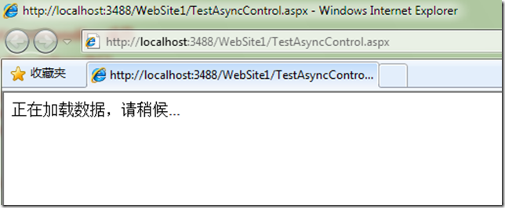
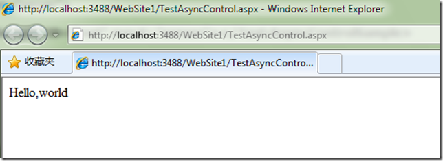

# ASP.NET : 为服务器控件或者页面添加异步行为 
> 原文发表于 2009-11-09, 地址: http://www.cnblogs.com/chenxizhang/archive/2009/11/09/1599239.html 

ASP.NET提供了网络开发的新平台，较之其他一些网络开发技术，它提供了服务器控件极大地方便了开发人员。但服务器控件也不是只有优点，有时候如果控件本身逻辑比较复杂，就会导致页面的效率受到较大的影响，用户的感觉就是页面很慢。那么，有没有办法既利用到服务器控件的好处，又能尽可能地改善用户的体验呢？

 ASP.NET提供了一个很好的接口来实现这样的需求：ICallbackEventHandler。也就是说，控件首先可以先Render一部分静态的内容到页面上，然后再可以用javascript的方式来调用自己的另外一些服务器代码，实现异步的效果。

 很早之前写过有关的例子，今天再翻出来看了一下，整理出来给大家参考吧

  

 1. 控件部分。这个控件很简单，它在render的时候，只是输出一个div，里面显示“数据正在加载”的字样。与此同时，它会用javascript再次Callback回来，此时才是真正的服务器端逻辑代码在执行。服务器代码执行的结果会用string的方式返回，最后填充到那个 div中去。

 using System;  
using System.Collections.Generic;  
using System.Linq;  
using System.Web;  
using System.Web.UI; namespace Test  
{  
    /// 
  
    /// 利用ICallbackEventHandler实现异步加载的控件  
    /// 范例代码：陈希章  
    /// 
  
    public class AsyncControlSample : Control, ICallbackEventHandler  
    {  
        public AsyncControlSample()  
        {  
            //  
            //TODO: 在此处添加构造函数逻辑  
            //  
        }         protected override void OnInit(EventArgs e)  
        {  
            base.OnInit(e);             //这一段脚本负责调用控件的回调函数  
            string serverscript = Page.ClientScript.GetCallbackEventReference(this, "", "OnCallBack", null);             //这一段脚本负责处理回调返回之后的工作  
            string clientscript = "function OnCallBack(result){document.getElementById('" + this.ClientID + "\_div').innerHTML=result;}";  
            //向页面上注册两段脚本  
            Page.ClientScript.RegisterStartupScript(this.GetType(), "test", clientscript + serverscript, true);         }         protected override void Render(HtmlTextWriter writer)  
        {  
            //输出一个div，让他先显示出来一部分内容，减少用户的焦虑感  
            string html = string.Format("
正在加载数据，请稍候...
", this.ClientID + "\_div");  
            writer.Write(html);         }       **#region ICallbackEventHandler 成员**  **public string GetCallbackResult()  
        {  
            ///这里模拟一个远程的调用，耗时的访问  
            System.Threading.Thread.Sleep(5000);  
            return "Hello,world";**  **}**  **public void RaiseCallbackEvent(string eventArgument)  
        {  
            //这里可以根据参数，改变控件的逻辑  
        }**  **#endregion**    }  
}   2. 页面部分 <%@ Page Language="C#" AutoEventWireup="true" CodeFile="TestAsyncControl.aspx.cs" Inherits="TestAsyncControl" %> <!DOCTYPE html PUBLIC "-//W3C//DTD XHTML 1.0 Transitional//EN" "<http://www.w3.org/TR/xhtml1/DTD/xhtml1-transitional.dtd">> **<%@ Register Namespace="Test" TagPrefix="Test" %>**  <html xmlns="<http://www.w3.org/1999/xhtml">>  
<head runat="server">  
    <title></title>  
</head>  
<body>  
    <form id="form1" runat="server">  
    
  
    **<Test:AsyncControlSample ID="test" runat="server"></Test:AsyncControlSample>**    
  
    </form>  
</body>  
</html>   页面被打开的效果  5秒钟之后，我们看到了最后的结果    有意思的是，根据这样的思路，我们也可以将页面直接实现ICallBackEventHandler来实现类似的行为。这种做法跟异步页不是一个概念。 using System;  
using System.Collections.Generic;  
using System.Linq;  
using System.Web;  
using System.Web.UI;  
using System.Web.UI.WebControls; public partial class TestAsyncControl : System.Web.UI.Page,ICallbackEventHandler  
{  
    protected void Page\_Load(object sender, EventArgs e)  
    {     }  
    protected override void OnInit(EventArgs e)  
    {  
        base.OnInit(e);  
        //这一段脚本负责调用控件的回调函数  
        string serverscript = Page.ClientScript.GetCallbackEventReference(this, "", "OnCallBack", null);         //这一段脚本负责处理回调返回之后的工作  
        string clientscript = "function OnCallBack(result){document.getElementById('content').innerHTML=result;}";  
        //向页面上注册两段脚本  
        Page.ClientScript.RegisterStartupScript(this.GetType(), "test", clientscript + serverscript, true);  
    }     #region ICallbackEventHandler 成员     public string GetCallbackResult()  
    {  
        ///这里模拟一个远程的调用，耗时的访问  
        System.Threading.Thread.Sleep(5000);  
        return "Hello,world";     }     public void RaiseCallbackEvent(string eventArgument)  
    {  
        //这里可以根据参数，改变控件的逻辑  
    }     #endregion  
} 

