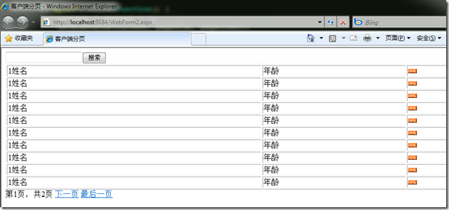

# javascript : 客户端分页脚本 
> 原文发表于 2009-11-09, 地址: http://www.cnblogs.com/chenxizhang/archive/2009/11/09/1599253.html 

一般我们认为分页有服务器分页和客户端分页两种。如果数据行本身不多，那么其实我更倾向于将数据一次性读取过来，然后通过下面的脚本在页面里面实现分页效果。

 其实主要思路就是将部分行隐藏起来。

   
 

