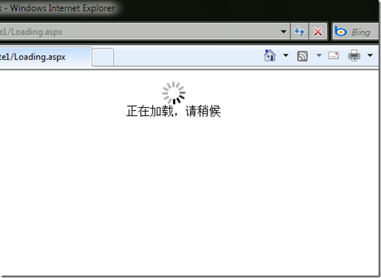

# 如何为复杂页面实现过渡页面 
> 原文发表于 2009-11-11, 地址: http://www.cnblogs.com/chenxizhang/archive/2009/11/11/1601260.html 

在我们的网站中，有些复杂页面的加载时间可能比较长，如果让用户一直看着一个空白页面等待页面最后展现，那么可能用户会不耐烦。好吧，为了降低用户的焦虑感，我们一般会做一个过渡性的页面，提示用户说“页面正在加载”，并配套一个动画。

 下面就是这个页面的最简单做法

  

 loading.aspx

 ===========================

 <html>  
<head> </head>  
<body>  
    
  
           
        正在加载，请稍候  
    
   
</body>  
</html> ============================   

