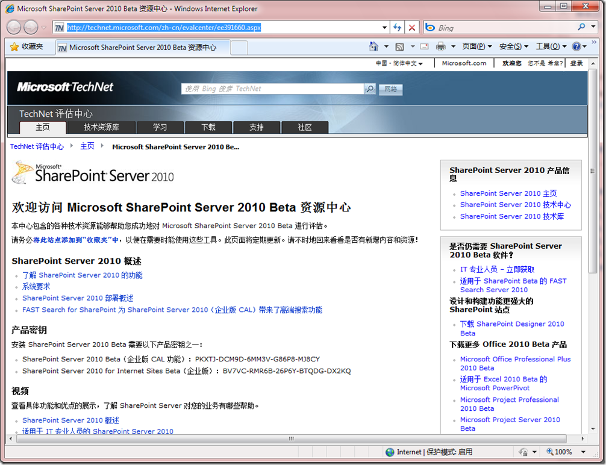
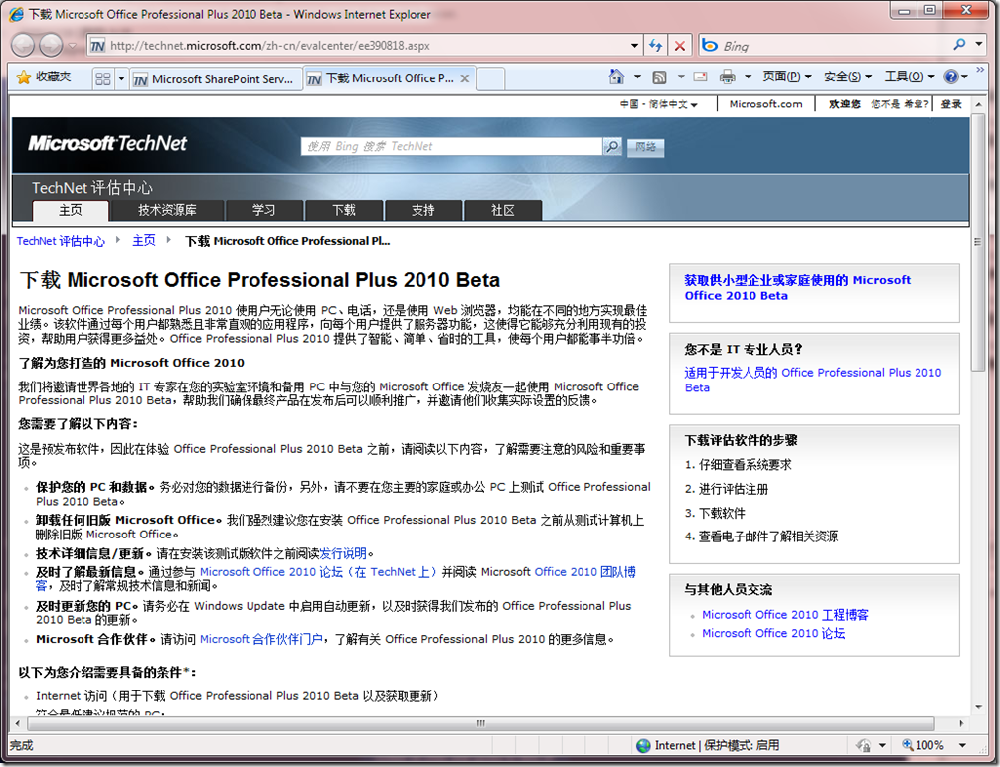
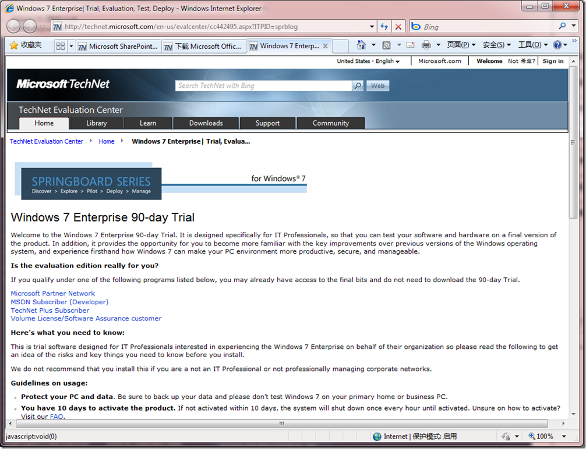
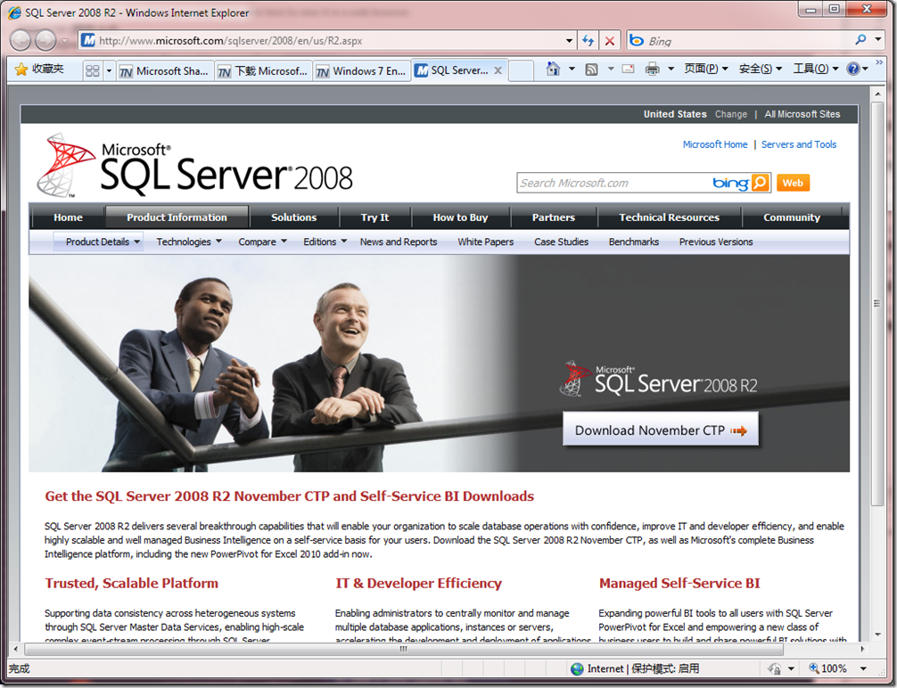
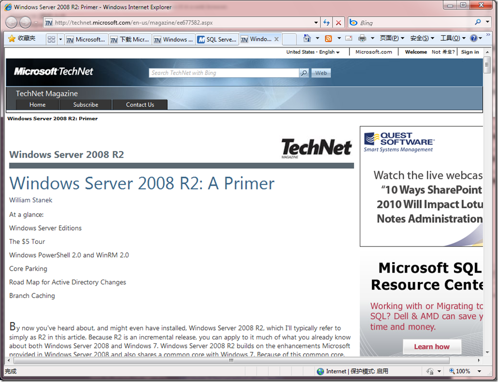

# 新时代的来临 
> 原文发表于 2009-11-19, 地址: http://www.cnblogs.com/chenxizhang/archive/2009/11/19/1605773.html 

SharePoint Server 2010

 [http://technet.microsoft.com/zh-cn/evalcenter/ee391660.aspx](http://technet.microsoft.com/zh-cn/evalcenter/ee391660.aspx "http://technet.microsoft.com/zh-cn/evalcenter/ee391660.aspx")

  

 [http://technet.microsoft.com/zh-cn/evalcenter/ee390818.aspx](http://technet.microsoft.com/zh-cn/evalcenter/ee390818.aspx "http://technet.microsoft.com/zh-cn/evalcenter/ee390818.aspx")

  

 [http://technet.microsoft.com/en-us/evalcenter/cc442495.aspx?ITPID=sprblog](http://technet.microsoft.com/en-us/evalcenter/cc442495.aspx?ITPID=sprblog "http://technet.microsoft.com/en-us/evalcenter/cc442495.aspx?ITPID=sprblog")

  

 [http://www.microsoft.com/sqlserver/2008/en/us/R2.aspx](http://www.microsoft.com/sqlserver/2008/en/us/R2.aspx "http://www.microsoft.com/sqlserver/2008/en/us/R2.aspx")

    

 [http://technet.microsoft.com/en-us/magazine/ee677582.aspx](http://technet.microsoft.com/en-us/magazine/ee677582.aspx "http://technet.microsoft.com/en-us/magazine/ee677582.aspx")

 

