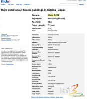

# 什么是 EXIF {转载} 
> 原文发表于 2009-11-22, 地址: http://www.cnblogs.com/chenxizhang/archive/2009/11/22/1607913.html 

还是有关图片的处理。再次整理有关的参考资料，以备参考

 [http://baike.baidu.com/view/22006.htm](http://baike.baidu.com/view/22006.htm "http://baike.baidu.com/view/22006.htm")

  

  ** Exif**是英文**Ex**changeable **I**mage **F**ile(可交换图像文件)的缩写，最初由日本电子工业发展协会(JEIDA --Japan Electronic Industry Development Association) 制订，目前的最新版本是发表于2002年04月的2.21 版。国际标准化组织(ISO)正在制订的相机文件设计标准（DCF -- Design role for Camera File system）可能以Exif2.1为基础。 　　Exif 文件实际是JPEG文件的一种，遵从JPEG标准，只是在文件头信息中增加了有关拍摄信息的内容和索引图。所以你可以使用任何支持JPEG格式的图像工具软件观看或修改Exif文件，但，打开时可能看不到Exif信息，一旦修改，Exif信息可能丢失。 　　简单来说，EXIF 信息就是由数码相机在拍摄过程中采集一系列的信息，然后把信息放置在我们熟知的 JPEG/TIFF 文件的头部，也就是说 EXIF 信息是镶嵌在 JPEG/TIFF 图像文件格式内的一组拍摄参数，主要包括摄影时的光圈、快门、ISO、时间等各种与当时摄影条件相关的讯息，相机品牌型号，色彩编码，拍摄时录制的声音以及全球定位系统（GPS）等信息。简单的说，它就好像是傻瓜相机的日期打印功能一样，只不过 EXIF 信息所记录的资讯更为详尽和完备。 　　需要注意的是，用Photoshop等图像处理软件编辑过的数码相片会丢失EXIF信息。 　　Exif21.pdf (580k) JEIDA 制定的EXIF 2.1 官方标准。(1998.6.12) Exif22.pdf (750k) JEIDA 制定的EXIF 2.2 官方标准。(2002.4) EXIF 文件格式说明 一个日本人写的 EXIF 英文参考文档，内容很详细。 ####  [[编辑本段](http://baike.baidu.com/#)] Exif的标识

　　所有的JPEG文件以字符串“0xFFD8”开头，并以字符串“0xFFD9”结束。文件头中有一系列“0xFF??”格式的字符串，称为“标识”，用来标记JPEG文件的信息段。“0xFFD8”表示图像信息开始，“0xFFD9”表示图像信息结束，这两个标识后面没有信息，而其它标识紧跟一些信息字符。 　　0xFFE0 -- 0xFFEF之间的标识符称为“应用标记”，没有被常规JPEG文件利用，Exif正是利用这些信息串记录拍摄信息如快门速度、光圈值等，甚至可以包括全球定位信息。按照Exif2.1标准对这些标识符的定义，数码相机可以把各种拍摄信息记入数码图像中，应用软件可以读取这些数据，再按照Exif2.1标准，检索出它们的具体含义,一般而言包括以下一些信息： 　　Image Description 图像描述、来源. 指生成图像的工具 　　Artist作者 有些相机可以输入使用者的名字 　　Make 生产者 指产品生产厂家 　　Model 型号 指设备型号 　　Orientation方向 有的相机支持，有的不支持 　　XResolution/YResolution X/Y方向分辨率 本栏目已有专门条目解释此问题。 　　ResolutionUnit分辨率单位 一般为PPI 　　Software软件 显示固件Firmware版本 　　DateTime日期和时间 　　YCbCrPositioning 色相定位 　　ExifOffsetExif信息位置，定义Exif在信息在文件中的写入，有些软件不显示。 　　ExposureTime 曝光时间 即快门速度 　　FNumber光圈系数 　　ExposureProgram曝光程序 指程序式自动曝光的设置，各相机不同,可能是Sutter Priority（快门优先）、Aperture Priority（快门优先）等等。 　　ISO speed ratings感光度 　　ExifVersionExif版本 　　DateTimeOriginal创建时间 　　DateTimeDigitized数字化时间 　　ComponentsConfiguration图像构造（多指色彩组合方案） 　　CompressedBitsPerPixel(BPP)压缩时每像素色彩位 指压缩程度 　　ExposureBiasValue曝光补偿。 　　MaxApertureValue最大光圈 　　MeteringMode测光方式， 平均式测光、中央重点测光、点测光等。 　　Lightsource光源 指白平衡设置 　　Flash是否使用闪光灯。 　　FocalLength焦距，一般显示镜头物理焦距，有些软件可以定义一个系数，从而显示相当于35mm相机的焦距 MakerNote(User Comment)作者标记、说明、记录 　　FlashPixVersionFlashPix版本 （个别机型支持） 　　ColorSpace色域、色彩空间 　　ExifImageWidth(Pixel X Dimension)图像宽度 指横向像素数 　　ExifImageLength(Pixel Y Dimension)图像高度 指纵向像素数 　　Interoperability IFD通用性扩展项定义指针 和TIFF文件相关，具体含义不详 　　FileSource源文件 Compression压缩比。   扩展阅读： 1.* EXIF.org <http://www.exif.org/> 2.* Opanda <http://www.opanda.com/cn/iexif/exif.htm> 3.* EXIF 2.1 官方标准（PDF文档） <http://www.exif.org/Exif2-1.PDF> 4.* EXIF 2.2 官方标准（PDF文档） <http://www.exif.org/Exif2-2.PDF> 5.* EXIF 文件格式说明 <http://park2.wakwak.com/~tsuruzoh/Computer/Digicams/exif-e.html>

