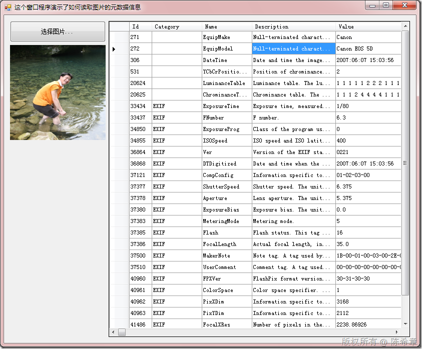

# .NET ： 如何读取图片中的元数据信息 
> 原文发表于 2009-11-23, 地址: http://www.cnblogs.com/chenxizhang/archive/2009/11/23/1608568.html 

如果我们希望在程序中对图片中包含的一些元数据信息进行读取，并作为后期分析的准备。那么可以参考下面这个例子

 [http://www.codeproject.com/KB/graphics/photoproperties.aspx](http://www.codeproject.com/KB/graphics/photoproperties.aspx "http://www.codeproject.com/KB/graphics/photoproperties.aspx")

  

 我在这基础上也做了一个范例，如下图的效果

  

 代码大致如下

 private void btSelectImageFile\_Click(object sender, EventArgs e)  
{  
    OpenFileDialog dialog = new OpenFileDialog();  
    dialog.Filter = "Image File (*.jpg)|*.jpg";  
    if (dialog.ShowDialog() == DialogResult.OK)  
    {  
        pbImage.Image = Image.FromFile(dialog.FileName);         JSG.PhotoPropertiesLibrary.PhotoProperties p = new JSG.PhotoPropertiesLibrary.PhotoProperties();  
        p.Initialize();  
        p.Analyze(dialog.FileName);  
        JSG.PhotoPropertiesLibrary.ResultOptions options = new JSG.PhotoPropertiesLibrary.ResultOptions();         MemoryStream ms = new MemoryStream();  
        p.WriteXml(ms, options);  
        if (ms.CanRead == false)  
        {  
            byte[] buffer = ms.GetBuffer();  
            ms = new MemoryStream(buffer);  
        }         XDocument doc = XDocument.Load(new XmlTextReader(ms), LoadOptions.PreserveWhitespace);         var query = from x in doc.Descendants("tagDatum")  
                    select new  
                       {  
                           Id = x.Attribute("id").Value,  
                           Category = x.Attribute("category").Value,  
                           Name = x.Element("name").Value,  
                           Description = x.Element("description").Value,  
                           Value = x.Element("value").Value  
                       };         dgvProperties.DataSource = query.ToArray();     }  
} 

