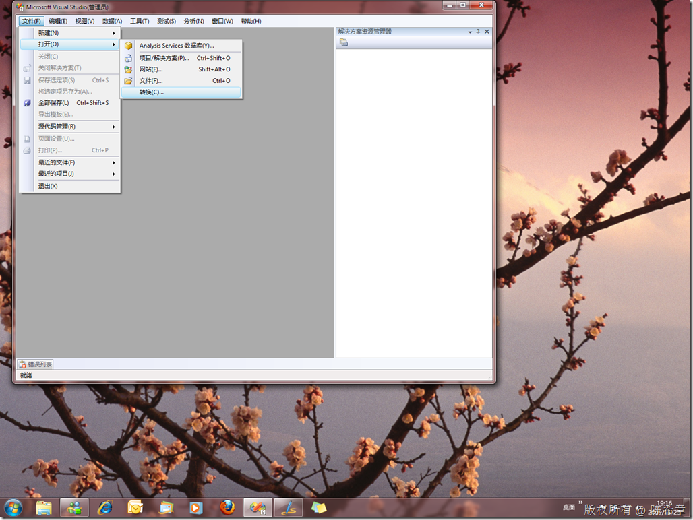
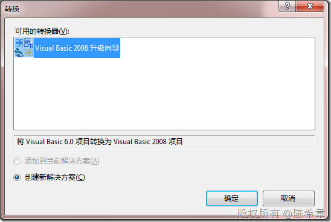
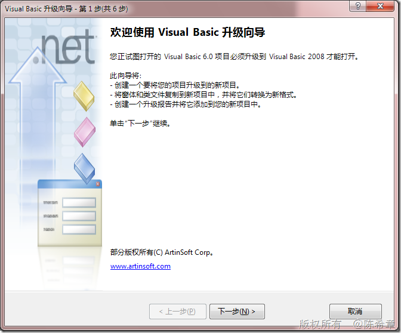
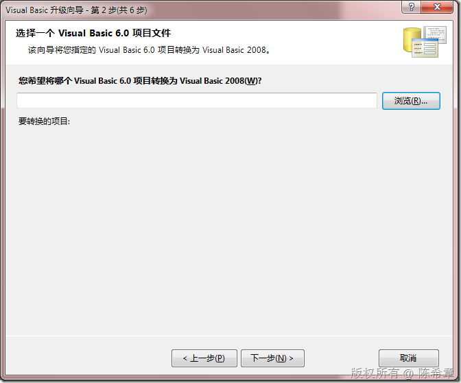

# .NET : VS 2008中的一个转换器 
> 原文发表于 2009-11-23, 地址: http://www.cnblogs.com/chenxizhang/archive/2009/11/23/1608946.html 

今天偶然发现，在VS2008中有一个转换器，是可以把VB 6.0的项目迁移到VS2008. 在VS2005的时候，这是要单独安装一个插件的。

  

 时空穿梭，让人不由得想起N年前写VB的时光

  

  

 

