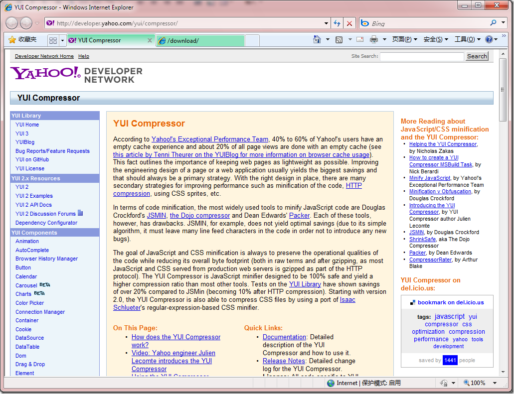
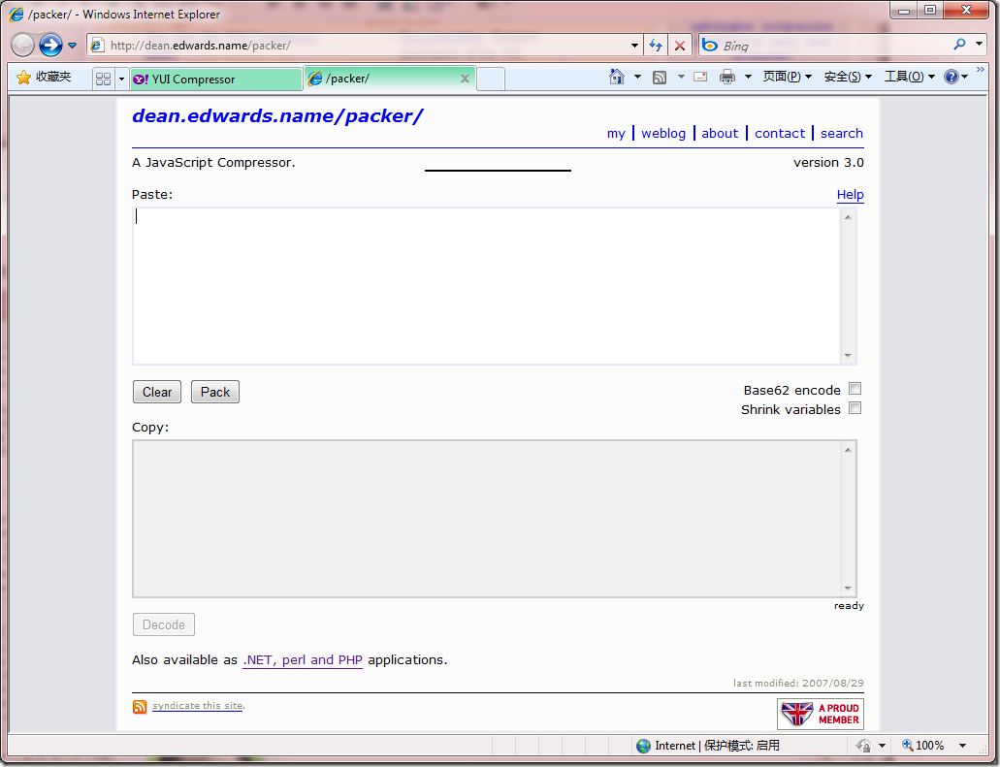
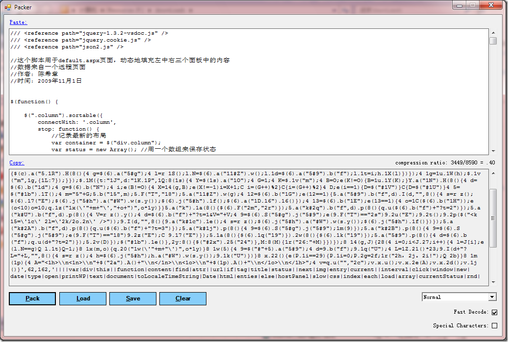

# 如何压缩javascript和css文件？ 
> 原文发表于 2009-11-23, 地址: http://www.cnblogs.com/chenxizhang/archive/2009/11/23/1609049.html 

在网站开发过程中，我们会有很多javascript文件和css文件。这些文件其实就是文本格式的，那么如何压缩他们使其体积更小，并且通过压缩达到一定意义上的加密呢？

 我找了几个方面的工具，给大家参考参考

  

 [http://developer.yahoo.com/yui/compressor/](http://developer.yahoo.com/yui/compressor/ "http://developer.yahoo.com/yui/compressor/") 

 看了介绍貌似很强，但要用java去运行。放弃了

  

  

 [http://dean.edwards.name/packer/](http://dean.edwards.name/packer/ "http://dean.edwards.name/packer/")

  

  

 这个工具还有一个可以下载的版本

 

