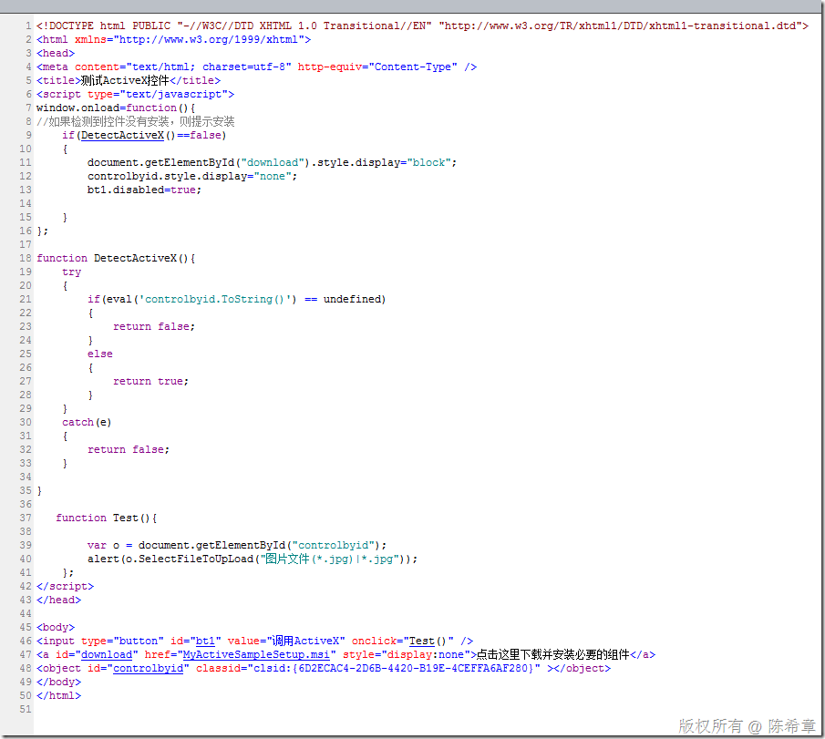
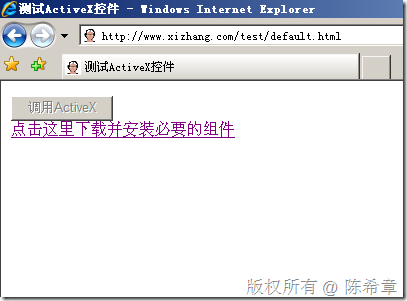
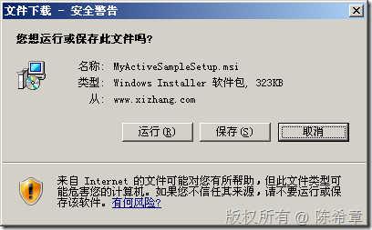
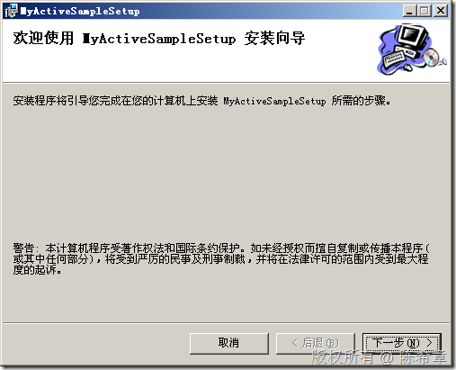
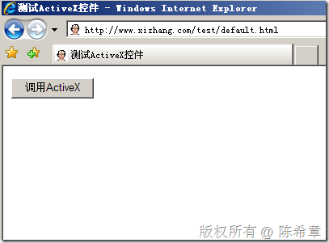
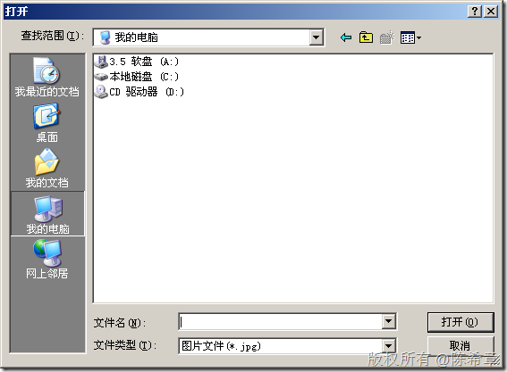

# 如何在页面中检测ActiveX控件的安装情况 
> 原文发表于 2009-11-27, 地址: http://www.cnblogs.com/chenxizhang/archive/2009/11/27/1612255.html 


接上一篇，因为通过IE的安全性等等限制，我们看到一般会直接被禁用掉，而无法提示用户进行安装。所以，如果我们想在页面中自己检测ActiveX控件的安装情况下，那么该怎么办？  


```
[](http://images.cnblogs.com/cnblogs_com/chenxizhang/WindowsLiveWriter/ActiveX_10740/image_2.png)
```

```
 
```

```
然后我们来测试一下。当目前还没有安装的话，会把按钮禁用掉。然后显示一个下载的链接。这样就和谐了
```

```
[](http://images.cnblogs.com/cnblogs_com/chenxizhang/WindowsLiveWriter/ActiveX_10740/image_4.png) 
```

```
如果安装了之后呢
```

```
[](http://images.cnblogs.com/cnblogs_com/chenxizhang/WindowsLiveWriter/ActiveX_10740/image_6.png) 
```

```
[](http://images.cnblogs.com/cnblogs_com/chenxizhang/WindowsLiveWriter/ActiveX_10740/image_8.png) 
```

```
[](http://images.cnblogs.com/cnblogs_com/chenxizhang/WindowsLiveWriter/ActiveX_10740/image_10.png) 
```

```
点击“调用ActiveX”按钮，ActiveX控件正常工作了
```

```
[](http://images.cnblogs.com/cnblogs_com/chenxizhang/WindowsLiveWriter/ActiveX_10740/image_12.png) 
```
