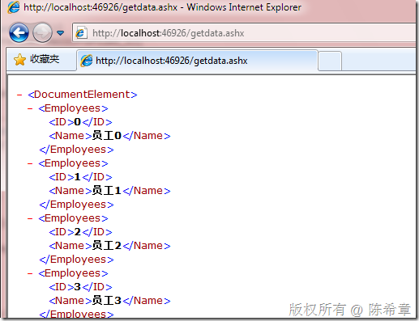
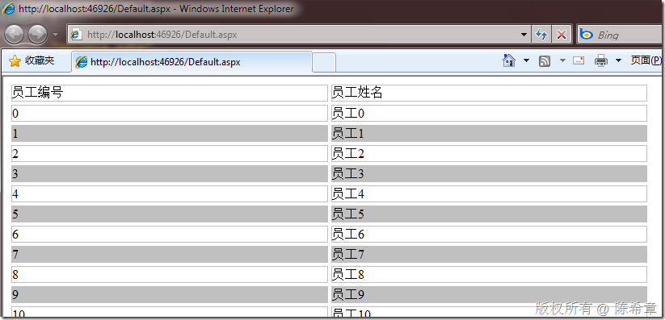

# 利用ashx和ajax实现表格的异步填充 
> 原文发表于 2009-11-27, 地址: http://www.cnblogs.com/chenxizhang/archive/2009/11/27/1612280.html 


这个例子是为了解答一个网友的问题而写的。使用场景就是，希望在ashx中返回DataTable，然后在页面中进行异步调用和显示。原先他的做法是想用json格式返回数据。

 因为DataTable可以直接序列化为XML格式，所以我比较推荐用XML返回。而不是再去解析为json之类的格式。

 1. 创建ashx文件


```
using System;
using System.Collections.Generic;
using System.Web;
using System.Web.Services;

using System.Data;

namespace WebApplication1
{
    /// <summary>
    /// $codebehindclassname$ 的摘要说明
    /// </summary>
    [WebService(Namespace = "http://tempuri.org/")]
    [WebServiceBinding(ConformsTo = WsiProfiles.BasicProfile1\_1)]
    public class GetData : IHttpHandler
    {

        public void ProcessRequest(HttpContext context)
        {
            context.Response.ContentType = "text/xml";
            context.Response.Charset = "UTF-8";
            DataTable dt = new DataTable("Employees");
            dt.Columns.Add("ID");
            dt.Columns.Add("Name");

            for (int i = 0; i < 50; i++)
            {
                DataRow row = dt.NewRow();
                row[0] = i;
                row[1] = "员工"+i.ToString();
                dt.Rows.Add(row);
            }


            dt.WriteXml(context.Response.OutputStream);
        }

        public bool IsReusable
        {
            get
            {
                return false;
            }
        }
    }
}

```

.csharpcode, .csharpcode pre
{
 font-size: small;
 color: black;
 font-family: consolas, "Courier New", courier, monospace;
 background-color: #ffffff;
 /*white-space: pre;*/
}
.csharpcode pre { margin: 0em; }
.csharpcode .rem { color: #008000; }
.csharpcode .kwrd { color: #0000ff; }
.csharpcode .str { color: #006080; }
.csharpcode .op { color: #0000c0; }
.csharpcode .preproc { color: #cc6633; }
.csharpcode .asp { background-color: #ffff00; }
.csharpcode .html { color: #800000; }
.csharpcode .attr { color: #ff0000; }
.csharpcode .alt 
{
 background-color: #f4f4f4;
 width: 100%;
 margin: 0em;
}
.csharpcode .lnum { color: #606060; }

这个文件如果直接访问的话，是类似下面这样的返回结果


[](http://images.cnblogs.com/cnblogs_com/chenxizhang/WindowsLiveWriter/ashxajax_11484/image_2.png) 


 


2.编写页面


```
<%@ Page Language="C#" AutoEventWireup="true" CodeBehind="Default.aspx.cs" Inherits="WebApplication1.\_Default" %>

<!DOCTYPE html PUBLIC "-//W3C//DTD XHTML 1.0 Transitional//EN" "http://www.w3.org/TR/xhtml1/DTD/xhtml1-transitional.dtd">

<html xmlns="http://www.w3.org/1999/xhtml" >
<head runat="server">
    <title></title>
    <script src="jquery-1.3.2-vsdoc.js" type="text/javascript"></script>
    <script type="text/javascript">
        $(function() {
            $.ajax({
                url: "GetData.ashx",
                type: "POST",
                datatype: "xml",
                success: function(result) {
                    var employees = $(result).find("Employees");
                    var index = 0;
                    employees.each(function() {
                        var id = $(this).find("ID").text();
                        var name = $(this).find("Name").text();
                        if (index++ % 2 == 0) {
                            $("<div class='row' />").appendTo("#result").end().text(id);
                            $("<div class='row' />").appendTo("#result").end().text(name);
                        }
                        else {
                            $("<div class='row' />").appendTo("#result").end().css("background-color", "Silver").text(id);
                            $("<div class='row' />").appendTo("#result").end().css("background-color", "Silver").text(name);
                            
                        }
                    });
                }
            })
        });
    </script>
    <style type="text/css">
        .row
        {
            margin:2px;
            float:left;
            width:40%;
            border-style:solid;
            border-color:Silver;
            border-width:1px;
        }
    </style>
</head>
<body>
    <form id="form1" runat="server">
    <div id="result">
        <div class="row">员工编号</div>
        <div class="row">员工姓名</div>
    </div>
    </form>
</body>
</html>

```

```
 
```

```
3. 最后的效果如下
```

```
[](http://images.cnblogs.com/cnblogs_com/chenxizhang/WindowsLiveWriter/ashxajax_11484/image_4.png) 
```

.csharpcode, .csharpcode pre
{
 font-size: small;
 color: black;
 font-family: consolas, "Courier New", courier, monospace;
 background-color: #ffffff;
 /*white-space: pre;*/
}
.csharpcode pre { margin: 0em; }
.csharpcode .rem { color: #008000; }
.csharpcode .kwrd { color: #0000ff; }
.csharpcode .str { color: #006080; }
.csharpcode .op { color: #0000c0; }
.csharpcode .preproc { color: #cc6633; }
.csharpcode .asp { background-color: #ffff00; }
.csharpcode .html { color: #800000; }
.csharpcode .attr { color: #ff0000; }
.csharpcode .alt 
{
 background-color: #f4f4f4;
 width: 100%;
 margin: 0em;
}
.csharpcode .lnum { color: #606060; }
 