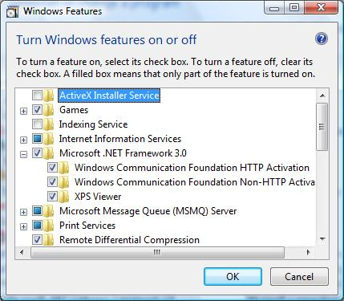
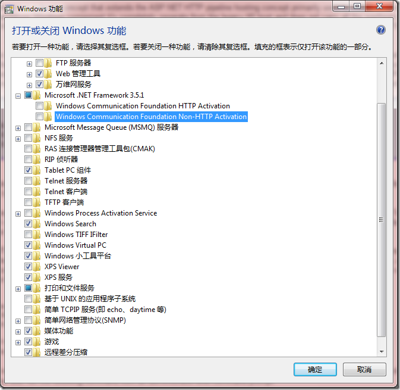

# Hosting WCF Services in Windows Activation Service {转载} 
> 原文发表于 2009-12-02, 地址: http://www.cnblogs.com/chenxizhang/archive/2009/12/02/1615002.html 


该文转载自：[http://www.devx.com/VistaSpecialReport/Article/33831](http://www.devx.com/VistaSpecialReport/Article/33831 "http://www.devx.com/VistaSpecialReport/Article/33831")

  

 简单地说，WAS是IIS7的一个新特性，它增强了IIS6只能提供HTTP侦听的情况，而WAS则可以提供其他协议的侦听，例如tcp 和namedpiple等等

 ====================================================================================

  

     indows Activation Service (WAS), introduced with Windows Vista, is the new process activation mechanism that ships with IIS 7.0. WAS builds on the existing IIS 6.0 process and hosting models, but is much more powerful because it provides support for other protocols besides HTTP, such as TCP and Named Pipes.  
By hosting the Windows Communication Foundation (WCF) services in WAS, you can take advantage of WAS features such as process recycling, rapid failover protection, and the common configuration system, all of which were **Setting up WAS**  
Before getting into the steps involved in setting up WAS, create a new WCF Service project named WASHostedService through Visual Studio 2005. I've used C# for the examples here, but you can easily translate them to VB.NET. [](http://www.devx.com/) [Figure 1](http://www.devx.com/). WAS Hosting for Non-HTTP Protocols: To make your WCF services available for remote invocation through TCP, Named Pipe and MSMQ protocol bindings, turn on the WCF Non-HTTP Activation feature through the Windows Features dialog box. In Windows Vista, you need to perform two steps to host WCF services in WAS. First, install the WCF Non-HTTP activation components. To do that, go to the Start menu —> Control Panel —> Programs and Features, and then click "Turn Windows Components On or Off" in the left pane. Expand the Microsoft .NET Framework 3.0 node and ensure that the "Windows Communication Foundation Non-HTTP Activation" feature is checked as shown in [Figure 1](http://www.devx.com/).  
Second, to use a non-HTTP protocol such as TCP or Named Pipes, you need to add the site binding to the WAS configuration. As an example, here's how you'd bind the default web site to the TCP protocol. Go to the Start menu —> Programs —>Accessories. Right click on the "Command Prompt" item, and select "Run as administrator" from the context menu. You'll see a command prompt that has the requested elevated administrator permissions so you can execute administrator commands. Execute the following command:
```
   <DriveName>\Windows\system32\inetsrv\appcmd.exe set 
      site "Default Web Site" --
      +bindings.[protocol='net.tcp',bindingInformation='808:*']

```
That command adds the net.tcp site binding to the default web site by modifying the applicationHost.config file located in the <DriveName>\Windows\system32\inetsrv\config directory.  
After binding the default web site to the appropriate protocol, you need to enable the individual web applications to support the same protocol. To enable net.tcp for the WASHostedService site, run the following command from an administrator-level command prompt:
```
   %windir%\system32\inetsrv\appcmd.exe set app 
      "Default Web Site/MyProjects/DevX/WASHostedService" 
      /enabledProtocols:http,net.tcp

```
Now that you have set up the web site and application, you are ready to create a service and host it in WAS.


 


如果使用Win 7则，则配置窗口大致如下


[](http://images.cnblogs.com/cnblogs_com/chenxizhang/WindowsLiveWriter/HostingWCFServicesinWindowsActivationSer_74B0/image_2.png)


