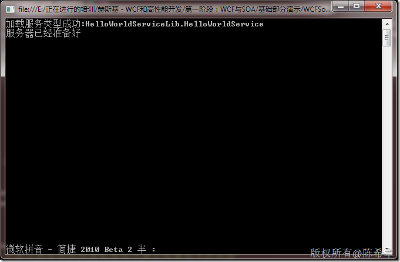

# .NET: 如何在宿主中动态加载所有的服务 
> 原文发表于 2009-12-03, 地址: http://www.cnblogs.com/chenxizhang/archive/2009/12/03/1616420.html 


今天在讲WCF的时候，谈到了一个老问题。如果我们希望宿主程序具有足够的灵活性，那么我们会用配置文件的方式来定义服务。例如下面这样


```
<?xml version="1.0" encoding="utf-8" ?>
<configuration>
  <system.serviceModel>
    <services>
      <service name="HelloWorldServiceLib.HelloWorldService" behaviorConfiguration="MyBehavior">
        <host>
          <baseAddresses>
            <add baseAddress="http://localhost:8000/HelloWorldService"/>
            <add baseAddress="net.tcp://localhost:8081/HelloWorld"/>
          </baseAddresses>
        </host>

        <endpoint address="" contract="Contracts.IHelloWorld" binding="basicHttpBinding"></endpoint>

        <endpoint address="mex" binding="mexHttpBinding" contract="IMetadataExchange"/>
      </service>
    </services>
    <behaviors>
      <serviceBehaviors>
        <behavior name="MyBehavior">
          <serviceMetadata httpGetEnabled="true"/>
          
        </behavior>
      </serviceBehaviors>
    </behaviors>
  </system.serviceModel>
</configuration>
```


.csharpcode, .csharpcode pre
{
 font-size: small;
 color: black;
 font-family: consolas, "Courier New", courier, monospace;
 background-color: #ffffff;
 /*white-space: pre;*/
}
.csharpcode pre { margin: 0em; }
.csharpcode .rem { color: #008000; }
.csharpcode .kwrd { color: #0000ff; }
.csharpcode .str { color: #006080; }
.csharpcode .op { color: #0000c0; }
.csharpcode .preproc { color: #cc6633; }
.csharpcode .asp { background-color: #ffff00; }
.csharpcode .html { color: #800000; }
.csharpcode .attr { color: #ff0000; }
.csharpcode .alt 
{
 background-color: #f4f4f4;
 width: 100%;
 margin: 0em;
}
.csharpcode .lnum { color: #606060; }


如果有这样的配置文件，那么宿主中就可以通过下面这样的代码来实现服务的托管


```

#region 加载一个服务宿主
            using (ServiceHost host = new ServiceHost(typeof(HelloWorldServiceLib.HelloWorldService)))
            {
                host.Open();
                Console.WriteLine("服务器已经准备好");
                Console.Read();
            }
#endregion
```

```
[](http://images.cnblogs.com/cnblogs_com/chenxizhang/WindowsLiveWriter/180726246ca9.NET_FFB8/image_4.png) 
```

看起来不错，不是吗？


但是，这样仍然是有一个问题，就是如果我们现在需要添加一个服务，我们当然可以修改配置文件。但此时，我们就必须修改宿主的代码，因为每一个服务都要求有一个对应的ServiceHost。


如此说来的话，我们的宿主程序就很难稳定下来了。有什么方法可以解决这个问题呢？


我们的思路是


* 我们需要读取配置文件中，所有定义的Service节点，然后找到它们的name属性
* 然后，我们需要根据这个name属性反射得到有关的类型


基于这样的思路，我们最后实现的完整代码如下


```
using System;
using System.Collections.Generic;
using System.Text;
using System.ServiceModel;
using System.ServiceModel.Configuration;
using System.Configuration;
using System.Reflection;
using System.IO;


namespace SimpleHostUseConfiguration
{
    class Program
    {
        static void Main(string[] args)
        {


            
#region 循环加载所有的服务宿主

            //先加载当前目录下面的所有dll，然后检索里面是否有我们需要的类型
            List<Assembly> assemblys = new List<Assembly>();
            foreach (string file in Directory.GetFiles(Environment.CurrentDirectory, "*.dll")) {
                assemblys.Add(Assembly.LoadFile(file));
            }

            if (assemblys.Count > 0)
            {
                ServiceModelSectionGroup group = ConfigurationManager.OpenExeConfiguration(ConfigurationUserLevel.None).SectionGroups["system.serviceModel"] as ServiceModelSectionGroup;

                foreach (ServiceElement item in group.Services.Services)
                {
                    string typeName = item.Name;
                    Type serviceType = GetTypeByName(typeName, assemblys);
                    if (serviceType != null)
                    {
                        ServiceHost host = new ServiceHost(serviceType);
                        host.Open();
                        Console.WriteLine("加载服务类型成功:{0}", serviceType.FullName);
                    }
                }
            }

            Console.WriteLine("服务器已经准备好");
            Console.Read();
#endregion
        }

        /// <summary>
        /// 这个方法从现有项目所有私有程序集中检查有关的类型
        /// </summary>
        /// <param name="typeName">相应的类型名称</param>
        /// <returns>如果找到则返回类型，否则返回NULL</returns>
        static Type GetTypeByName(string typeName,List<Assembly> assemblys) {
            foreach (Assembly assem in assemblys)
            {
                Type temp = assem.GetType(typeName);
                if (temp != null)
                    return temp;
            }

            return null;
        }
    }
}

```

[](http://images.cnblogs.com/cnblogs_com/chenxizhang/WindowsLiveWriter/180726246ca9.NET_FFB8/image_2.png)

