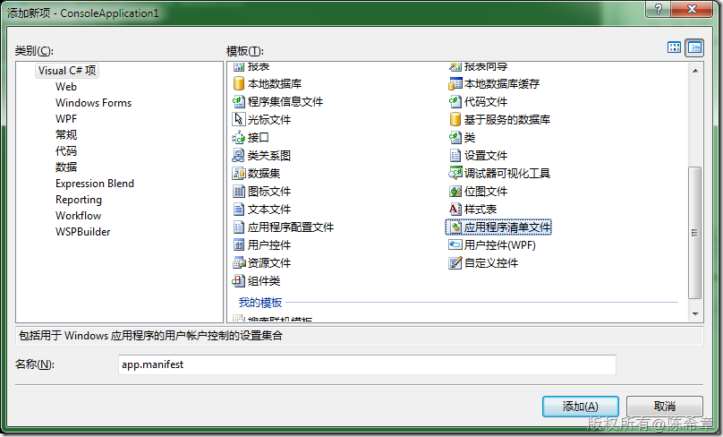
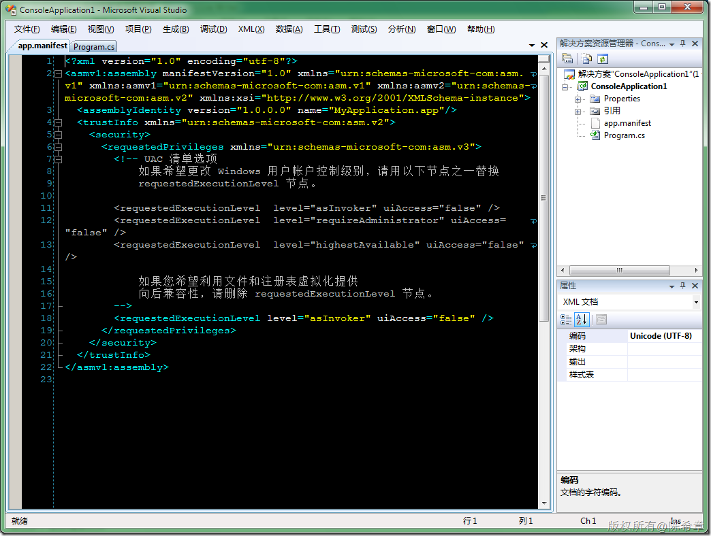
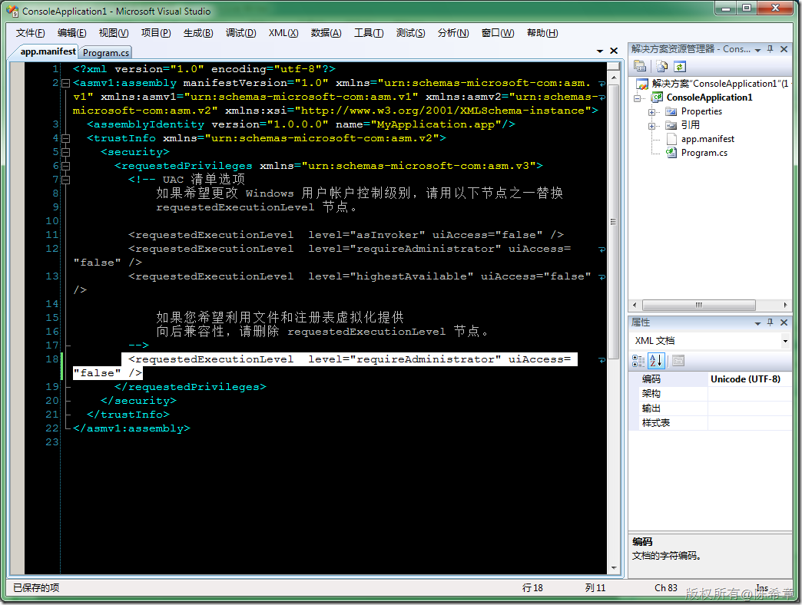
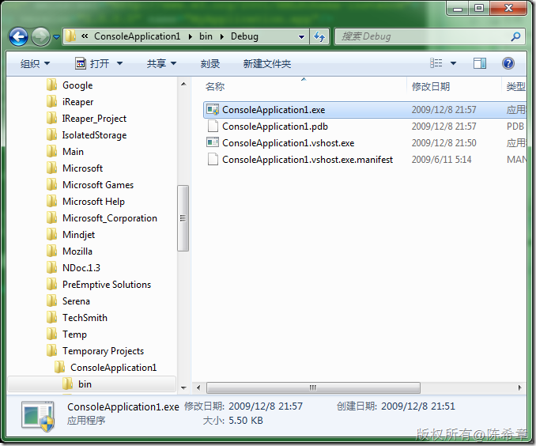

# .NET:如何声明某个程序需要管理员权限 
> 原文发表于 2009-12-08, 地址: http://www.cnblogs.com/chenxizhang/archive/2009/12/08/1619783.html 

在Vista和Win 7中，有一套用户权限管理（UAC： User Access Control）的功能。关于UAC的争议一直不少，我这里就不多谈这方面的内容了。有兴趣的朋友可以参考这篇博客文件 [http://blogs.itecn.net/blogs/winvista/archive/2006/07/21/2945.aspx](http://blogs.itecn.net/blogs/winvista/archive/2006/07/21/2945.aspx "http://blogs.itecn.net/blogs/winvista/archive/2006/07/21/2945.aspx")

  

 这一篇文章，演示一下，如何在开发程序的时候声明某个程序需要管理员权限？

 第一步：添加一个应用程序清单文件

  

  

 第二步：修改清单文件

  

 • **asInvoker****：**继承父进程的访问令牌。  
• **highestAvailable****：**进程可以获得它所能得到的最高级别的访问令牌。  
• **requireAdministrator****：**进程必须由管理员组成员启动，并且必须获得完全级别的访问令牌。   第三步：编译程序（注意观察，此时这个应用程序图标上会有一个黄色的盾牌）

  

 双击这个程序后，会弹出我们熟悉的确认对话框（嘿嘿，这个对话框连截图都截不到）

