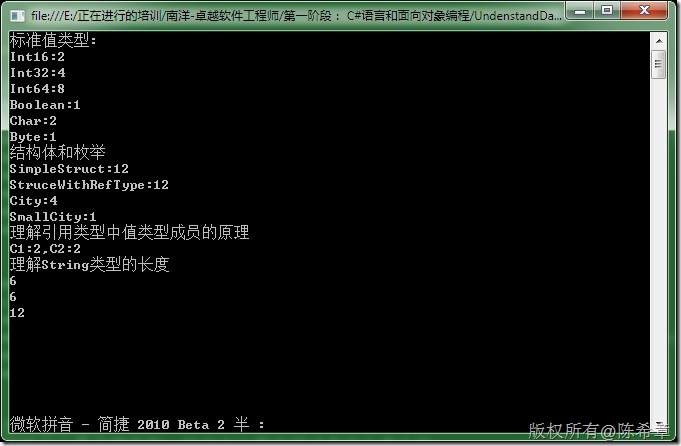

# .NET : 如何查看值类型的大小 
> 原文发表于 2009-12-09, 地址: http://www.cnblogs.com/chenxizhang/archive/2009/12/09/1620564.html 


```
using System;
using System.Text;

using System.Runtime.InteropServices;


namespace DataTypeSample
{
    class Program
    {
        static void Main(string[] args)
        {
            //打印标准数据值类型的大小 sizeof
            Console.WriteLine("标准值类型:");

            Console.WriteLine("Int16:{0}", sizeof(Int16));
            Console.WriteLine("Int32:{0}", sizeof(Int32));
            Console.WriteLine("Int64:{0}", sizeof(Int64));
            Console.WriteLine("Boolean:{0}", sizeof(bool));
            Console.WriteLine("Char:{0}", sizeof(char));
            Console.WriteLine("Byte:{0}", sizeof(byte));


            Console.WriteLine("结构体和枚举");
            //打印struce和enum的大小
            Console.WriteLine("SimpleStruct:{0}", Marshal.SizeOf(typeof(SimpleStruct)));
            Console.WriteLine("StruceWithRefType:{0}", Marshal.SizeOf(typeof(StructWithRefType)));
            Console.WriteLine("City:{0}", sizeof(City));
            Console.WriteLine("SmallCity:{0}", sizeof(SmallCity));


            //打印引用类型的大小
            //引用类型的大小是不固定的，初识大小是内部成员的长度之和
            Console.WriteLine("理解引用类型中值类型成员的原理");
            Customer c1 = new Customer() { Id = 1 };
            Customer c2 = c1;
            c2.Id = 2;

            Console.WriteLine("C1:{0},C2:{1}", c1.Id, c2.Id);

            Console.WriteLine("理解String类型的长度");
            string info = "你好,陈希章";
            Console.WriteLine(info.Length);//非unicode
            Console.WriteLine(Encoding.ASCII.GetBytes(info).Length);
            Console.WriteLine(Encoding.Unicode.GetBytes(info).Length);

            Console.Read();


        }
    }


    [StructLayout(LayoutKind.Sequential)]
    struct SimpleStruct
    {
        public int ID { get; set; }
        public byte MyProperty { get; set; }//在结构体中，即便是值类型，最少也是4字节

        public short money { get; set; }
        public short other { get; set; }

        //也就是说，即便全部是值类型，但其实每次分配空间的时候都是4字节（如果32位的话）的倍数
    }

    /// <summary>
    /// 这是一个包含了值类型和引用类型成员的结构
    /// </summary>
    [StructLayout(LayoutKind.Sequential)]
    struct StructWithRefType {
        public int Id { get; set; }//值类型，直接就是该类型的大小,4Byte
        

        public string Name { get; set; }//引用类型，在结构中用一个INT32的字节表示，其实就是4个字节。（这个跟当前操作系统是32位还是64位有关
        public string Address { get; set; }//引用类型，在结构中用一个INT32的字节表示，其实就是4个字节。（这个跟当前操作系统是32位还是64位有关
        
    }
    

    enum City { 
        Beijing,
        Shanghai,
        Nanjing
    }
    enum SmallCity :byte
    { 
        Beijing,
        Shanghai,
        Hangzhou
    }

   
    class Customer
    {
        public int Id { get; set; }//四个字节，而且这个INT的值是方法在堆上面的

        private string name = string.Empty;
        public string Name { 
            get { return name; } 
            set { name = value; } 
        }
    }
}

```

```
[](http://images.cnblogs.com/cnblogs_com/chenxizhang/WindowsLiveWriter/9cfeba7272bb.NET_14182/image_2.png) 
```

.csharpcode, .csharpcode pre
{
 font-size: small;
 color: black;
 font-family: consolas, "Courier New", courier, monospace;
 background-color: #ffffff;
 /*white-space: pre;*/
}
.csharpcode pre { margin: 0em; }
.csharpcode .rem { color: #008000; }
.csharpcode .kwrd { color: #0000ff; }
.csharpcode .str { color: #006080; }
.csharpcode .op { color: #0000c0; }
.csharpcode .preproc { color: #cc6633; }
.csharpcode .asp { background-color: #ffff00; }
.csharpcode .html { color: #800000; }
.csharpcode .attr { color: #ff0000; }
.csharpcode .alt 
{
 background-color: #f4f4f4;
 width: 100%;
 margin: 0em;
}
.csharpcode .lnum { color: #606060; }
