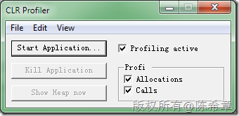
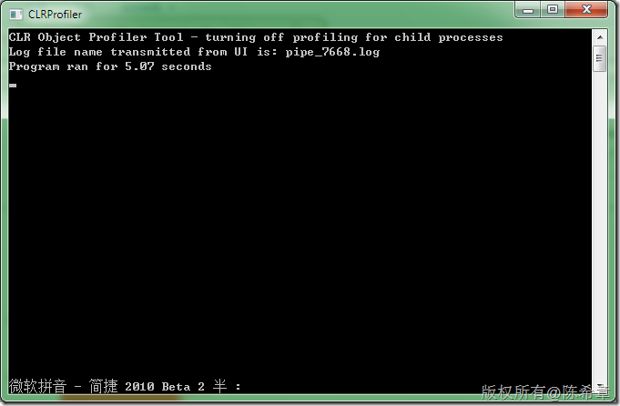
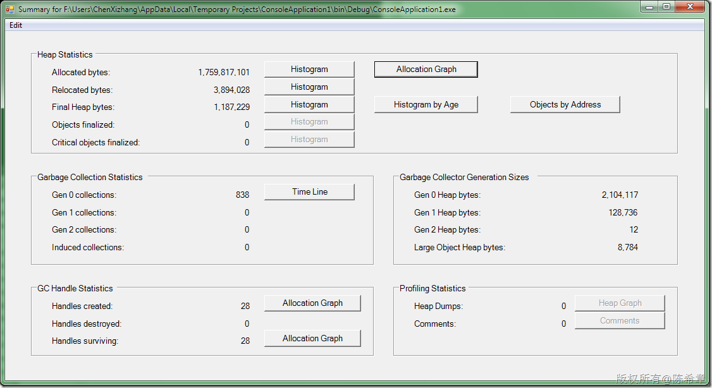
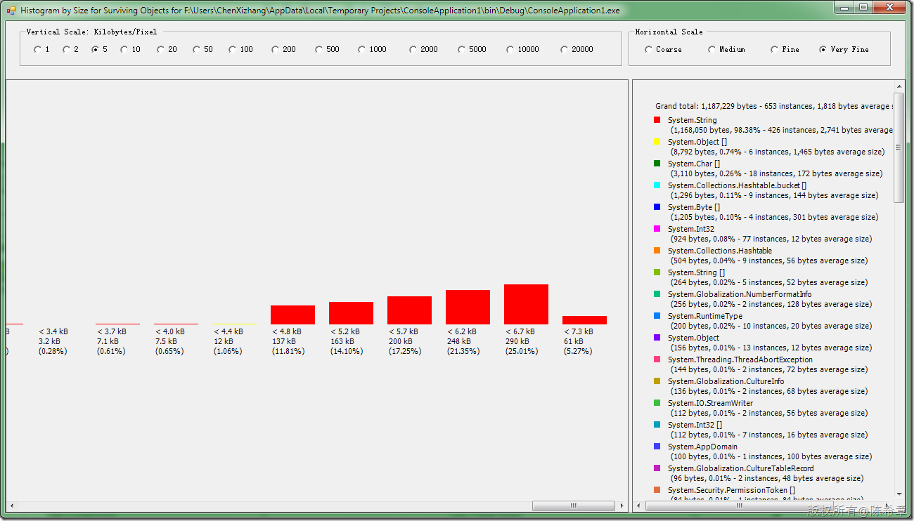
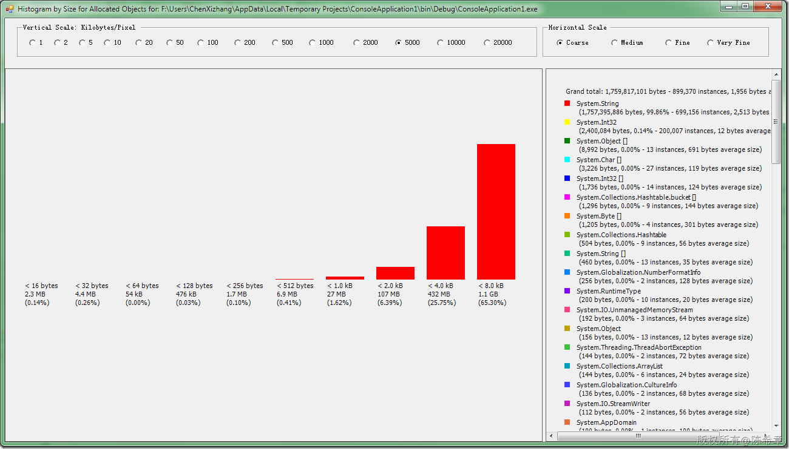
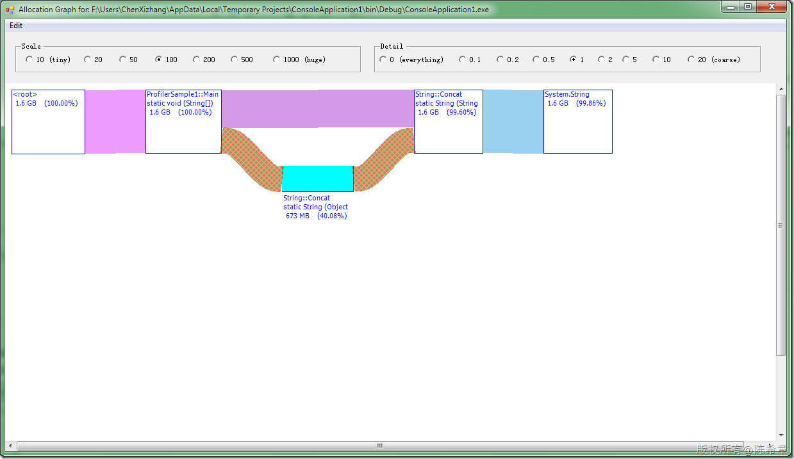
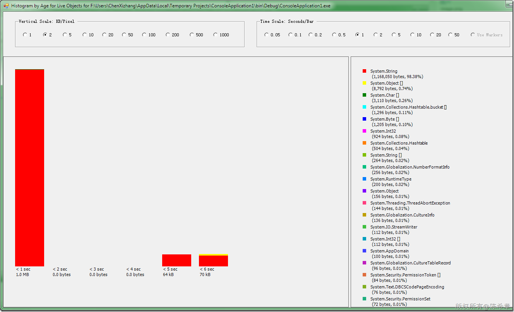
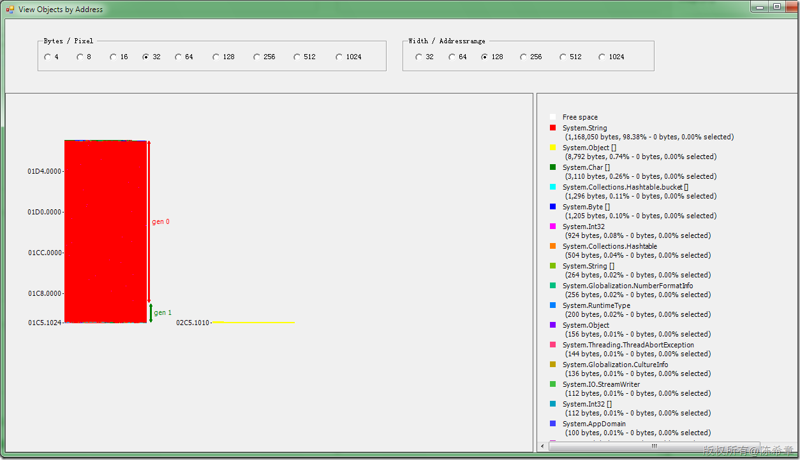
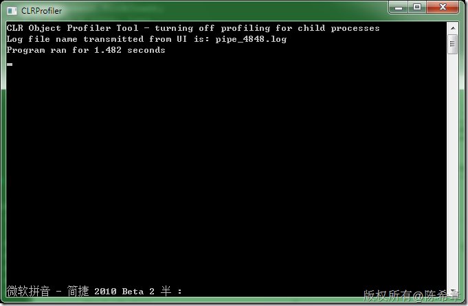
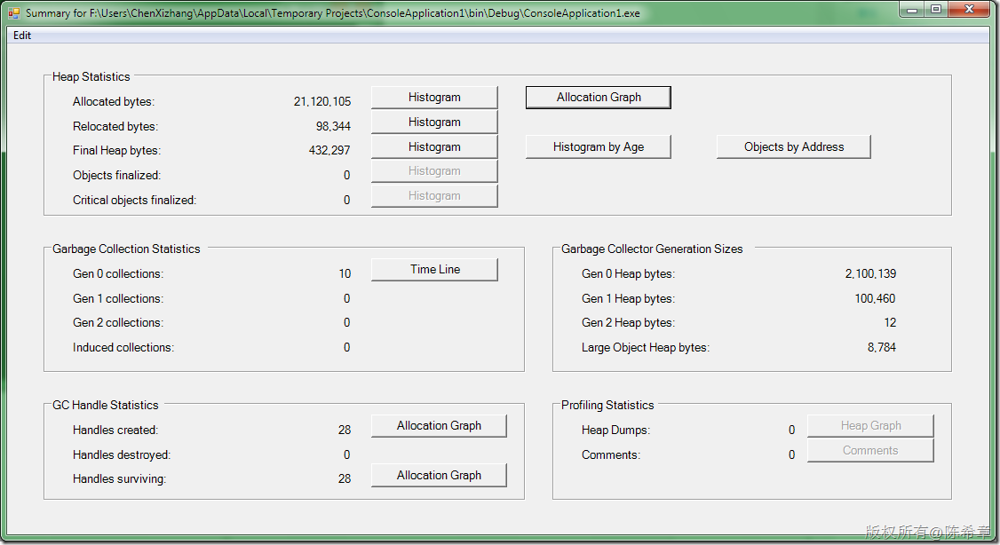

# .NET : CLR Profiler的使用 
> 原文发表于 2009-12-13, 地址: http://www.cnblogs.com/chenxizhang/archive/2009/12/13/1623071.html 


经常讲课的时候会提到值类型和引用类型，也会提到如何查看它们的大小。多次被朋友问到，如何真的想要知道到底每个方法分配了多少内存之类的问题，其实这可以通过CLR Profiler工具来监控。

 有兴趣的朋友可以查看下面这篇文档

 <http://msdn.microsoft.com/zh-cn/library/ms979205(en-us).aspx>

 演示程序


```
using System;
public class ProfilerSample1
{
    static void Main(string[] args)
    {
        int start = Environment.TickCount;
        for (int i = 0; i < 1000; i++)
        {
            string s = "";
            for (int j = 0; j < 100; j++)
            {
                s += "Outer index = ";
                s += i;
                s += " Inner index = ";
                s += j;
                s += " ";
            }
        }
        Console.WriteLine("Program ran for {0} seconds",
            0.001 * (Environment.TickCount - start));
    }
}
```

```
**你能想到这个程序在运行期间居然要分配1.6GB的内存吗？**
```

```
 
```

.csharpcode, .csharpcode pre
{
 font-size: small;
 color: black;
 font-family: consolas, "Courier New", courier, monospace;
 background-color: #ffffff;
 /*white-space: pre;*/
}
.csharpcode pre { margin: 0em; }
.csharpcode .rem { color: #008000; }
.csharpcode .kwrd { color: #0000ff; }
.csharpcode .str { color: #006080; }
.csharpcode .op { color: #0000c0; }
.csharpcode .preproc { color: #cc6633; }
.csharpcode .asp { background-color: #ffff00; }
.csharpcode .html { color: #800000; }
.csharpcode .attr { color: #ff0000; }
.csharpcode .alt 
{
 background-color: #f4f4f4;
 width: 100%;
 margin: 0em;
}
.csharpcode .lnum { color: #606060; }

[](http://images.cnblogs.com/cnblogs_com/chenxizhang/WindowsLiveWriter/541dad921f83.NETCLRProfiler_EFAC/image_2.png) 


[](http://images.cnblogs.com/cnblogs_com/chenxizhang/WindowsLiveWriter/541dad921f83.NETCLRProfiler_EFAC/image_16.png) 


[](http://images.cnblogs.com/cnblogs_com/chenxizhang/WindowsLiveWriter/541dad921f83.NETCLRProfiler_EFAC/image_4.png) 


查看堆上面分配的情况


[](http://images.cnblogs.com/cnblogs_com/chenxizhang/WindowsLiveWriter/541dad921f83.NETCLRProfiler_EFAC/image_6.png) 


[](http://images.cnblogs.com/cnblogs_com/chenxizhang/WindowsLiveWriter/541dad921f83.NETCLRProfiler_EFAC/image_8.png) 


[](http://images.cnblogs.com/cnblogs_com/chenxizhang/WindowsLiveWriter/541dad921f83.NETCLRProfiler_EFAC/image_10.png) 


[](http://images.cnblogs.com/cnblogs_com/chenxizhang/WindowsLiveWriter/541dad921f83.NETCLRProfiler_EFAC/image_12.png) 


[](http://images.cnblogs.com/cnblogs_com/chenxizhang/WindowsLiveWriter/541dad921f83.NETCLRProfiler_EFAC/image_14.png) 


大家可能很惊讶，为什么这么简单的代码居然要用那么多内存空间呢？


其实这也是我们经常所说的，不要在大量的循环中使用字符串(string)拼接，因为string类型在.NET中是一个特殊的引用类型，它本身不可改变。


那么，如果我们将代码稍作一些修改，如下


```
using System;
using System.Text;

public class ProfilerSample1
{
    static void Main(string[] args)
    {
        int start = Environment.TickCount;

        for (int i = 0; i < 1000; i++)
        {
            StringBuilder sb = new StringBuilder();
            for (int j = 0; j < 100; j++)
            {
                sb.Append("Outer index = ");
                sb.Append(i);
                sb.Append(" Inner index = ");
                sb.Append(j);
                sb.Append(" ");
            }
        }
        Console.WriteLine("Program ran for {0} seconds",
            0.001 * (Environment.TickCount - start));
    }
}
```

.csharpcode, .csharpcode pre
{
 font-size: small;
 color: black;
 font-family: consolas, "Courier New", courier, monospace;
 background-color: #ffffff;
 /*white-space: pre;*/
}
.csharpcode pre { margin: 0em; }
.csharpcode .rem { color: #008000; }
.csharpcode .kwrd { color: #0000ff; }
.csharpcode .str { color: #006080; }
.csharpcode .op { color: #0000c0; }
.csharpcode .preproc { color: #cc6633; }
.csharpcode .asp { background-color: #ffff00; }
.csharpcode .html { color: #800000; }
.csharpcode .attr { color: #ff0000; }
.csharpcode .alt 
{
 background-color: #f4f4f4;
 width: 100%;
 margin: 0em;
}
.csharpcode .lnum { color: #606060; }

再次运行，我们发现首先运行时间大致只有1.4秒了，原先是5.07秒，大约是4倍的速度差异


[](http://images.cnblogs.com/cnblogs_com/chenxizhang/WindowsLiveWriter/541dad921f83.NETCLRProfiler_EFAC/image_18.png) 


**而且此时程序所分配的内存大致为20MB，原先为1.6GB。**


[](http://images.cnblogs.com/cnblogs_com/chenxizhang/WindowsLiveWriter/541dad921f83.NETCLRProfiler_EFAC/image_20.png) 


并且GC工作的次数也只有10次。大大地降低了CLR的负荷

