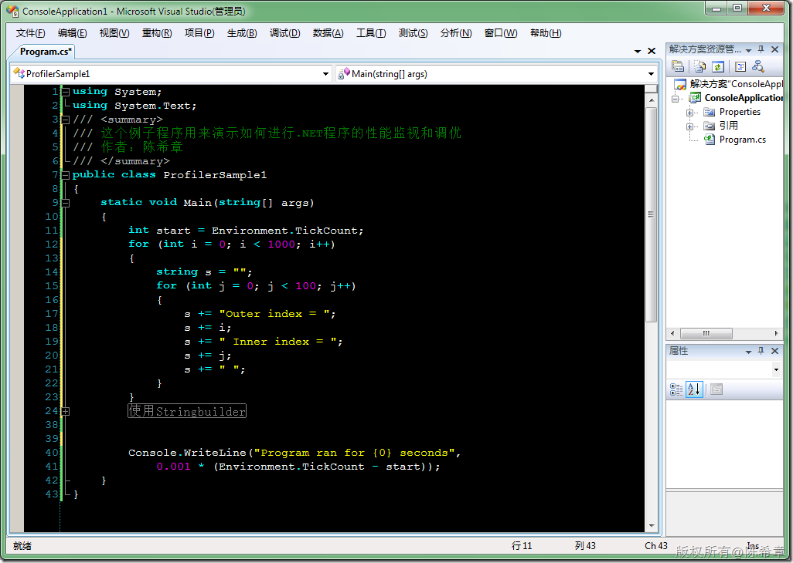
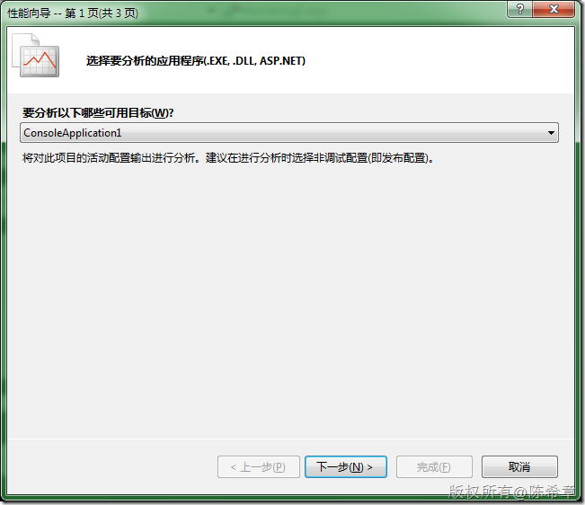
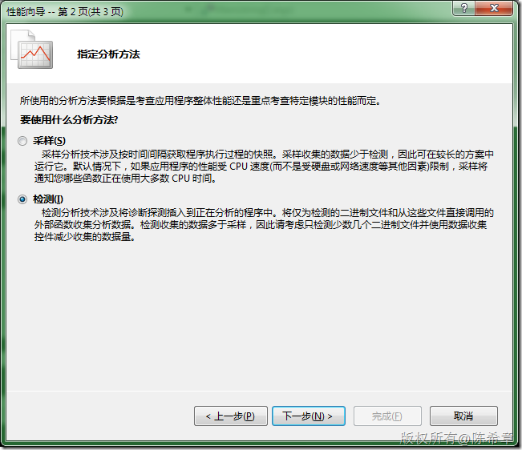
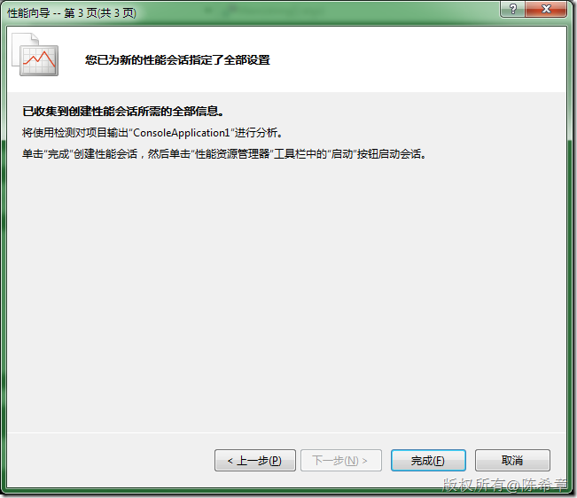
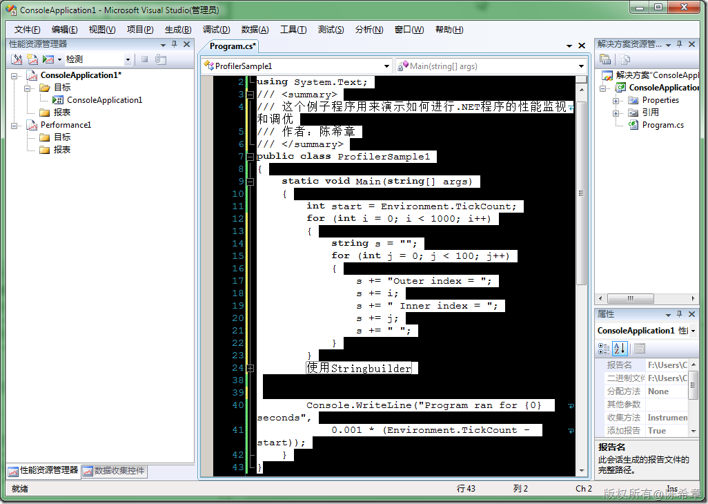
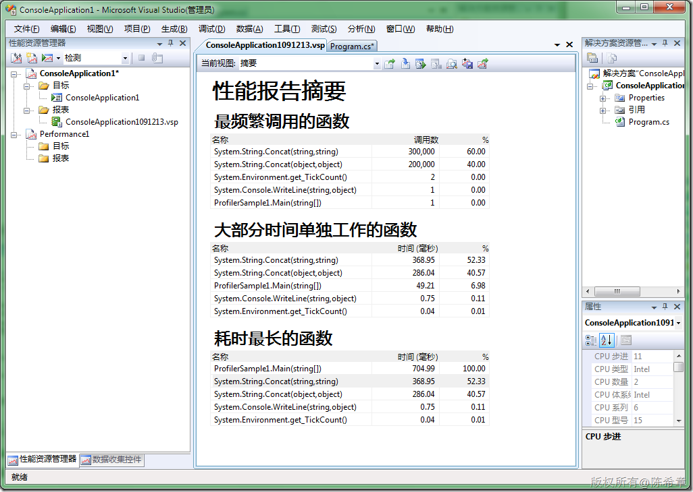
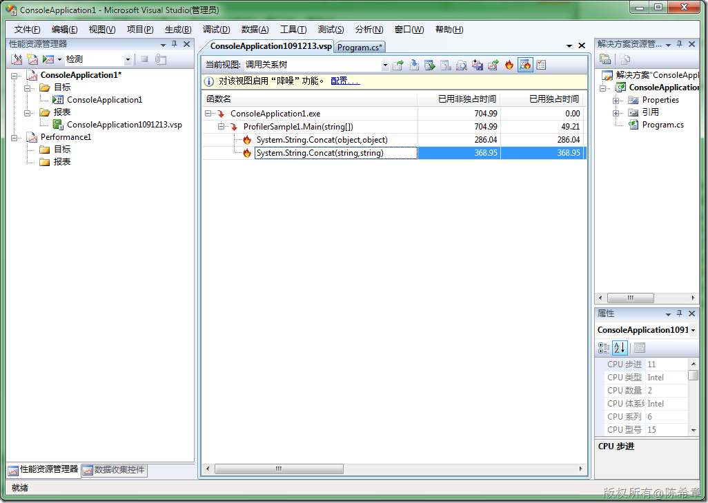
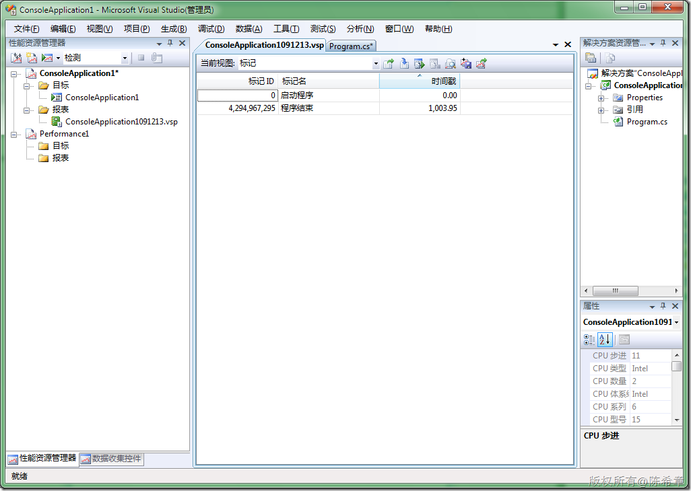
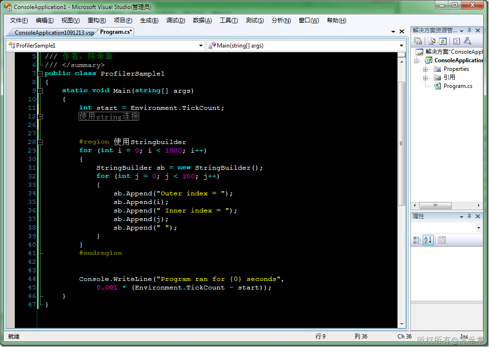
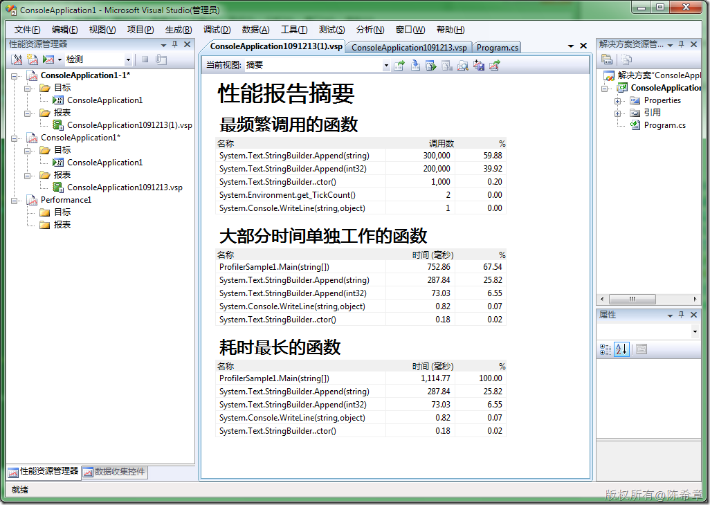

# .NET : 使用代码性能分析工具 
> 原文发表于 2009-12-13, 地址: http://www.cnblogs.com/chenxizhang/archive/2009/12/13/1623079.html 


上一篇，我演示了如何使用CLR Profiler对.NET应用程序进行性能分析。下面再谈谈在Visual Studio中自带的工具

  

 示范代码


```
using System;
using System.Text;
/// <summary>
/// 这个例子程序用来演示如何进行.NET程序的性能监视和调优
/// 作者：陈希章
/// </summary>
public class ProfilerSample1
{
    static void Main(string[] args)
    {
        int start = Environment.TickCount;
        for (int i = 0; i < 1000; i++)
        {
            string s = "";
            for (int j = 0; j < 100; j++)
            {
                s += "Outer index = ";
                s += i;
                s += " Inner index = ";
                s += j;
                s += " ";
            }
        }

        #endregion


        Console.WriteLine("Program ran for {0} seconds",
            0.001 * (Environment.TickCount - start));
    }
}
```

.csharpcode, .csharpcode pre
{
 font-size: small;
 color: black;
 font-family: consolas, "Courier New", courier, monospace;
 background-color: #ffffff;
 /*white-space: pre;*/
}
.csharpcode pre { margin: 0em; }
.csharpcode .rem { color: #008000; }
.csharpcode .kwrd { color: #0000ff; }
.csharpcode .str { color: #006080; }
.csharpcode .op { color: #0000c0; }
.csharpcode .preproc { color: #cc6633; }
.csharpcode .asp { background-color: #ffff00; }
.csharpcode .html { color: #800000; }
.csharpcode .attr { color: #ff0000; }
.csharpcode .alt 
{
 background-color: #f4f4f4;
 width: 100%;
 margin: 0em;
}
.csharpcode .lnum { color: #606060; }

[](http://images.cnblogs.com/cnblogs_com/chenxizhang/WindowsLiveWriter/dc44cda0bf78.NET_FA77/image_2.png) 


运行代码分析工具（需要Visual Studio Team suite for developer版本）


"分析"==〉“启动性能向导”


[](http://images.cnblogs.com/cnblogs_com/chenxizhang/WindowsLiveWriter/dc44cda0bf78.NET_FA77/image_4.png) 


[](http://images.cnblogs.com/cnblogs_com/chenxizhang/WindowsLiveWriter/dc44cda0bf78.NET_FA77/image_8.png) 


[](http://images.cnblogs.com/cnblogs_com/chenxizhang/WindowsLiveWriter/dc44cda0bf78.NET_FA77/image_10.png) 


[](http://images.cnblogs.com/cnblogs_com/chenxizhang/WindowsLiveWriter/dc44cda0bf78.NET_FA77/image_12.png) 


现在可以启动性能监视了，很快就能看到下面的一个报表


[](http://images.cnblogs.com/cnblogs_com/chenxizhang/WindowsLiveWriter/dc44cda0bf78.NET_FA77/image_14.png) 


通过这个摘要报告，我们可以看出来，该程序中占绝大部分的操作都是string.concat方法，就是字符串连接。一共有500000次。


从时间上也可以看到它们占用了绝大部分时间


[](http://images.cnblogs.com/cnblogs_com/chenxizhang/WindowsLiveWriter/dc44cda0bf78.NET_FA77/image_16.png) 


[](http://images.cnblogs.com/cnblogs_com/chenxizhang/WindowsLiveWriter/dc44cda0bf78.NET_FA77/image_18.png) 


[](http://images.cnblogs.com/cnblogs_com/chenxizhang/WindowsLiveWriter/dc44cda0bf78.NET_FA77/image_20.png) 


将程序修改为使用stringbuidler


[](http://images.cnblogs.com/cnblogs_com/chenxizhang/WindowsLiveWriter/dc44cda0bf78.NET_FA77/image_22.png) 


[](http://images.cnblogs.com/cnblogs_com/chenxizhang/WindowsLiveWriter/dc44cda0bf78.NET_FA77/image_24.png)

