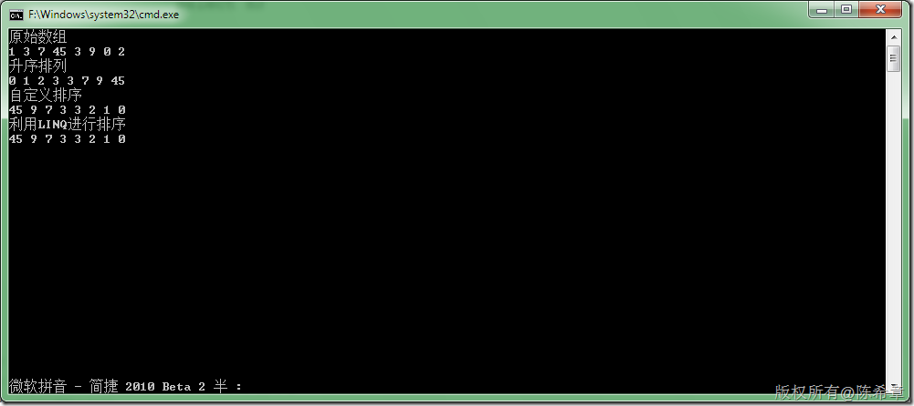

# .NET :如何对数组进行排序 
> 原文发表于 2009-12-15, 地址: http://www.cnblogs.com/chenxizhang/archive/2009/12/15/1625051.html 


这些天仍然在讲数据结构方面的课程，关于数组的排序问题，下面是一个简单的范例


```
using System;
using System.Collections.Generic;
using System.Linq;
using System.Text;

namespace ArraySample
{
    /// <summary>
    /// 这个例子程序是用来演示对数组的排序，自定义排序，和利用linq语法进行处理
    /// 作者：陈希章
    /// </summary>

    class Program
    {
        static void Main(string[] args)
        {
            int[] numbers = new[] { 1, 3, 7, 45, 3, 9, 0, 2 };
            Console.WriteLine("原始数组");
            PrintArray(numbers);
            Console.WriteLine("升序排列");
            Array.Sort(numbers);//默认为升序
            PrintArray(numbers);

            Console.WriteLine("自定义排序");
            Array.Sort(numbers, new MyComparer<int>());
            PrintArray(numbers);

            Console.WriteLine("利用LINQ进行排序");
            var query = from n in numbers
                        orderby n descending
                        select n;

            PrintArray(query);

            Console.Read();
        }

        static void PrintArray(IEnumerable<int> arr) {
            
            foreach (var item in arr)
            {
                Console.Write(item);
                Console.Write(" ");
            }
            Console.WriteLine();
        }
    }

    /// <summary>
    /// 自定义的比较器，实现降序排列
    /// </summary>
    /// <typeparam name="T"></typeparam>
    class MyComparer<T> : IComparer<T>
        where T : IComparable
    {

        #region IComparer<T> 成员

        public int Compare(T x, T y)
        {
            return -x.CompareTo(y);
        }

        #endregion
    }
}

```

```
[](http://images.cnblogs.com/cnblogs_com/chenxizhang/WindowsLiveWriter/7010b2e82302.NET_12AAC/image_2.png) 
```

.csharpcode, .csharpcode pre
{
 font-size: small;
 color: black;
 font-family: consolas, "Courier New", courier, monospace;
 background-color: #ffffff;
 /*white-space: pre;*/
}
.csharpcode pre { margin: 0em; }
.csharpcode .rem { color: #008000; }
.csharpcode .kwrd { color: #0000ff; }
.csharpcode .str { color: #006080; }
.csharpcode .op { color: #0000c0; }
.csharpcode .preproc { color: #cc6633; }
.csharpcode .asp { background-color: #ffff00; }
.csharpcode .html { color: #800000; }
.csharpcode .attr { color: #ff0000; }
.csharpcode .alt 
{
 background-color: #f4f4f4;
 width: 100%;
 margin: 0em;
}
.csharpcode .lnum { color: #606060; }
