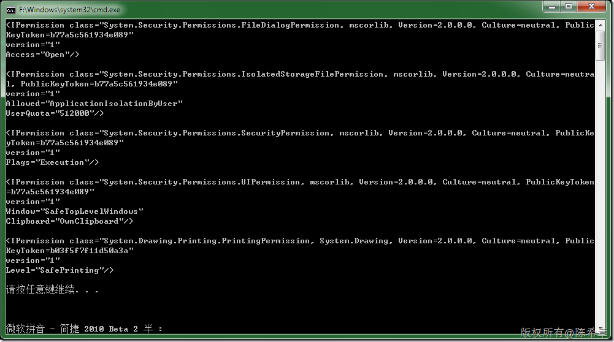
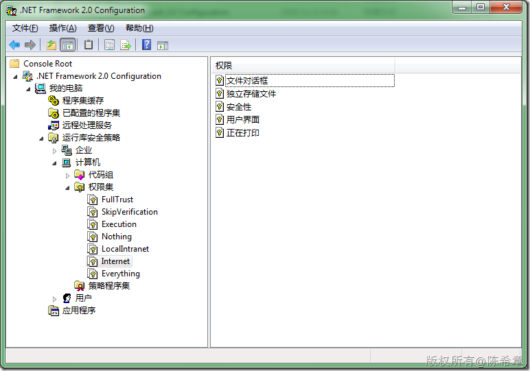

# 。NET ：遍历某个权限集中的权限列表 
> 原文发表于 2009-12-17, 地址: http://www.cnblogs.com/chenxizhang/archive/2009/12/17/1626696.html 


```
using System;
using System.Security;
using System.Security.Policy;


namespace ConsoleApplication1
{
    class Program
    {
        static void Main(string[] args)
        {
            PermissionSet ps = PolicyLevel.CreateAppDomainLevel().GetNamedPermissionSet("Internet");
            foreach (IPermission item in ps)
            {
                Console.WriteLine(item.ToString());
            }
        }
    }
}

```

[](http://images.cnblogs.com/cnblogs_com/chenxizhang/WindowsLiveWriter/NET_12FFE/image_2.png)
.csharpcode, .csharpcode pre
{
 font-size: small;
 color: black;
 font-family: consolas, "Courier New", courier, monospace;
 background-color: #ffffff;
 /*white-space: pre;*/
}
.csharpcode pre { margin: 0em; }
.csharpcode .rem { color: #008000; }
.csharpcode .kwrd { color: #0000ff; }
.csharpcode .str { color: #006080; }
.csharpcode .op { color: #0000c0; }
.csharpcode .preproc { color: #cc6633; }
.csharpcode .asp { background-color: #ffff00; }
.csharpcode .html { color: #800000; }
.csharpcode .attr { color: #ff0000; }
.csharpcode .alt 
{
 background-color: #f4f4f4;
 width: 100%;
 margin: 0em;
}
.csharpcode .lnum { color: #606060; }


[](http://images.cnblogs.com/cnblogs_com/chenxizhang/WindowsLiveWriter/NET_12FFE/image_4.png)

