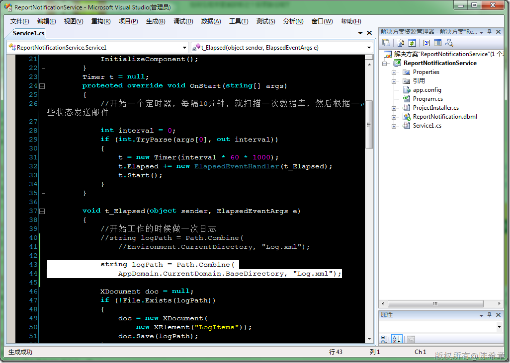

# .NET : 如何在Windows Service中获取到当前工作目录 
> 原文发表于 2009-12-17, 地址: http://www.cnblogs.com/chenxizhang/archive/2009/12/17/1626729.html 

要注意，不能用Environment.CurrentDirectory，而需要用**AppDomain.CurrentDomain.BaseDirectory**

 

