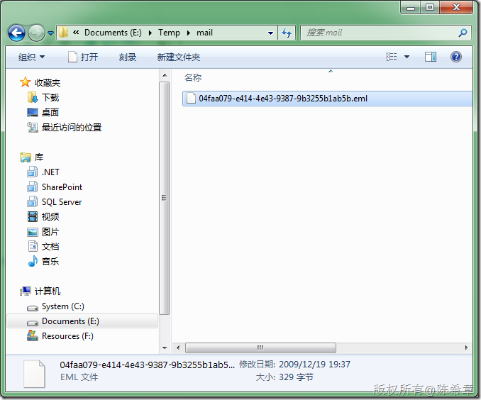
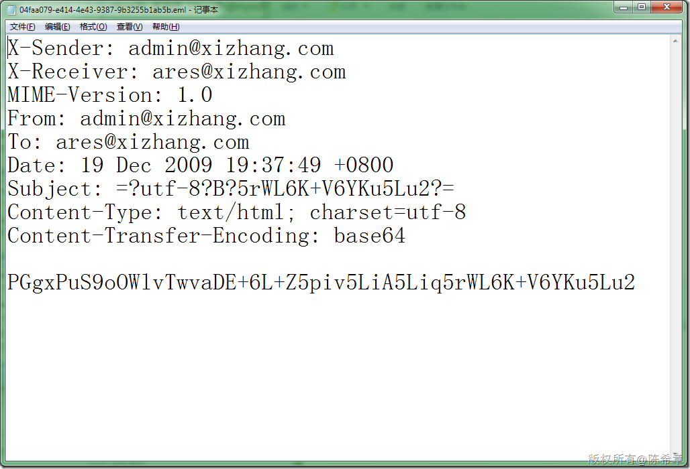
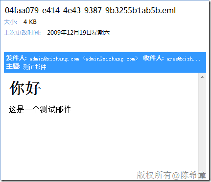

# .NET Mail : 注意Win 7 不再包含SMTP服务 
> 原文发表于 2009-12-19, 地址: http://www.cnblogs.com/chenxizhang/archive/2009/12/19/1627908.html 


前两天在讲.NET的邮件功能时，发现Win 7中居然没有SMTP服务了。经过确认，证实了这一点。

 解决方案，可以安装其他第三方的SMTP服务器。

 如果是出于测试目的，可以直接远程的SMTP服务器，例如smtp.gmail.com之类，前提是你拥有有关的账号。

 另外，还有一个很有意思的测试方式，请参考下面的一个说明

 [http://www.cnblogs.com/zhangronghua/archive/2008/01/09/1031254.html](http://www.cnblogs.com/zhangronghua/archive/2008/01/09/1031254.html "http://www.cnblogs.com/zhangronghua/archive/2008/01/09/1031254.html")

  

  

 一个范例程序如下


```
using System;

using System.Net.Mail;

namespace ConsoleApplication1
{
    class Program
    {
        static void Main(string[] args)
        {
            MailMessage message = new MailMessage();
            message.To.Add("ares@xizhang.com");
            message.Body = "<h1>你好</h1>这是一个测试邮件";
            message.Subject = "测试邮件";
            message.IsBodyHtml = true;

            SmtpClient client = new SmtpClient();
            client.Send(message);

            Console.WriteLine("邮件已经发送");
            Console.Read();

        }
    }
}

```

```
配置文件如下
```

```
<?xml version="1.0" encoding="utf-8" ?>
<configuration>
  <system.net>
    <mailSettings>
      <smtp deliveryMethod="SpecifiedPickupDirectory" from="admin@xizhang.com">
        <specifiedPickupDirectory pickupDirectoryLocation="e:\temp\mail"/>
      </smtp>
    </mailSettings>
  </system.net>
</configuration>
```


.csharpcode, .csharpcode pre
{
 font-size: small;
 color: black;
 font-family: consolas, "Courier New", courier, monospace;
 background-color: #ffffff;
 /*white-space: pre;*/
}
.csharpcode pre { margin: 0em; }
.csharpcode .rem { color: #008000; }
.csharpcode .kwrd { color: #0000ff; }
.csharpcode .str { color: #006080; }
.csharpcode .op { color: #0000c0; }
.csharpcode .preproc { color: #cc6633; }
.csharpcode .asp { background-color: #ffff00; }
.csharpcode .html { color: #800000; }
.csharpcode .attr { color: #ff0000; }
.csharpcode .alt 
{
 background-color: #f4f4f4;
 width: 100%;
 margin: 0em;
}
.csharpcode .lnum { color: #606060; }


测试结果如下


[](http://images.cnblogs.com/cnblogs_com/chenxizhang/WindowsLiveWriter/d023764cd80d.NETMailWin7SMTP_117F7/image_2.png) 


[](http://images.cnblogs.com/cnblogs_com/chenxizhang/WindowsLiveWriter/d023764cd80d.NETMailWin7SMTP_117F7/image_4.png) 


邮件在Outlook中查看的效果


[](http://images.cnblogs.com/cnblogs_com/chenxizhang/WindowsLiveWriter/d023764cd80d.NETMailWin7SMTP_117F7/image_6.png)

