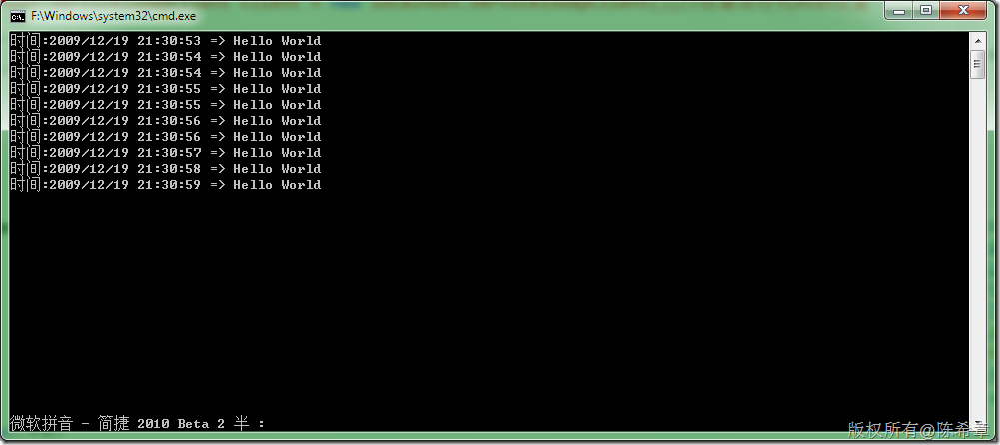

# XML Web Service的异步调用中可能的问题 
> 原文发表于 2009-12-19, 地址: http://www.cnblogs.com/chenxizhang/archive/2009/12/19/1627936.html 


1.服务（很简单）


```
using System;
using System.Collections.Generic;
using System.Linq;
using System.Web;
using System.Web.Services;

namespace WebService1
{
    /// <summary>
    /// Service1 的摘要说明
    /// </summary>
    [WebService(Namespace = "http://tempuri.org/")]
    [WebServiceBinding(ConformsTo = WsiProfiles.BasicProfile1\_1)]
    [System.ComponentModel.ToolboxItem(false)]
    // 若要允许使用 ASP.NET AJAX 从脚本中调用此 Web 服务，请取消对下行的注释。
    // [System.Web.Script.Services.ScriptService]
    public class Service1 : System.Web.Services.WebService
    {

        [WebMethod]
        public string HelloWorld()
        {
            System.Threading.Thread.Sleep(10000);
            return "Hello World";
        }
    }
}

```


.csharpcode, .csharpcode pre
{
 font-size: small;
 color: black;
 font-family: consolas, "Courier New", courier, monospace;
 background-color: #ffffff;
 /*white-space: pre;*/
}
.csharpcode pre { margin: 0em; }
.csharpcode .rem { color: #008000; }
.csharpcode .kwrd { color: #0000ff; }
.csharpcode .str { color: #006080; }
.csharpcode .op { color: #0000c0; }
.csharpcode .preproc { color: #cc6633; }
.csharpcode .asp { background-color: #ffff00; }
.csharpcode .html { color: #800000; }
.csharpcode .attr { color: #ff0000; }
.csharpcode .alt 
{
 background-color: #f4f4f4;
 width: 100%;
 margin: 0em;
}
.csharpcode .lnum { color: #606060; }


2. 客户端（同样很简单）


大家可以比较下面两段代码的区别


```
using System;

namespace ConsoleApplication1
{
    class Program
    {
        static void Main(string[] args)
        {
            for (int i = 0; i < 10; i++)
            {
 **localhost.Service1SoapClient client = new localhost.Service1SoapClient();//注意这行代码的位置**

                client.HelloWorldCompleted += (o1, e1) =>
                {
                    Console.WriteLine("{0}:{1}",DateTime.Now, e1.Result);
                };

                client.HelloWorldAsync();
            }

            Console.Read();
        }
    }
}
**--这一种情况，因为client每次都会创建一个新的实例，所以它的工作是合乎要求的，只返回了10个结果。**
```

[](http://images.cnblogs.com/cnblogs_com/chenxizhang/WindowsLiveWriter/XMLWebService_12F4A/image_4.png)

.csharpcode, .csharpcode pre
{
 font-size: small;
 color: black;
 font-family: consolas, "Courier New", courier, monospace;
 background-color: #ffffff;
 /*white-space: pre;*/
}
.csharpcode pre { margin: 0em; }
.csharpcode .rem { color: #008000; }
.csharpcode .kwrd { color: #0000ff; }
.csharpcode .str { color: #006080; }
.csharpcode .op { color: #0000c0; }
.csharpcode .preproc { color: #cc6633; }
.csharpcode .asp { background-color: #ffff00; }
.csharpcode .html { color: #800000; }
.csharpcode .attr { color: #ff0000; }
.csharpcode .alt 
{
 background-color: #f4f4f4;
 width: 100%;
 margin: 0em;
}
.csharpcode .lnum { color: #606060; }


另外一个写法（这可能是很多朋友会使用的方式）


```
using System;

namespace ConsoleApplication1
{
    class Program
    {
        static void Main(string[] args)
        {

 **localhost.Service1SoapClient client = new localhost.Service1SoapClient();//注意这行代码的位置** 

            for (int i = 0; i < 10; i++)
            {

                client.HelloWorldCompleted += (o1, e1) =>
                {
                    Console.WriteLine("{0}:{1}",DateTime.Now, e1.Result);
                };

                client.HelloWorldAsync();
            }

            Console.Read();
        }
    }
}

```

```
虽然代码很合理，但是它的工作结果却很奇怪。它返回的结果有70行。
```

```
[](http://images.cnblogs.com/cnblogs_com/chenxizhang/WindowsLiveWriter/XMLWebService_12F4A/image_2.png) 
```

```
**这说明什么问题呢？**
```

```
**也就是说，如果一个服务代理的异步调用还没有完成之前，最后是不要继续调用它的其他异步操作。否则就会造成奇怪的现象。**
```

.csharpcode, .csharpcode pre
{
 font-size: small;
 color: black;
 font-family: consolas, "Courier New", courier, monospace;
 background-color: #ffffff;
 /*white-space: pre;*/
}
.csharpcode pre { margin: 0em; }
.csharpcode .rem { color: #008000; }
.csharpcode .kwrd { color: #0000ff; }
.csharpcode .str { color: #006080; }
.csharpcode .op { color: #0000c0; }
.csharpcode .preproc { color: #cc6633; }
.csharpcode .asp { background-color: #ffff00; }
.csharpcode .html { color: #800000; }
.csharpcode .attr { color: #ff0000; }
.csharpcode .alt 
{
 background-color: #f4f4f4;
 width: 100%;
 margin: 0em;
}
.csharpcode .lnum { color: #606060; }


