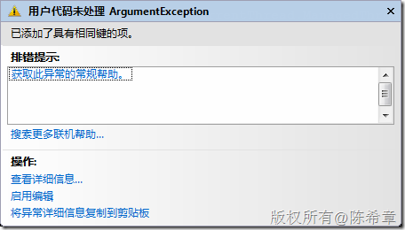

# WCF：并发模型（ConcurrencyMode) 
> 原文发表于 2009-12-19, 地址: http://www.cnblogs.com/chenxizhang/archive/2009/12/19/1627946.html 


1. 什么是WCF并发问题

 并发指的是，一个服务实例的成员被多个请求同时进行访问并且修改的可能性及其影响

  

 2. 什么时候会发生并发问题

 根据实例模型的不同，我们大致可以分解为

 * Single和PerSession（默认），这两种实例模型因为涉及到实例的共享，所以存在并发的可能性。
* PerCall，因为每次调用都是单独的实例，所以不存在并发的可能。

  

 3. WCF如何做并发控制

 WCF有三种并发选项，分别是

 * Single : 单线程，同一时间只有一个请求可以对实例进行操作。通过加锁的方式来实现
* Reentrant ：类似于Single，但可以重入。适合于Callback的情况
* Multiple：多线程，请求对实例访问期间不加锁

  

 本文主要就是讨论PerSession和Single这两种实例模型情况下的并发问题及其处理方案。事实上，它们也很类似，所以主要讨论PerSession即可

 因为Single和Reentrant都是单线程模型，它们都会通过加锁的方式来对实例进行保护。所以我们没有必要讨论它们，除了需要了解：它们会降低吞吐量，但保证了安全性。

  

 所以，我们这里讨论的并发问题，就是PerSession这个实例模型结合Multiple这个并发模型的情况。

  

 1. 合约


```
using System;
using System.Collections.Generic;
using System.Text;

using System.ServiceModel;

namespace Contracts
{
    [ServiceContract]
    public interface IHelloWorld
    {
        [OperationContract(IsOneWay=true)]
        //为了演示多线程同时发起请求，特意将操作设置为OneWay
        void HelloWorld();
    }
}

```

.csharpcode, .csharpcode pre
{
 font-size: small;
 color: black;
 font-family: consolas, "Courier New", courier, monospace;
 background-color: #ffffff;
 /*white-space: pre;*/
}
.csharpcode pre { margin: 0em; }
.csharpcode .rem { color: #008000; }
.csharpcode .kwrd { color: #0000ff; }
.csharpcode .str { color: #006080; }
.csharpcode .op { color: #0000c0; }
.csharpcode .preproc { color: #cc6633; }
.csharpcode .asp { background-color: #ffff00; }
.csharpcode .html { color: #800000; }
.csharpcode .attr { color: #ff0000; }
.csharpcode .alt 
{
 background-color: #f4f4f4;
 width: 100%;
 margin: 0em;
}
.csharpcode .lnum { color: #606060; }

2. 服务


```
using System;
using System.Collections.Generic;
using System.ServiceModel;
using System.Threading;
namespace Services
{
    [
        **ServiceBehavior(ConcurrencyMode = ConcurrencyMode.Multiple)**
    ]
    public class HelloWorldService:Contracts.IHelloWorld
    {

        private int messageCount;
        private Dictionary<int, string> dic = new Dictionary<int, string>();
        

        #region IHelloWorld 成员


        void Contracts.IHelloWorld.HelloWorld()
        {
            dic.Add(messageCount, "Hello,World");

            Console.WriteLine("序列号{0},线程号{1}", messageCount, Thread.CurrentThread.ManagedThreadId);
            messageCount++;

            Thread.Sleep(50);
        }

        #endregion
    }
}

```

.csharpcode, .csharpcode pre
{
 font-size: small;
 color: black;
 font-family: consolas, "Courier New", courier, monospace;
 background-color: #ffffff;
 /*white-space: pre;*/
}
.csharpcode pre { margin: 0em; }
.csharpcode .rem { color: #008000; }
.csharpcode .kwrd { color: #0000ff; }
.csharpcode .str { color: #006080; }
.csharpcode .op { color: #0000c0; }
.csharpcode .preproc { color: #cc6633; }
.csharpcode .asp { background-color: #ffff00; }
.csharpcode .html { color: #800000; }
.csharpcode .attr { color: #ff0000; }
.csharpcode .alt 
{
 background-color: #f4f4f4;
 width: 100%;
 margin: 0em;
}
.csharpcode .lnum { color: #606060; }

3. 宿主


```
using System;
using System.ServiceModel;
using System.ServiceModel.Description;

namespace Host
{
    class Program
    {
        static void Main(string[] args)
        {
            using (ServiceHost host =
                new ServiceHost(
                    typeof(Services.HelloWorldService),
                    new Uri("http://localhost:8000/HelloWorldService")
                    ))
            {
                host.AddServiceEndpoint(
                    typeof(Contracts.IHelloWorld).ToString(),
                    new WSHttpBinding(),
                    "");


                ServiceMetadataBehavior behavior = new ServiceMetadataBehavior();
                behavior.HttpGetEnabled = true;
                host.Description.Behaviors.Add(behavior);

                host.AddServiceEndpoint(
                    "IMetadataExchange",
                    MetadataExchangeBindings.CreateMexHttpBinding(),
                    "mex");

                host.Open();
                Console.WriteLine("服务器已经准备好");
                Console.Read();
            }
        }
    }
}

```

.csharpcode, .csharpcode pre
{
 font-size: small;
 color: black;
 font-family: consolas, "Courier New", courier, monospace;
 background-color: #ffffff;
 /*white-space: pre;*/
}
.csharpcode pre { margin: 0em; }
.csharpcode .rem { color: #008000; }
.csharpcode .kwrd { color: #0000ff; }
.csharpcode .str { color: #006080; }
.csharpcode .op { color: #0000c0; }
.csharpcode .preproc { color: #cc6633; }
.csharpcode .asp { background-color: #ffff00; }
.csharpcode .html { color: #800000; }
.csharpcode .attr { color: #ff0000; }
.csharpcode .alt 
{
 background-color: #f4f4f4;
 width: 100%;
 margin: 0em;
}
.csharpcode .lnum { color: #606060; }

4. 客户端（通过svcutil生成代理类）


配置文件


```
<?xml version="1.0" encoding="utf-8" ?>
<configuration>
    <system.serviceModel>
        <bindings>
            <wsHttpBinding>
                <binding name="WSHttpBinding\_IHelloWorld" closeTimeout="00:01:00"
                    openTimeout="00:01:00" receiveTimeout="00:10:00" sendTimeout="00:01:00"
                    bypassProxyOnLocal="false" transactionFlow="false" hostNameComparisonMode="StrongWildcard"
                    maxBufferPoolSize="524288" maxReceivedMessageSize="65536"
                    messageEncoding="Text" textEncoding="utf-8" useDefaultWebProxy="true"
                    allowCookies="false">
                    <readerQuotas maxDepth="32" maxStringContentLength="8192" maxArrayLength="16384"
                        maxBytesPerRead="4096" maxNameTableCharCount="16384" />
                    <reliableSession ordered="true" inactivityTimeout="00:10:00"
                        enabled="false" />
                    <security mode="Message">
                        <transport clientCredentialType="Windows" proxyCredentialType="None"
                            realm="">
                            <extendedProtectionPolicy policyEnforcement="Never" />
                        </transport>
                        <message clientCredentialType="Windows" negotiateServiceCredential="true"
                            algorithmSuite="Default" establishSecurityContext="true" />
                    </security>
                </binding>
            </wsHttpBinding>
        </bindings>
        <client>
            <endpoint address="http://localhost:8000/HelloWorldService" binding="wsHttpBinding"
                bindingConfiguration="WSHttpBinding\_IHelloWorld" contract="localhost.IHelloWorld"
                name="WSHttpBinding\_IHelloWorld">
                <identity>
                    <userPrincipalName value="ChenXizhang-PC\ChenXizhang" />
                </identity>
            </endpoint>
        </client>
    </system.serviceModel>
</configuration>
```

```
 
```

```
代码
```

```
using System;

namespace Client
{
    class Program
    {
        static void Main(string[] args)
        {

            localhost.HelloWorldClient client = new Client.localhost.HelloWorldClient();
            for (int i = 0; i < 1000; i++)//发起1000次异步调用
            {
                client.BeginHelloWorld(null, null);
            }

            Console.Read();
        }
    }
}

```

.csharpcode, .csharpcode pre
{
 font-size: small;
 color: black;
 font-family: consolas, "Courier New", courier, monospace;
 background-color: #ffffff;
 /*white-space: pre;*/
}
.csharpcode pre { margin: 0em; }
.csharpcode .rem { color: #008000; }
.csharpcode .kwrd { color: #0000ff; }
.csharpcode .str { color: #006080; }
.csharpcode .op { color: #0000c0; }
.csharpcode .preproc { color: #cc6633; }
.csharpcode .asp { background-color: #ffff00; }
.csharpcode .html { color: #800000; }
.csharpcode .attr { color: #ff0000; }
.csharpcode .alt 
{
 background-color: #f4f4f4;
 width: 100%;
 margin: 0em;
}
.csharpcode .lnum { color: #606060; }

.csharpcode, .csharpcode pre
{
 font-size: small;
 color: black;
 font-family: consolas, "Courier New", courier, monospace;
 background-color: #ffffff;
 /*white-space: pre;*/
}
.csharpcode pre { margin: 0em; }
.csharpcode .rem { color: #008000; }
.csharpcode .kwrd { color: #0000ff; }
.csharpcode .str { color: #006080; }
.csharpcode .op { color: #0000c0; }
.csharpcode .preproc { color: #cc6633; }
.csharpcode .asp { background-color: #ffff00; }
.csharpcode .html { color: #800000; }
.csharpcode .attr { color: #ff0000; }
.csharpcode .alt 
{
 background-color: #f4f4f4;
 width: 100%;
 margin: 0em;
}
.csharpcode .lnum { color: #606060; }

 


测试程序，我们发现在运行到第148次的时候发生了异常


[](http://images.cnblogs.com/cnblogs_com/chenxizhang/WindowsLiveWriter/WCFConcurrencyMode_6D32/image_2.png) 


[](http://images.cnblogs.com/cnblogs_com/chenxizhang/WindowsLiveWriter/WCFConcurrencyMode_6D32/image_4.png) 


这说明什么问题呢？也就是说，之前肯定是有不同的线程同时对messagecount这个变量进行了修改，但是没有同步。也就是它们同时在修改，而不是一个修改完了之后另外一个才开始进入代码。（这就是传说中的并发问题）


 


那么如何来解决这样的问题呢？因为Multiple模式本身不提供保护，所以，我们得自己来保护这个变量。


将服务修改为下面这样的代码


 


```
using System;
using System.Collections.Generic;
using System.ServiceModel;
using System.Threading;
namespace Services
{
    [
        ServiceBehavior(ConcurrencyMode = ConcurrencyMode.Multiple)
    ]
    public class HelloWorldService:Contracts.IHelloWorld
    {

        private int messageCount;
        private Dictionary<int, string> dic = new Dictionary<int, string>();

        Mutex m = new Mutex(false);

        #region IHelloWorld 成员


        void Contracts.IHelloWorld.HelloWorld()
        {
            try
            {

                m.WaitOne();

                dic.Add(messageCount, "Hello,World");
                Console.WriteLine("序列号{0},线程号{1}", messageCount, Thread.CurrentThread.ManagedThreadId);
                messageCount++;

                Thread.Sleep(50);

            }
            finally
            {
                m.ReleaseMutex();
            }
        }

        #endregion
    }
}

```

.csharpcode, .csharpcode pre
{
 font-size: small;
 color: black;
 font-family: consolas, "Courier New", courier, monospace;
 background-color: #ffffff;
 /*white-space: pre;*/
}
.csharpcode pre { margin: 0em; }
.csharpcode .rem { color: #008000; }
.csharpcode .kwrd { color: #0000ff; }
.csharpcode .str { color: #006080; }
.csharpcode .op { color: #0000c0; }
.csharpcode .preproc { color: #cc6633; }
.csharpcode .asp { background-color: #ffff00; }
.csharpcode .html { color: #800000; }
.csharpcode .attr { color: #ff0000; }
.csharpcode .alt 
{
 background-color: #f4f4f4;
 width: 100%;
 margin: 0em;
}
.csharpcode .lnum { color: #606060; }

再次测试则可以避免刚才出现的问题

