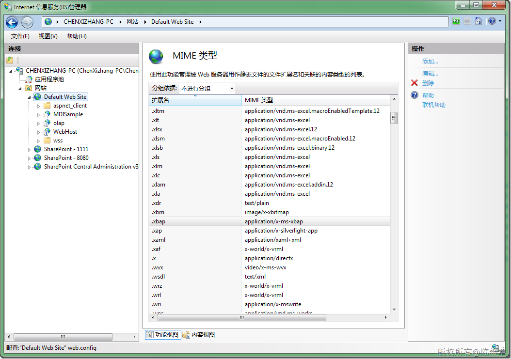

# Silverlight: 服务器配置 
> 原文发表于 2009-12-21, 地址: http://www.cnblogs.com/chenxizhang/archive/2009/12/21/1628887.html 

要让网站可以运行Silverlight应用程序，需要添加有关的MIME类型

 　　.xaml application/xaml+xml   
　　.xap application/x-Silverlight-app IIS 6的话，需要手工添加一下，而IIS 7，默认就有了

 

