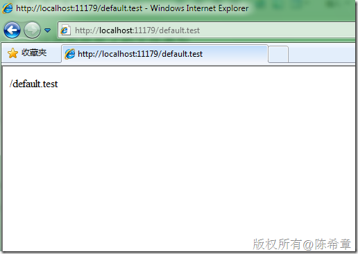
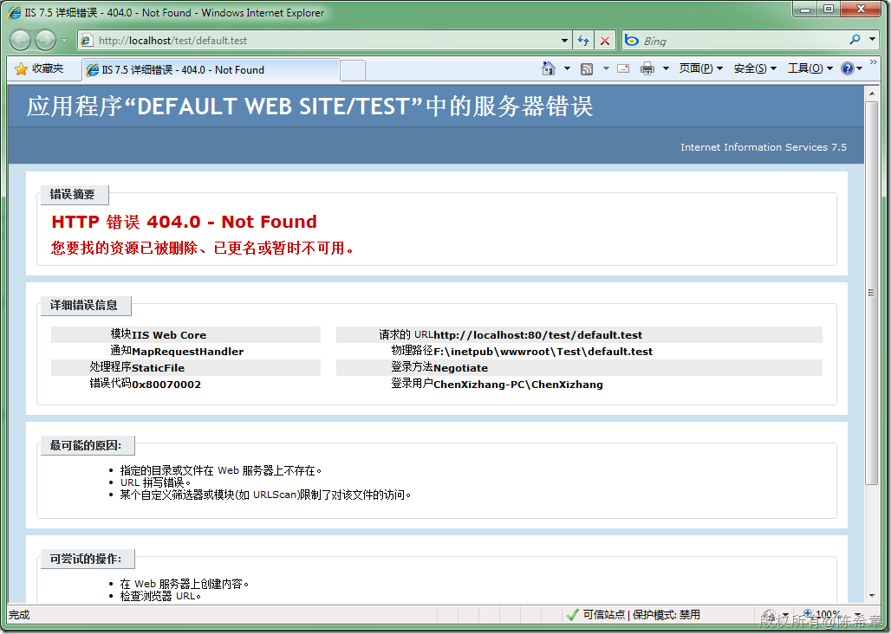
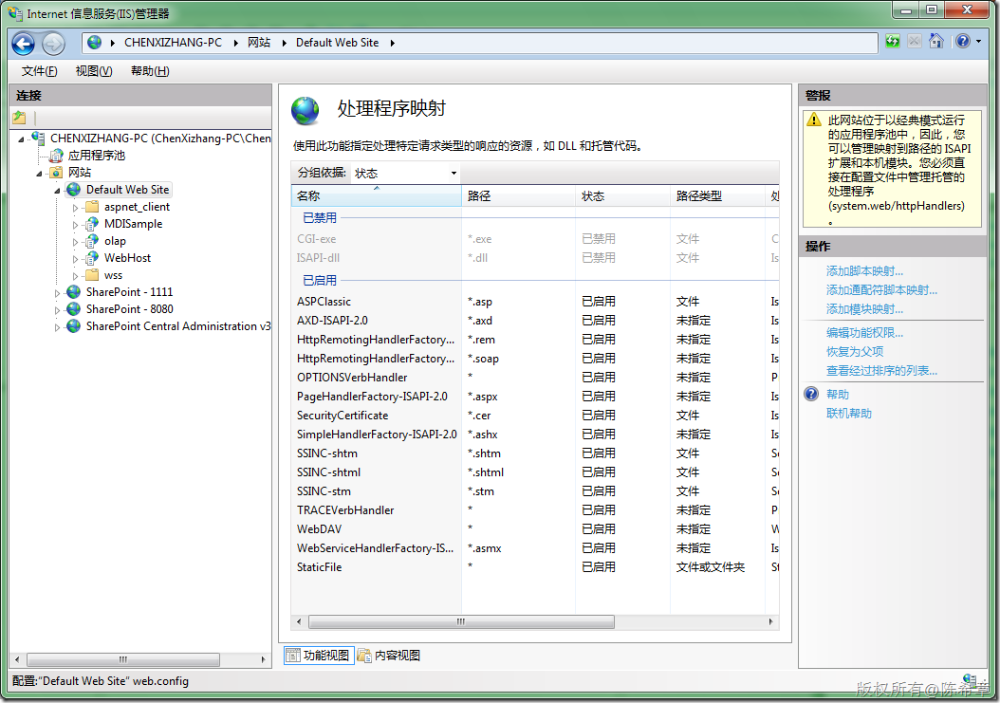
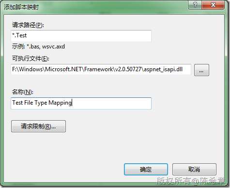
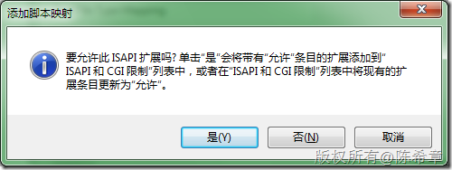
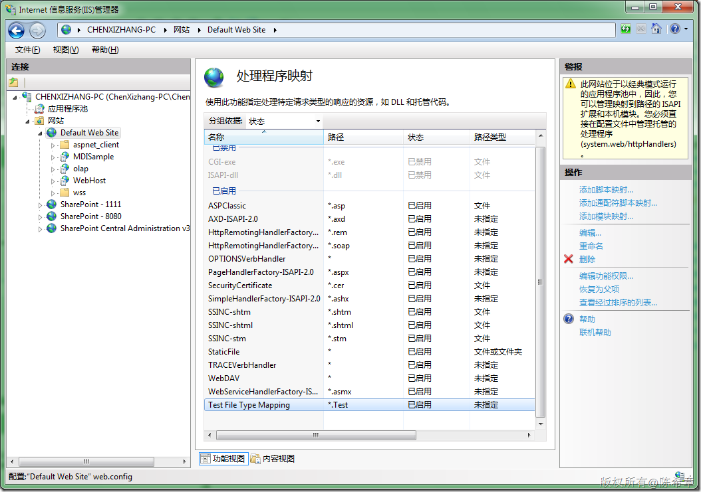
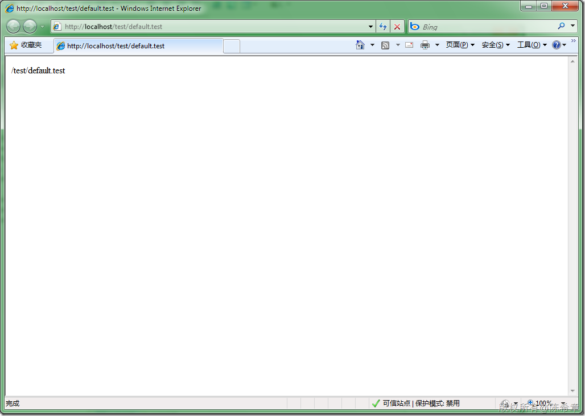

# ASP.NET : 如何为网站添加自定义的文件类型 
> 原文发表于 2009-12-21, 地址: http://www.cnblogs.com/chenxizhang/archive/2009/12/21/1628917.html 


 我们知道，在ASP.NET网站中，默认页面的扩展名是aspx.要想实现在网站中提供特殊的文件类型，例如Test之类的,就可以考虑通过HttpHandler来实现。下面是一个小的例子

 1. HttpHandler


```
using System;
using System.Collections.Generic;
using System.Linq;
using System.Web;

namespace TestWeb
{
    public class MyHandler:IHttpHandler
    {
        #region IHttpHandler 成员

        public bool IsReusable
        {
            get { return false; }
        }

        public void ProcessRequest(HttpContext context)
        {
            context.Response.Write(context.Request.Path);
        }

        #endregion
    }
}

```


.csharpcode, .csharpcode pre
{
 font-size: small;
 color: black;
 font-family: consolas, "Courier New", courier, monospace;
 background-color: #ffffff;
 /*white-space: pre;*/
}
.csharpcode pre { margin: 0em; }
.csharpcode .rem { color: #008000; }
.csharpcode .kwrd { color: #0000ff; }
.csharpcode .str { color: #006080; }
.csharpcode .op { color: #0000c0; }
.csharpcode .preproc { color: #cc6633; }
.csharpcode .asp { background-color: #ffff00; }
.csharpcode .html { color: #800000; }
.csharpcode .attr { color: #ff0000; }
.csharpcode .alt 
{
 background-color: #f4f4f4;
 width: 100%;
 margin: 0em;
}
.csharpcode .lnum { color: #606060; }


2. 配置文件注册


```
<add verb="*" path="*.Test" type="TestWeb.MyHandler,TestWeb"/>
```


.csharpcode, .csharpcode pre
{
 font-size: small;
 color: black;
 font-family: consolas, "Courier New", courier, monospace;
 background-color: #ffffff;
 /*white-space: pre;*/
}
.csharpcode pre { margin: 0em; }
.csharpcode .rem { color: #008000; }
.csharpcode .kwrd { color: #0000ff; }
.csharpcode .str { color: #006080; }
.csharpcode .op { color: #0000c0; }
.csharpcode .preproc { color: #cc6633; }
.csharpcode .asp { background-color: #ffff00; }
.csharpcode .html { color: #800000; }
.csharpcode .attr { color: #ff0000; }
.csharpcode .alt 
{
 background-color: #f4f4f4;
 width: 100%;
 margin: 0em;
}
.csharpcode .lnum { color: #606060; }


3. 在VS中直接调试


[](http://images.cnblogs.com/cnblogs_com/chenxizhang/WindowsLiveWriter/ASP.NET_D6DD/image_2.png)


 


4. 发布到IIS后再测试


[](http://images.cnblogs.com/cnblogs_com/chenxizhang/WindowsLiveWriter/ASP.NET_D6DD/image_4.png) 


我们尝试在IE中访问该类文件，则出现了一个错误，说是找不到


[](http://images.cnblogs.com/cnblogs_com/chenxizhang/WindowsLiveWriter/ASP.NET_D6DD/image_6.png) 


这是因为什么呢？这是因为IIS无法识别Test这个文件类型


 


5. 向IIS注册该类型


[](http://images.cnblogs.com/cnblogs_com/chenxizhang/WindowsLiveWriter/ASP.NET_D6DD/image_8.png) 


点击“处理程序映射”


[](http://images.cnblogs.com/cnblogs_com/chenxizhang/WindowsLiveWriter/ASP.NET_D6DD/image_10.png) 


点击“添加脚本映射...”


[](http://images.cnblogs.com/cnblogs_com/chenxizhang/WindowsLiveWriter/ASP.NET_D6DD/image_12.png) 


[](http://images.cnblogs.com/cnblogs_com/chenxizhang/WindowsLiveWriter/ASP.NET_D6DD/image_14.png) 


[](http://images.cnblogs.com/cnblogs_com/chenxizhang/WindowsLiveWriter/ASP.NET_D6DD/image_16.png) 


做完上面的配置之后，就可以在浏览器中使用这种文件类型了


[](http://images.cnblogs.com/cnblogs_com/chenxizhang/WindowsLiveWriter/ASP.NET_D6DD/image_18.png)

