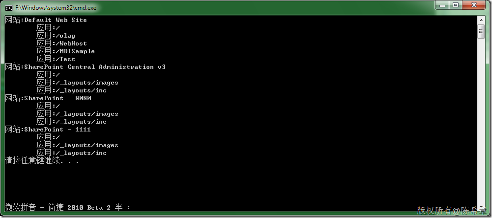

# IIS 7 提供的.NET 管理接口 
> 原文发表于 2009-12-21, 地址: http://www.cnblogs.com/chenxizhang/archive/2009/12/21/1628967.html 


参考文章：

 [http://blogs.msdn.com/carlosag/archive/2006/04/17/MicrosoftWebAdministration.aspx](http://blogs.msdn.com/carlosag/archive/2006/04/17/MicrosoftWebAdministration.aspx "http://blogs.msdn.com/carlosag/archive/2006/04/17/MicrosoftWebAdministration.aspx")

 [http://dflying.cnblogs.com/archive/2006/04/17/377276.html](http://dflying.cnblogs.com/archive/2006/04/17/377276.html "http://dflying.cnblogs.com/archive/2006/04/17/377276.html")

  

 1. 添加引用

 [](http://images.cnblogs.com/cnblogs_com/chenxizhang/WindowsLiveWriter/IIS7.NET_E28F/image_2.png) 

 2. 编写代码


```
using System;
using System.Collections.Generic;
using System.Linq;
using System.Text;
using Microsoft.Web.Administration;

namespace ConsoleApplication1
{
    class Program
    {
        static void Main(string[] args)
        {
            //取得所有的网站及其应用程序的信息

            ServerManager iis = new ServerManager();
            foreach (var item in iis.Sites)
            {
                Console.WriteLine("网站:{0}", item.Name);
                foreach (var app in item.Applications)
                {
                    Console.WriteLine("\t应用:{0}", app.Path);
                }

            }
        }
    }
}

```

.csharpcode, .csharpcode pre
{
 font-size: small;
 color: black;
 font-family: consolas, "Courier New", courier, monospace;
 background-color: #ffffff;
 /*white-space: pre;*/
}
.csharpcode pre { margin: 0em; }
.csharpcode .rem { color: #008000; }
.csharpcode .kwrd { color: #0000ff; }
.csharpcode .str { color: #006080; }
.csharpcode .op { color: #0000c0; }
.csharpcode .preproc { color: #cc6633; }
.csharpcode .asp { background-color: #ffff00; }
.csharpcode .html { color: #800000; }
.csharpcode .attr { color: #ff0000; }
.csharpcode .alt 
{
 background-color: #f4f4f4;
 width: 100%;
 margin: 0em;
}
.csharpcode .lnum { color: #606060; }

 


3. 运行效果


[](http://images.cnblogs.com/cnblogs_com/chenxizhang/WindowsLiveWriter/IIS7.NET_E28F/image_4.png)

