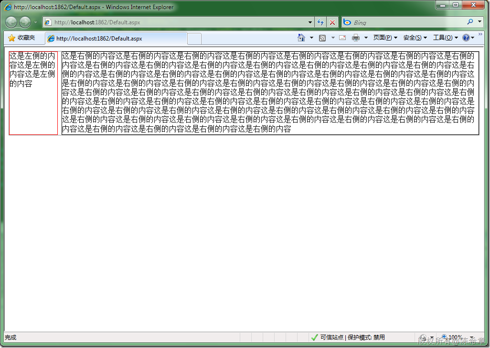

# div如何实现左右两个panel并排，而且高度一致 
> 原文发表于 2009-12-26, 地址: http://www.cnblogs.com/chenxizhang/archive/2009/12/26/1632919.html 


```
<%@ Page Language="C#" AutoEventWireup="true" CodeBehind="Default.aspx.cs" Inherits="WebApplication1.\_Default" %>

<!DOCTYPE html PUBLIC "-//W3C//DTD XHTML 1.0 Transitional//EN" "http://www.w3.org/TR/xhtml1/DTD/xhtml1-transitional.dtd">
<html xmlns="http://www.w3.org/1999/xhtml">
<head runat="server">
    <title></title>
    <script src="jquery-1.3.2-vsdoc.js"></script>
    <script type="text/javascript">
        $(function() {
            var div1 = $("#left");
            var div2 = $("#right");

            var h = GetMaxHeight(div1, div2);
            div1.css("height", h);
            div2.css("height", h);
            
        });


        function GetMaxHeight(div1, div2) {
            var h1 = $(div1).attr("offsetHeight");
            var h2 = $(div2).attr("offsetHeight");

            return Math.max(h1, h2);
        }
        
    </script>
</head>
<body>
    <form id="form1" runat="server">
    <div id="list" style="border: solid 1px #999;">
        <div id="left" style="border: 1px solid red; float: left; width: 100px; overflow: hidden;">
            这是左侧的内容这是左侧的内容这是左侧的内容
        </div>
        <div id="right" style="margin-left: 110px; border: 1px solid #000;">
          这是右侧的内容这是右侧的内容这是右侧的内容这是右侧的内容这是右侧的内容这是右侧的内容这是右侧的内容这是右侧的内容这是右侧的内容这是右侧的内容这是右侧的内容这是右侧的内容这是右侧的内容这是右侧的内容这是右侧的内容这是右侧的内容这是右侧的内容这是右侧的内容这是右侧的内容这是右侧的内容这是右侧的内容这是右侧的内容这是右侧的内容这是右侧的内容这是右侧的内容这是右侧的内容这是右侧的内容这是右侧的内容这是右侧的内容这是右侧的内容这是右侧的内容这是右侧的内容这是右侧的内容这是右侧的内容这是右侧的内容这是右侧的内容这是右侧的内容这是右侧的内容这是右侧的内容这是右侧的内容这是右侧的内容这是右侧的内容这是右侧的内容这是右侧的内容这是右侧的内容这是右侧的内容这是右侧的内容这是右侧的内容这是右侧的内容这是右侧的内容这是右侧的内容这是右侧的内容这是右侧的内容这是右侧的内容这是右侧的内容这是右侧的内容这是右侧的内容这是右侧的内容这是右侧的内容这是右侧的内容这是右侧的内容这是右侧的内容这是右侧的内容这是右侧的内容这是右侧的内容这是右侧的内容

        </div>
        <div style="clear: both;" title="该标签用于清除浮动，使left和right的父标签能自适应高度！">
        </div>
    </div>
    </form>
</body>
</html>

```

```
通过一个特殊的div,将其style设置为clear为both即可。这样上面的两个div就不可能浮动超出下面这个div。
```

```
关于这个属性，可以参考这篇文章
```

```
[http://www.w3school.com.cn/css/pr\_class\_clear.asp](http://www.w3school.com.cn/css/pr_class_clear.asp "http://www.w3school.com.cn/css/pr_class_clear.asp")
```

```
 
```

```
而关于高度相同，目前据我所知，一般都是通过javascript来强制干预。需要注意的是，我们需要读取offsetHeight属性。
```

```
[](http://images.cnblogs.com/cnblogs_com/chenxizhang/WindowsLiveWriter/divpanel_FFB3/image_2.png) 
```

```
 
```

.csharpcode, .csharpcode pre
{
 font-size: small;
 color: black;
 font-family: consolas, "Courier New", courier, monospace;
 background-color: #ffffff;
 /*white-space: pre;*/
}
.csharpcode pre { margin: 0em; }
.csharpcode .rem { color: #008000; }
.csharpcode .kwrd { color: #0000ff; }
.csharpcode .str { color: #006080; }
.csharpcode .op { color: #0000c0; }
.csharpcode .preproc { color: #cc6633; }
.csharpcode .asp { background-color: #ffff00; }
.csharpcode .html { color: #800000; }
.csharpcode .attr { color: #ff0000; }
.csharpcode .alt 
{
 background-color: #f4f4f4;
 width: 100%;
 margin: 0em;
}
.csharpcode .lnum { color: #606060; }
