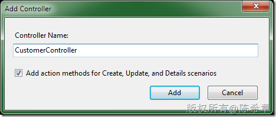
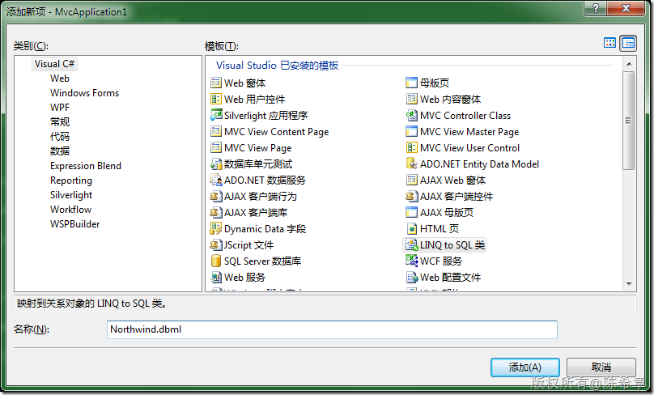
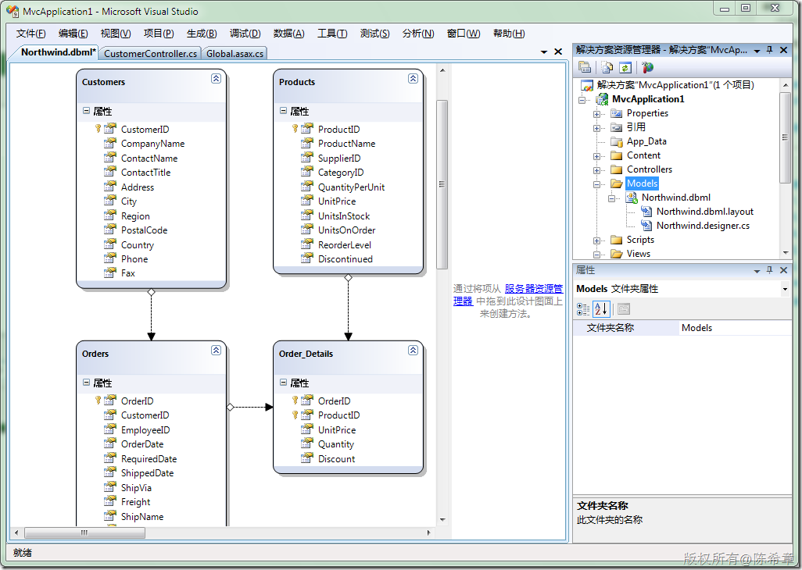
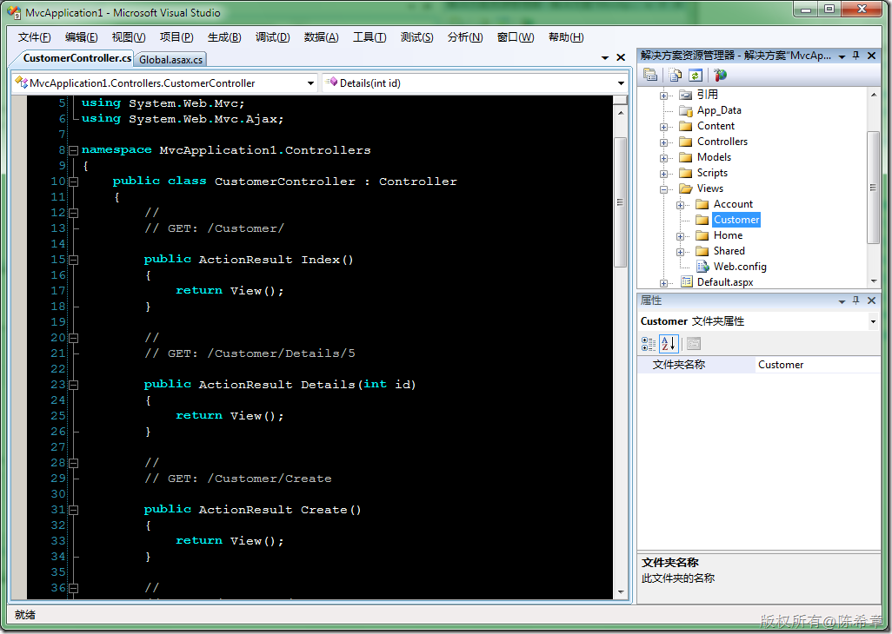
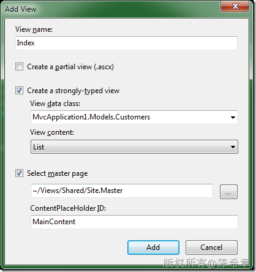
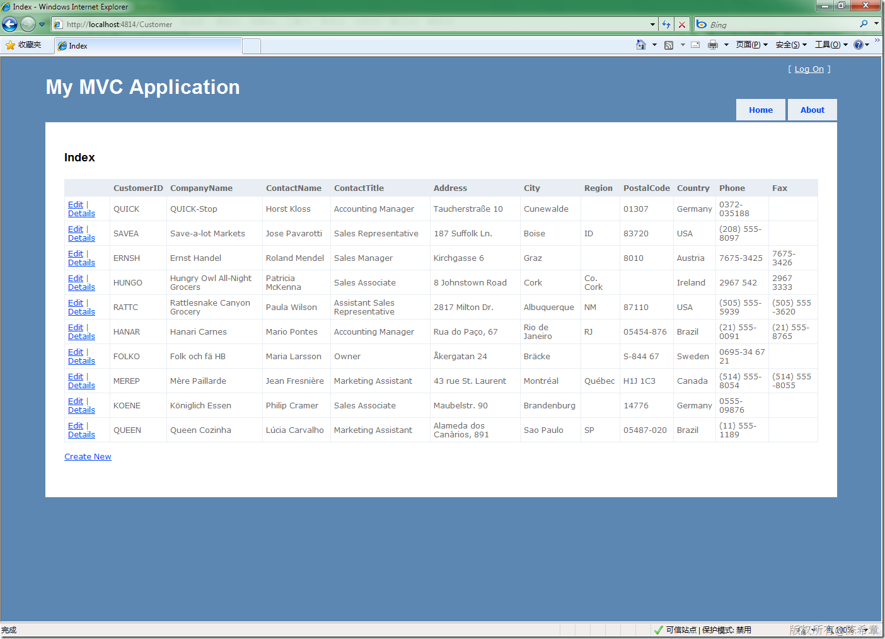

# ASP.NET MVC 实战演练 
> 原文发表于 2009-12-27, 地址: http://www.cnblogs.com/chenxizhang/archive/2009/12/27/1633324.html 


关于MVC，已经有了很多的讨论。这一篇我用一个简单的实例演示了如何使用它，以及几个常见问题的解答。我推荐大家要了解一下MVC，尽可能地话，提前尝试用他做一些项目，这样理解会更加深刻

  

 1. 添加一个Controller。在Controllers目录，点右键，有专门一个菜单项

 [](http://images.cnblogs.com/cnblogs_com/chenxizhang/WindowsLiveWriter/ASP.NETMVC_B4F2/image_4.png) 

 注意：这里的命名规范是后缀为Controller

 默认生成的代码如下


```
using System;
using System.Collections.Generic;
using System.Linq;
using System.Web;
using System.Web.Mvc;
using System.Web.Mvc.Ajax;

namespace MvcApplication1.Controllers
{
    public class CustomerController : Controller
    {
        //
        // GET: /Customer/

        public ActionResult Index()
        {
            return View();
        }

        //
        // GET: /Customer/Details/5

        public ActionResult Details(int id)
        {
            return View();
        }

        //
        // GET: /Customer/Create

        public ActionResult Create()
        {
            return View();
        } 

        //
        // POST: /Customer/Create

        [AcceptVerbs(HttpVerbs.Post)]
        public ActionResult Create(FormCollection collection)
        {
            try
            {
                // TODO: Add insert logic here

                return RedirectToAction("Index");
            }
            catch
            {
                return View();
            }
        }

        //
        // GET: /Customer/Edit/5
 
        public ActionResult Edit(int id)
        {
            return View();
        }

        //
        // POST: /Customer/Edit/5

        [AcceptVerbs(HttpVerbs.Post)]
        public ActionResult Edit(int id, FormCollection collection)
        {
            try
            {
                // TODO: Add update logic here
 
                return RedirectToAction("Index");
            }
            catch
            {
                return View();
            }
        }
    }
}

```

.csharpcode, .csharpcode pre
{
 font-size: small;
 color: black;
 font-family: consolas, "Courier New", courier, monospace;
 background-color: #ffffff;
 /*white-space: pre;*/
}
.csharpcode pre { margin: 0em; }
.csharpcode .rem { color: #008000; }
.csharpcode .kwrd { color: #0000ff; }
.csharpcode .str { color: #006080; }
.csharpcode .op { color: #0000c0; }
.csharpcode .preproc { color: #cc6633; }
.csharpcode .asp { background-color: #ffff00; }
.csharpcode .html { color: #800000; }
.csharpcode .attr { color: #ff0000; }
.csharpcode .alt 
{
 background-color: #f4f4f4;
 width: 100%;
 margin: 0em;
}
.csharpcode .lnum { color: #606060; }

 


2. 添加一个数据模型


[](http://images.cnblogs.com/cnblogs_com/chenxizhang/WindowsLiveWriter/ASP.NETMVC_B4F2/image_6.png) 


[](http://images.cnblogs.com/cnblogs_com/chenxizhang/WindowsLiveWriter/ASP.NETMVC_B4F2/image_8.png) 


3. 添加视图


首先准备一个文件夹：Customer


[](http://images.cnblogs.com/cnblogs_com/chenxizhang/WindowsLiveWriter/ASP.NETMVC_B4F2/image_10.png) 


选择该文件夹,在右键菜单中选择"添加"=>"View"


[](http://images.cnblogs.com/cnblogs_com/chenxizhang/WindowsLiveWriter/ASP.NETMVC_B4F2/image_22.png) 


点击“Add”之后，可以看到如下代码


```
<%@ Page Title="" Language="C#" MasterPageFile="~/Views/Shared/Site.Master" Inherits="System.Web.Mvc.ViewPage<IEnumerable<MvcApplication1.Models.Customers>>" %>

<asp:Content ID="Content1" ContentPlaceHolderID="TitleContent" runat="server">
    Index
</asp:Content>

<asp:Content ID="Content2" ContentPlaceHolderID="MainContent" runat="server">

    <h2>Index</h2>

    <table>
        <tr>
            <th></th>
            <th>
                CustomerID
            </th>
            <th>
                CompanyName
            </th>
            <th>
                ContactName
            </th>
            <th>
                ContactTitle
            </th>
            <th>
                Address
            </th>
            <th>
                City
            </th>
            <th>
                Region
            </th>
            <th>
                PostalCode
            </th>
            <th>
                Country
            </th>
            <th>
                Phone
            </th>
            <th>
                Fax
            </th>
        </tr>

    <% foreach (var item in Model) { %>
    
        <tr>
            <td>
                <%= Html.ActionLink("Edit", "Edit", new { id=item.CustomerID }) %> |
                <%= Html.ActionLink("Details", "Details", new { id=item.CustomerID })%>
            </td>
            <td>
                <%= Html.Encode(item.CustomerID) %>
            </td>
            <td>
                <%= Html.Encode(item.CompanyName) %>
            </td>
            <td>
                <%= Html.Encode(item.ContactName) %>
            </td>
            <td>
                <%= Html.Encode(item.ContactTitle) %>
            </td>
            <td>
                <%= Html.Encode(item.Address) %>
            </td>
            <td>
                <%= Html.Encode(item.City) %>
            </td>
            <td>
                <%= Html.Encode(item.Region) %>
            </td>
            <td>
                <%= Html.Encode(item.PostalCode) %>
            </td>
            <td>
                <%= Html.Encode(item.Country) %>
            </td>
            <td>
                <%= Html.Encode(item.Phone) %>
            </td>
            <td>
                <%= Html.Encode(item.Fax) %>
            </td>
        </tr>
    
    <% } %>

    </table>

    <p>
        <%= Html.ActionLink("Create New", "Create") %>
    </p>

</asp:Content>


```

.csharpcode, .csharpcode pre
{
 font-size: small;
 color: black;
 font-family: consolas, "Courier New", courier, monospace;
 background-color: #ffffff;
 /*white-space: pre;*/
}
.csharpcode pre { margin: 0em; }
.csharpcode .rem { color: #008000; }
.csharpcode .kwrd { color: #0000ff; }
.csharpcode .str { color: #006080; }
.csharpcode .op { color: #0000c0; }
.csharpcode .preproc { color: #cc6633; }
.csharpcode .asp { background-color: #ffff00; }
.csharpcode .html { color: #800000; }
.csharpcode .attr { color: #ff0000; }
.csharpcode .alt 
{
 background-color: #f4f4f4;
 width: 100%;
 margin: 0em;
}
.csharpcode .lnum { color: #606060; }

注意：这个页面是没有aspx.cs文件的。这也是MVC模式极力避免的。因为如果页面如果有代码，就自然包含了逻辑，那么就不是MVC了。在MVC里面，视图（View）顾名思义，只是显示内容的一个载体，它自己要不要显示，要显示什么内容，全部由控制器(Controller)决定


 


4. 让视图具有实际意义。假使我们希望在Index页面中显示那些订购金额在前十名的客户名称。


我们首先需要修改一下Index这个Action


```
        public ActionResult Index()
        {
            Models.NorthwindDataContext context = new MvcApplication1.Models.NorthwindDataContext();

            var query = from c in context.Customers
                        let total = c.Orders.Sum(
                            o => o.Order\_Details.Sum(
                                d => d.Quantity * d.UnitPrice))
                        orderby total descending
                        select c;

            return View(query.Take(10).ToArray());

        }

```


.csharpcode, .csharpcode pre
{
 font-size: small;
 color: black;
 font-family: consolas, "Courier New", courier, monospace;
 background-color: #ffffff;
 /*white-space: pre;*/
}
.csharpcode pre { margin: 0em; }
.csharpcode .rem { color: #008000; }
.csharpcode .kwrd { color: #0000ff; }
.csharpcode .str { color: #006080; }
.csharpcode .op { color: #0000c0; }
.csharpcode .preproc { color: #cc6633; }
.csharpcode .asp { background-color: #ffff00; }
.csharpcode .html { color: #800000; }
.csharpcode .attr { color: #ff0000; }
.csharpcode .alt 
{
 background-color: #f4f4f4;
 width: 100%;
 margin: 0em;
}
.csharpcode .lnum { color: #606060; }


5. 运行页面看看效果如何


[](http://images.cnblogs.com/cnblogs_com/chenxizhang/WindowsLiveWriter/ASP.NETMVC_B4F2/image_24.png) 


 


小结：


上面这个简单的例子，演示了如何使用MVC这套新的开发框架。它与传统的WebForms有两点明显不一样


1. 不再基于PostBack的机制。页面不再是首先被用户接触到的东西，而且页面相对来说显得不是那么重要了（至少页面名称用户基本不用关心了）。


2. 没有了ViewState。其原因是因为现在的页面中不再使用服务器控件了。这是不是一大损失呢？初看是的，但细想一下不是。这样做的网络开发才更加标准。


 


常见问题解答


* 有哪几种Action（下面列出的10个Action) 
ContentResult(Content):返回标准文本  
FileContentResult(File)：返回文件  
FileStreamResult(File)：返回文件流  
FilePathResult(File)：返回文件流  
FileResult(File)：返回文件  
JavascriptResult(JavaScript)：返回javascript并在客户端执行  
JsonResult(Json):返回json  
PartialViewResult(PartialView)：返回一个局部视图  
RedirectToRouteResult(RedirectToAction)：跳转  
ViewResult(View)：展示一个视图（这是用得最多的）

* 跳转页面或者执行其它的Action


> 
> 其实就是跳转Action，如果在页面中的话，通过链接来实现 Html.ActionLink来实现，如果在服务端的话，就用RedirectToAction方法
> 
> 


* 如何post


> 
> 这是需要在Action上面添加一个Attribute
> 
> 
> [AcceptVerbs(HttpVerbs.Post)]
> 
> 
> 并且方法要有一个参数：FormCollection（这代表了表单中的域）
> 
> 


* 如何get


> 
> 这是标准的Action,无需任何设置，默认情况就是GET
> 
> 


 


* 如何使用用户控件(UserControl)


> 
> 在页面中的话，用Html.RendPartialView方法。在Controller中的话，用PartialView方法
> 
> 

