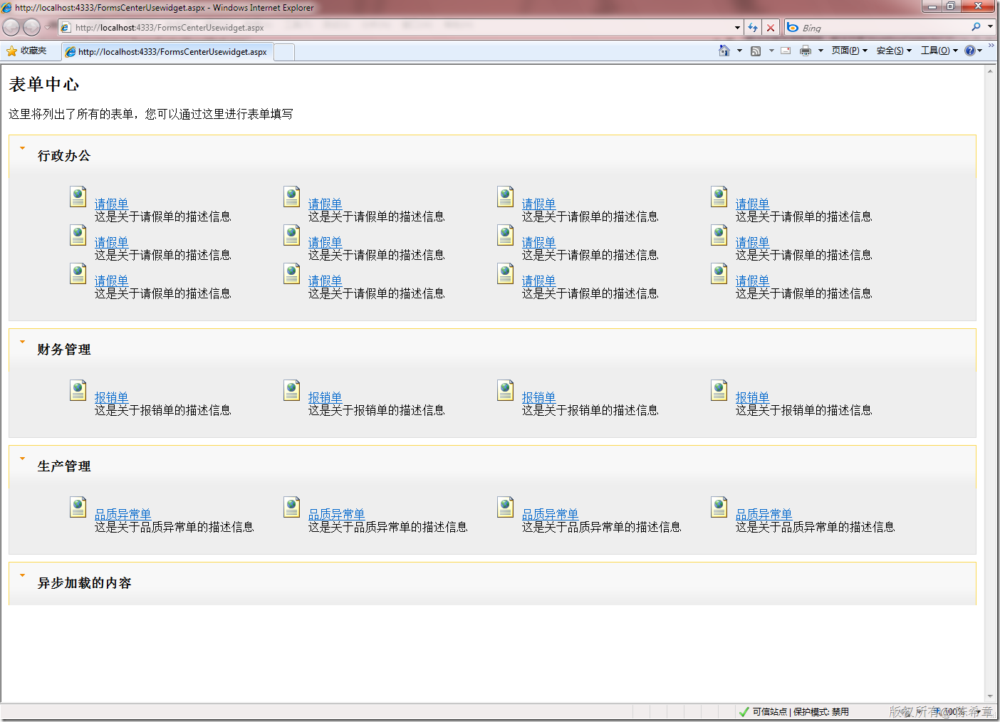
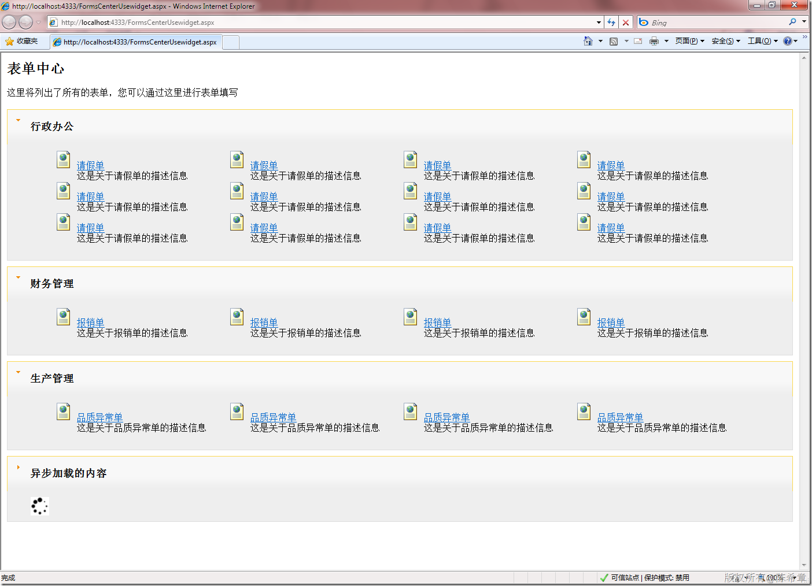
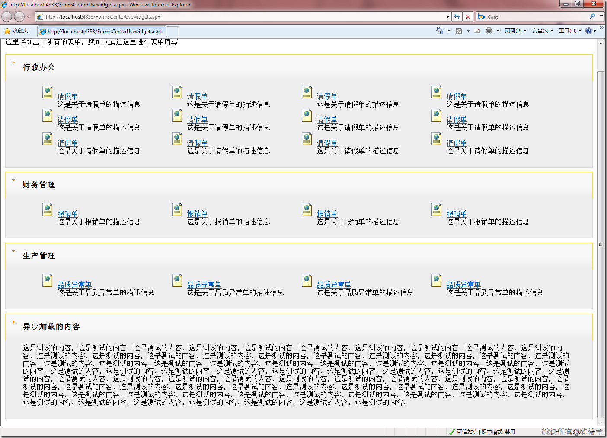

# jquery ui中 accordion的问题及我的解决方法 
> 原文发表于 2010-01-02, 地址: http://www.cnblogs.com/chenxizhang/archive/2010/01/02/1637950.html 


jquery有一套所谓的ui组件，很不错的。如果有兴趣的朋友，可以参考<http://jqueryui.com/>

 但其中的accordion，我使用的时候发现一些问题。如果按照demo那样，写一些静态内容，倒也正常。但如果每个面板里面的内容是动态绑定的，则会发生高度变小，然后出现滚动条的诡异现象

  


```
<%@ Page Language="C#" %>

<%@ Import Namespace="System.Linq" %>
<%@ Import Namespace="System.Xml.Linq" %>

<script runat="server">
    protected override void OnPreInit(EventArgs e)
    {
        rp.ItemDataBound += new RepeaterItemEventHandler(rp\_ItemDataBound);
    }

    void rp\_ItemDataBound(object sender, RepeaterItemEventArgs e)
    {
        Label lb = e.Item.FindControl("categoryId") as Label;
        if (lb != null)
        {
            string id = lb.Text;
            var forms = from x in config.Root.Descendants("Form")
                        where x.Attribute("CategoryId").Value == id
                        select new
                        {
                            FormTitle = x.Attribute("Title").Value,
                            FormDescription = x.Attribute("Description").Value,
                            Url = x.Attribute("Url").Value,
                            Icon = "Forms/Icons/" + x.Attribute("Icon").Value
                        };

            Repeater temp = e.Item.FindControl("rp\_forms") as Repeater;
            temp.DataSource = forms;
            temp.DataBind();

        }
    }

    protected override void OnLoad(EventArgs e)
    {
        if (!IsPostBack)
            DataBind();

    }

    private XDocument config = null;

    public override void DataBind()
    {
        //先读取分类数据
        config = XDocument.Load(Server.MapPath("Forms/Forms.xml"));
        var categories = from x in config.Root.Descendants("Category")
                         orderby x.Attribute("Id").Value
                         select new
                         {
                             Title = x.Attribute("Title").Value,
                             Id = x.Attribute("Id").Value,
                             Description = x.Attribute("Description").Value
                         };
        rp.DataSource = categories;
        rp.DataBind();


    }
    
    
    
</script>

<html>
<head runat="server">

    <script src="jquery-1.3.2-vsdoc.js" type="text/javascript"></script>

    <script src="ui/ui.core.js" type="text/javascript"></script>

    <script src="ui/ui.accordion.js" type="text/javascript"></script>

    <link href="themes/cupertino/ui.all.css" rel="stylesheet" type="text/css" />

    <script type="text/javascript">
        $(function() {


            $("#formscontainer").accordion();

        });
    </script>

    <style type="text/css">
        li.formli
        {
            list-style-type: none;
            width: 300px;
            float: left;
        }
        li.formli img
        {
            border: none;
        }
    </style>
</head>
<body>
    <h2>
        表单中心</h2>
    <p>
        这里将列出了所有的表单，您可以通过这里进行表单填写</p>
    <div id="formscontainer">
        <asp:Repeater ID="rp" runat="server">
            <ItemTemplate>
                <h3>
                    <a href="#" title='<%# Eval("Description") %>'>
                        <%# Eval("Title") %></a>
                    <asp:Label ID="categoryId" runat="server" Text='<%# Eval("Id") %>' Visible="false"></asp:Label>
                </h3>
                <div class="details">
                    <asp:Repeater ID="rp\_forms" runat="server">
                        <HeaderTemplate>
                            <ul>
                        </HeaderTemplate>
                        <ItemTemplate>
                            <li class="formli">
                                ' />
                                <a href='<%# Eval("Url") %>'>
                                    <%# Eval("FormTitle") %>
                                </a>
                                <div style="padding-left: 40px">
                                    <%# Eval("FormDescription") %>
                                </div>
                            </li>
                        </ItemTemplate>
                        <FooterTemplate>
                            </ul></FooterTemplate>
                    </asp:Repeater>
                </div>
            </ItemTemplate>
        </asp:Repeater>
    </div>
</body>
</html>
```

```
开始的时候，看起来不错

```

.csharpcode, .csharpcode pre
{
 font-size: small;
 color: black;
 font-family: consolas, "Courier New", courier, monospace;
 background-color: #ffffff;
 /*white-space: pre;*/
}
.csharpcode pre { margin: 0em; }
.csharpcode .rem { color: #008000; }
.csharpcode .kwrd { color: #0000ff; }
.csharpcode .str { color: #006080; }
.csharpcode .op { color: #0000c0; }
.csharpcode .preproc { color: #cc6633; }
.csharpcode .asp { background-color: #ffff00; }
.csharpcode .html { color: #800000; }
.csharpcode .attr { color: #ff0000; }
.csharpcode .alt 
{
 background-color: #f4f4f4;
 width: 100%;
 margin: 0em;
}
.csharpcode .lnum { color: #606060; }

[](http://images.cnblogs.com/cnblogs_com/chenxizhang/WindowsLiveWriter/jqueryuiaccordion_10BAF/image_2.png) 


但只要缩放几次，就会出现下面这样的情况


[](http://images.cnblogs.com/cnblogs_com/chenxizhang/WindowsLiveWriter/jqueryuiaccordion_10BAF/image_4.png) 


发现了吗，div的高度会缩小，然后出现滚动条。而且更加神奇的是，它会逐渐变小，小到一定程度之后，又会还原。


 


尝试过他所有的参数，也没有找到很好的方法，实在也是不解，难道这么明显的问题别人就没有遇到过。


 


我的解决方法倒也干脆，既然不好用，那就自己动手写一个，其实也没有什么大不了的。当然，我写的这个和accordion不完全一样，但更符合我自己的需要，而且简便易行


 


脚本代码


```

/// 这个脚本用来处理所有的widget行为。
/// 作者：陈希章

$(function() {

    $("div.widget").each(function() {
        var w = $(this);
        var d = w.find("div.details");
        var h = parseInt(d.attr("offsetHeight")) + 10;
        d.css("height", h);

        var autoOpen = w.attr("autoOpen");
        if (autoOpen != null && autoOpen == "false") {
            d.fadeOut("fast");
            //只有明确地设置了不自动打开，才隐藏起来
        }
        else {
            //如果设置了一个action，表示要异步加载 
            var a = d.attr("action");
            if (a != null) {
                d.empty();
                $("").appendTo(d);
                d.load(a);
            }
        }
    });


    $("div.widget>div.title").click(function() {
        var t = $(this);
        var d = t.next("div.details");
        t.children(".icon").toggleClass("icon2");

        var display = d.css("display");
        if (display == "none") {
            d.fadeIn("slow", function() {
                var a = d.attr("action");
                if (a != null) {
                    d.empty();
                    $("").appendTo(d);
                    d.load(a);
                }
            });
        }
        else
            d.fadeOut("fast");

    });
});
```

```
 
```

```
 
```

```
页面代码
```

```
<%@ Page Language="C#" %>

<%@ Import Namespace="System.Linq" %>
<%@ Import Namespace="System.Xml.Linq" %>

<script runat="server">
    protected override void OnPreInit(EventArgs e)
    {
        rp.ItemDataBound += new RepeaterItemEventHandler(rp\_ItemDataBound);
    }

    void rp\_ItemDataBound(object sender, RepeaterItemEventArgs e)
    {
        Label lb = e.Item.FindControl("categoryId") as Label;
        if (lb != null)
        {
            string id = lb.Text;
            var forms = from x in config.Root.Descendants("Form")
                        where x.Attribute("CategoryId").Value == id
                        select new
                        {
                            FormTitle = x.Attribute("Title").Value,
                            FormDescription = x.Attribute("Description").Value,
                            Url = x.Attribute("Url").Value,
                            Icon = "Forms/Icons/" + x.Attribute("Icon").Value
                        };

            Repeater temp = e.Item.FindControl("rp\_forms") as Repeater;
            temp.DataSource = forms;
            temp.DataBind();

        }
    }

    protected override void OnLoad(EventArgs e)
    {
        if (!IsPostBack)
            DataBind();

    }

    private XDocument config = null;

    public override void DataBind()
    {
        //先读取分类数据
        config = XDocument.Load(Server.MapPath("Forms/Forms.xml"));
        var categories = from x in config.Root.Descendants("Category")
                         orderby x.Attribute("Id").Value
                         select new
                         {
                             Title = x.Attribute("Title").Value,
                             Id = x.Attribute("Id").Value,
                             Description = x.Attribute("Description").Value
                         };
        rp.DataSource = categories;
        rp.DataBind();


    }
    
    
    
</script>

<html>
<head id="Head1" runat="server">

    <script src="jquery-1.3.2-vsdoc.js" type="text/javascript"></script>
    <script src="widget.js" type="text/javascript"></script>
    <link href="Style/Widget.css" rel="stylesheet" type="text/css" />
    <style type="text/css">
        li.formli
        {
            list-style-type: none;
            width: 300px;
            float: left;
        }
        li.formli img
        {
            border: none;
        }
    </style>
</head>
<body>
    <h2>
        表单中心</h2>
    <p>
        这里将列出了所有的表单，您可以通过这里进行表单填写</p>
    <div id="formscontainer">
        <asp:Repeater ID="rp" runat="server">
            <ItemTemplate>
                <div class="widget">
                    <div class="title">
                        <div class="icon">
                        </div>
                        <h3>
                            <%# Eval("Title") %>
                            <asp:Label ID="categoryId" runat="server" Text='<%# Eval("Id") %>' Visible="false"></asp:Label>
                        </h3>
                    </div>
                    <div class="details">
                        <asp:Repeater ID="rp\_forms" runat="server">
                            <HeaderTemplate>
                                <ul>
                            </HeaderTemplate>
                            <ItemTemplate>
                                <li class="formli">
                                    ' />
                                    <a href='<%# Eval("Url") %>'>
                                        <%# Eval("FormTitle") %>
                                    </a>
                                    <div style="padding-left:40px">
                                        <%# Eval("FormDescription") %>
                                    </div>
                                </li>
                            </ItemTemplate>
                            <FooterTemplate>
                                </ul></FooterTemplate>
                        </asp:Repeater>
                    </div>
                </div>
            </ItemTemplate>
        </asp:Repeater>
    </div>
    <div class="widget" autoOpen="false">
        <div class="title">
            <div class="icon">
            </div>
            <h3>
            异步加载的内容
            </h3>
        </div>
        <div class="details" action="AsyncDataPage.aspx">
        </div>
    </div> 
</body>
</html>

```


.csharpcode, .csharpcode pre
{
 font-size: small;
 color: black;
 font-family: consolas, "Courier New", courier, monospace;
 background-color: #ffffff;
 /*white-space: pre;*/
}
.csharpcode pre { margin: 0em; }
.csharpcode .rem { color: #008000; }
.csharpcode .kwrd { color: #0000ff; }
.csharpcode .str { color: #006080; }
.csharpcode .op { color: #0000c0; }
.csharpcode .preproc { color: #cc6633; }
.csharpcode .asp { background-color: #ffff00; }
.csharpcode .html { color: #800000; }
.csharpcode .attr { color: #ff0000; }
.csharpcode .alt 
{
 background-color: #f4f4f4;
 width: 100%;
 margin: 0em;
}
.csharpcode .lnum { color: #606060; }


页面效果


[](http://images.cnblogs.com/cnblogs_com/chenxizhang/WindowsLiveWriter/jqueryuiaccordion_10BAF/image_6.png)
.csharpcode, .csharpcode pre
{
 font-size: small;
 color: black;
 font-family: consolas, "Courier New", courier, monospace;
 background-color: #ffffff;
 /*white-space: pre;*/
}
.csharpcode pre { margin: 0em; }
.csharpcode .rem { color: #008000; }
.csharpcode .kwrd { color: #0000ff; }
.csharpcode .str { color: #006080; }
.csharpcode .op { color: #0000c0; }
.csharpcode .preproc { color: #cc6633; }
.csharpcode .asp { background-color: #ffff00; }
.csharpcode .html { color: #800000; }
.csharpcode .attr { color: #ff0000; }
.csharpcode .alt 
{
 background-color: #f4f4f4;
 width: 100%;
 margin: 0em;
}
.csharpcode .lnum { color: #606060; }


点击“异步加载的内容”


[](http://images.cnblogs.com/cnblogs_com/chenxizhang/WindowsLiveWriter/jqueryuiaccordion_10BAF/image_8.png) 


[](http://images.cnblogs.com/cnblogs_com/chenxizhang/WindowsLiveWriter/jqueryuiaccordion_10BAF/image_10.png)

