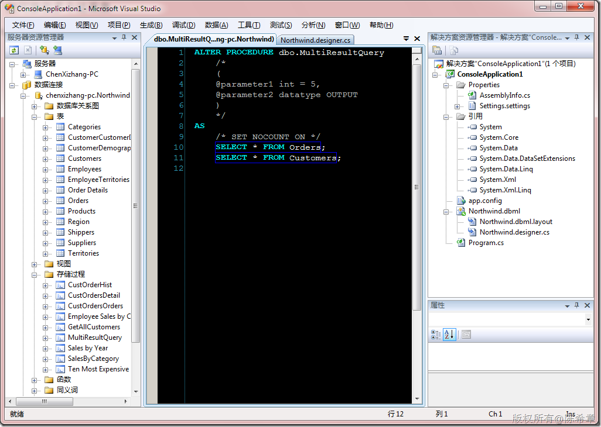
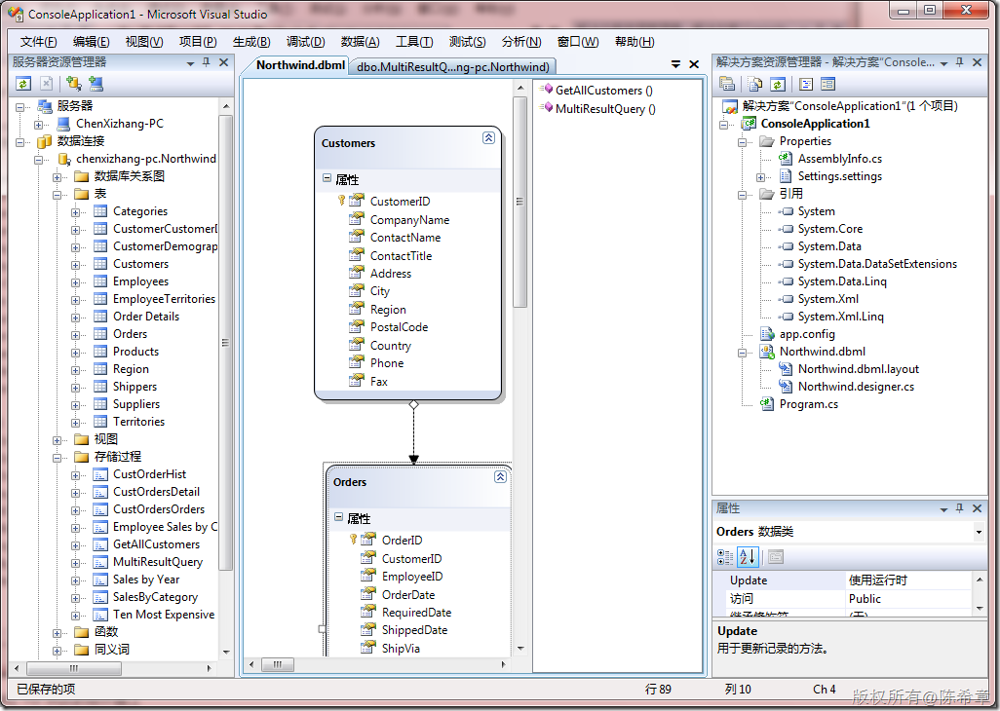
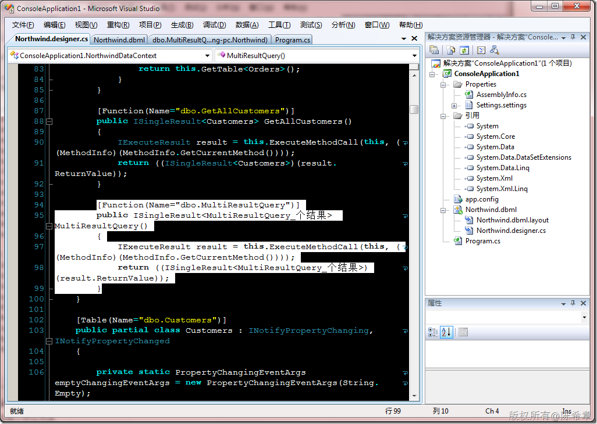
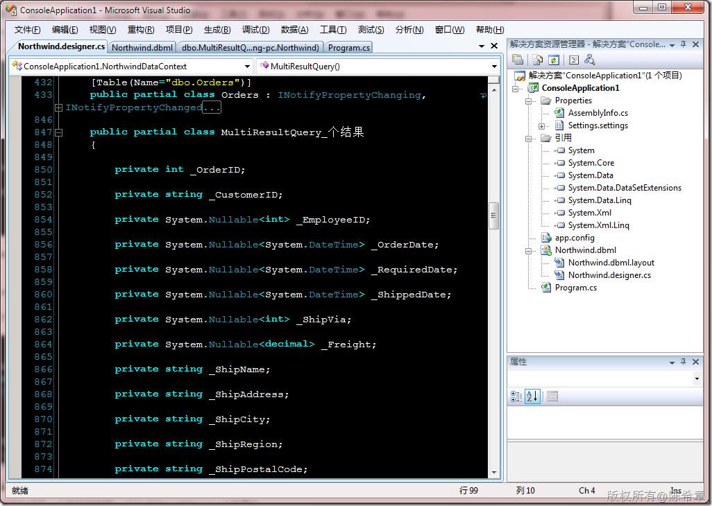

# LINQ TO SQL：如何接收多个结果集 
> 原文发表于 2010-01-03, 地址: http://www.cnblogs.com/chenxizhang/archive/2010/01/03/1638197.html 


如何我们需要在LINQ TO SQL中调用一个存储过程，它如果会返回多个结果集，这可能会稍微麻烦一点。下面来看一个范例

 存储过程：


```
ALTER PROCEDURE dbo.MultiResultQuery
    /*
    (
    @parameter1 int = 5,
    @parameter2 datatype OUTPUT
    )
    */
AS
    /* SET NOCOUNT ON */
    SELECT * FROM Orders;
    SELECT * FROM Customers;
```

.csharpcode, .csharpcode pre
{
 font-size: small;
 color: black;
 font-family: consolas, "Courier New", courier, monospace;
 background-color: #ffffff;
 /*white-space: pre;*/
}
.csharpcode pre { margin: 0em; }
.csharpcode .rem { color: #008000; }
.csharpcode .kwrd { color: #0000ff; }
.csharpcode .str { color: #006080; }
.csharpcode .op { color: #0000c0; }
.csharpcode .preproc { color: #cc6633; }
.csharpcode .asp { background-color: #ffff00; }
.csharpcode .html { color: #800000; }
.csharpcode .attr { color: #ff0000; }
.csharpcode .alt 
{
 background-color: #f4f4f4;
 width: 100%;
 margin: 0em;
}
.csharpcode .lnum { color: #606060; }

[](http://images.cnblogs.com/cnblogs_com/chenxizhang/WindowsLiveWriter/LINQTOSQL_A58A/image_2.png) 


将该存储过程拖拽到LINQ TO SQL的设计器上


[](http://images.cnblogs.com/cnblogs_com/chenxizhang/WindowsLiveWriter/LINQTOSQL_A58A/image_4.png) 


我们看看设计器帮我们生成了什么方法


[](http://images.cnblogs.com/cnblogs_com/chenxizhang/WindowsLiveWriter/LINQTOSQL_A58A/image_6.png) 


它生成了一个方法，同时还生成了一个特定的类型：“MultiResultQuery\_个结果”


[](http://images.cnblogs.com/cnblogs_com/chenxizhang/WindowsLiveWriter/LINQTOSQL_A58A/image_8.png) 


这显然不是我们想要的结果。我们当然希望直接通过Customers或者Orders去接收结果。那么怎么办呢？


首先，我们将这个“MultiResultQuery\_个结果”删除掉，然后修改一下MultiResultQuery方法


```
[Function(Name="dbo.MultiResultQuery")]
        [ResultType(typeof(Customers))]
        [ResultType(typeof(Orders))]
        public IMultipleResults MultiResultQuery()
        {
            IExecuteResult result = this.ExecuteMethodCall(this, ((MethodInfo)(MethodInfo.GetCurrentMethod())));
            return ((IMultipleResults)(result.ReturnValue));
        }
```


.csharpcode, .csharpcode pre
{
 font-size: small;
 color: black;
 font-family: consolas, "Courier New", courier, monospace;
 background-color: #ffffff;
 /*white-space: pre;*/
}
.csharpcode pre { margin: 0em; }
.csharpcode .rem { color: #008000; }
.csharpcode .kwrd { color: #0000ff; }
.csharpcode .str { color: #006080; }
.csharpcode .op { color: #0000c0; }
.csharpcode .preproc { color: #cc6633; }
.csharpcode .asp { background-color: #ffff00; }
.csharpcode .html { color: #800000; }
.csharpcode .attr { color: #ff0000; }
.csharpcode .alt 
{
 background-color: #f4f4f4;
 width: 100%;
 margin: 0em;
}
.csharpcode .lnum { color: #606060; }


那么，下面来看看如何使用这个存储过程


```
using System;

namespace ConsoleApplication1
{
    class Program
    {
        static void Main(string[] args)
        {


            NorthwindDataContext db = new NorthwindDataContext();
            db.Log = Console.Out;

            var result = db.MultiResultQuery();

            var orders = result.GetResult<Orders>();
            var customers = result.GetResult<Customers>();
            foreach (var item in orders)
            {
                Console.Write(item.OrderID);
            }
            foreach (var item in customers)
            {
                Console.Write(item.CustomerID);
            }
        }


    }
}

```

.csharpcode, .csharpcode pre
{
 font-size: small;
 color: black;
 font-family: consolas, "Courier New", courier, monospace;
 background-color: #ffffff;
 /*white-space: pre;*/
}
.csharpcode pre { margin: 0em; }
.csharpcode .rem { color: #008000; }
.csharpcode .kwrd { color: #0000ff; }
.csharpcode .str { color: #006080; }
.csharpcode .op { color: #0000c0; }
.csharpcode .preproc { color: #cc6633; }
.csharpcode .asp { background-color: #ffff00; }
.csharpcode .html { color: #800000; }
.csharpcode .attr { color: #ff0000; }
.csharpcode .alt 
{
 background-color: #f4f4f4;
 width: 100%;
 margin: 0em;
}
.csharpcode .lnum { color: #606060; }
