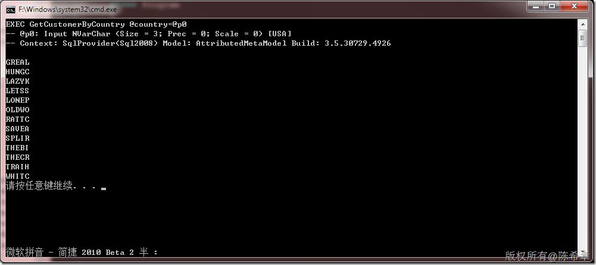

# LINQ TO SQL：动态执行带有有参数的存储过程 
> 原文发表于 2010-01-03, 地址: http://www.cnblogs.com/chenxizhang/archive/2010/01/03/1638201.html 


这是一个小的细节，如果我们在LINQ TO SQL中动态执行存储过程，而且它带有参数的话，应该按照下面的方法进行

 1. 存储过程


```
ALTER PROCEDURE dbo.GetCustomerByCountry
(@country NVARCHAR(50))
AS
    /* SET NOCOUNT ON */
    SELECT * FROM Customers WHERE Country=@Country

```

.csharpcode, .csharpcode pre
{
 font-size: small;
 color: black;
 font-family: consolas, "Courier New", courier, monospace;
 background-color: #ffffff;
 /*white-space: pre;*/
}
.csharpcode pre { margin: 0em; }
.csharpcode .rem { color: #008000; }
.csharpcode .kwrd { color: #0000ff; }
.csharpcode .str { color: #006080; }
.csharpcode .op { color: #0000c0; }
.csharpcode .preproc { color: #cc6633; }
.csharpcode .asp { background-color: #ffff00; }
.csharpcode .html { color: #800000; }
.csharpcode .attr { color: #ff0000; }
.csharpcode .alt 
{
 background-color: #f4f4f4;
 width: 100%;
 margin: 0em;
}
.csharpcode .lnum { color: #606060; }

2. 代码


```
using System;

namespace ConsoleApplication1
{
    class Program
    {
        static void Main(string[] args)
        {


            NorthwindDataContext db = new NorthwindDataContext();
            db.Log = Console.Out;


            var query = db.ExecuteQuery<Customers>("EXEC GetCustomerByCountry @country={0}", "USA");
            foreach (var item in query)
            {
                Console.WriteLine(item.CustomerID);
            }
        }


    }
}

```


.csharpcode, .csharpcode pre
{
 font-size: small;
 color: black;
 font-family: consolas, "Courier New", courier, monospace;
 background-color: #ffffff;
 /*white-space: pre;*/
}
.csharpcode pre { margin: 0em; }
.csharpcode .rem { color: #008000; }
.csharpcode .kwrd { color: #0000ff; }
.csharpcode .str { color: #006080; }
.csharpcode .op { color: #0000c0; }
.csharpcode .preproc { color: #cc6633; }
.csharpcode .asp { background-color: #ffff00; }
.csharpcode .html { color: #800000; }
.csharpcode .attr { color: #ff0000; }
.csharpcode .alt 
{
 background-color: #f4f4f4;
 width: 100%;
 margin: 0em;
}
.csharpcode .lnum { color: #606060; }


3. 结果


[](http://images.cnblogs.com/cnblogs_com/chenxizhang/WindowsLiveWriter/LINQTOSQL_A71E/image_2.png)

