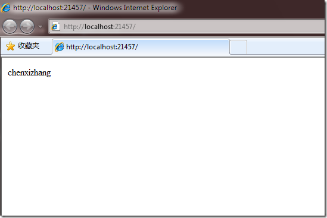
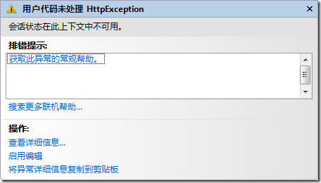
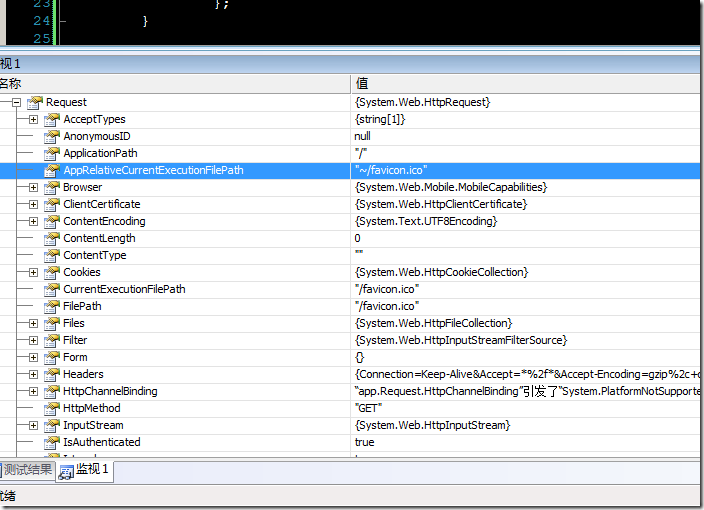

# HttpModule中真的不能读写Session吗？ 
> 原文发表于 2010-01-06, 地址: http://www.cnblogs.com/chenxizhang/archive/2010/01/06/1640611.html 


因为项目中遇到这样一个问题，我们希望编写一个HttpModule来对用户的请求进行一些额外的处理。期间，我们希望能读取到Session中的一些数据。HttpModule我们都不陌生，但这次在实际用的时候还是遇到一点小问题。

 为了说明问题，我用下面一个简单的例子来演示


```
using System;
using System.Collections.Generic;
using System.Linq;
using System.Web;

namespace TestHttpModuleSession
{
    public class TestModule : IHttpModule
    {
        #region IHttpModule 成员

        public void Dispose()
        {
        }

        public void Init(HttpApplication context)
        {
            context.AcquireRequestState += (o, e) =>
                {
                    HttpApplication app = (HttpApplication)o;

                    app.Session["Test"] = "chenxizhang";
                    app.Response.Write(app.Session["Test"].ToString());
                };
        }

        #endregion
    }
}

```


.csharpcode, .csharpcode pre
{
 font-size: small;
 color: black;
 font-family: consolas, "Courier New", courier, monospace;
 background-color: #ffffff;
 /*white-space: pre;*/
}
.csharpcode pre { margin: 0em; }
.csharpcode .rem { color: #008000; }
.csharpcode .kwrd { color: #0000ff; }
.csharpcode .str { color: #006080; }
.csharpcode .op { color: #0000c0; }
.csharpcode .preproc { color: #cc6633; }
.csharpcode .asp { background-color: #ffff00; }
.csharpcode .html { color: #800000; }
.csharpcode .attr { color: #ff0000; }
.csharpcode .alt 
{
 background-color: #f4f4f4;
 width: 100%;
 margin: 0em;
}
.csharpcode .lnum { color: #606060; }


代码很简单，因为要读取Session，所以按照说明，我们为AcquireRequestState事件绑定了处理程序。然后通过如下代码在web.config进行注册


```
<add name="Test" type="TestHttpModuleSession.TestModule,TestHttpModuleSession"/>
```

 


运行起来看到的效果如下


[](http://images.cnblogs.com/cnblogs_com/chenxizhang/WindowsLiveWriter/HttpModuleSession_FE36/image_2.png) 


但是，与此同时我们又收到一个错误


[](http://images.cnblogs.com/cnblogs_com/chenxizhang/WindowsLiveWriter/HttpModuleSession_FE36/image_4.png) 


乍看起来，有些矛盾不是吗？页面上我们看到了输出，而且也确实是Session中的数据。但为何又抛出这个所谓的会话状态不可用的异常呢？我们查看当前app变量中的数据发现


[](http://images.cnblogs.com/cnblogs_com/chenxizhang/WindowsLiveWriter/HttpModuleSession_FE36/image_6.png)
.csharpcode, .csharpcode pre
{
 font-size: small;
 color: black;
 font-family: consolas, "Courier New", courier, monospace;
 background-color: #ffffff;
 /*white-space: pre;*/
}
.csharpcode pre { margin: 0em; }
.csharpcode .rem { color: #008000; }
.csharpcode .kwrd { color: #0000ff; }
.csharpcode .str { color: #006080; }
.csharpcode .op { color: #0000c0; }
.csharpcode .preproc { color: #cc6633; }
.csharpcode .asp { background-color: #ffff00; }
.csharpcode .html { color: #800000; }
.csharpcode .attr { color: #ff0000; }
.csharpcode .alt 
{
 background-color: #f4f4f4;
 width: 100%;
 margin: 0em;
}
.csharpcode .lnum { color: #606060; }


所以，其实只是在请求favicon.ico时出现了异常，而页面是没有问题的。这说明什么呢？


因为ico这种请求与页面当然是不一样，那么这种请求的上下文中当然是不存在Session的。


那么，如果解决这个问题呢？其实只要理解了上面的道理，修改一下代码就可以很容易解决


```
using System;
using System.Collections.Generic;
using System.Linq;
using System.Web;

namespace TestHttpModuleSession
{
    public class TestModule : IHttpModule
    {
        #region IHttpModule 成员

        public void Dispose()
        {
        }

        public void Init(HttpApplication context)
        {
            context.AcquireRequestState += (o, e) =>
                {
                    HttpApplication app = (HttpApplication)o;
                    if (app.Context.Handler.ToString().EndsWith("aspx"))
                    {
                        app.Session["Test"] = "chenxizhang";
                        app.Response.Write(app.Session["Test"].ToString());
                    }
                };
        }

        #endregion
    }
}

```

.csharpcode, .csharpcode pre
{
 font-size: small;
 color: black;
 font-family: consolas, "Courier New", courier, monospace;
 background-color: #ffffff;
 /*white-space: pre;*/
}
.csharpcode pre { margin: 0em; }
.csharpcode .rem { color: #008000; }
.csharpcode .kwrd { color: #0000ff; }
.csharpcode .str { color: #006080; }
.csharpcode .op { color: #0000c0; }
.csharpcode .preproc { color: #cc6633; }
.csharpcode .asp { background-color: #ffff00; }
.csharpcode .html { color: #800000; }
.csharpcode .attr { color: #ff0000; }
.csharpcode .alt 
{
 background-color: #f4f4f4;
 width: 100%;
 margin: 0em;
}
.csharpcode .lnum { color: #606060; }
