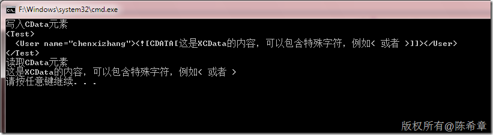

# LINQ to XML:如何读写XCData 
> 原文发表于 2010-01-16, 地址: http://www.cnblogs.com/chenxizhang/archive/2010/01/16/1649741.html 


```
using System;

using System.Xml.Linq;

namespace ConsoleApplication1
{
    class Program
    {
        static void Main(string[] args)
        {
            //写入CDATA元素块
            var doc = 
                new XElement("Test",
                    new XElement("User",
                        new XAttribute("name", "chenxizhang"),
                        new XCData("这是XCData的内容，可以包含特殊字符，例如< 或者 >")));
            Console.WriteLine("写入CData元素");
            Console.WriteLine(doc.ToString());

            Console.WriteLine("读取CData元素");
            Console.WriteLine(doc.Element("User").Value);

        }
    }
}

```


.csharpcode, .csharpcode pre
{
 font-size: small;
 color: black;
 font-family: consolas, "Courier New", courier, monospace;
 background-color: #ffffff;
 /*white-space: pre;*/
}
.csharpcode pre { margin: 0em; }
.csharpcode .rem { color: #008000; }
.csharpcode .kwrd { color: #0000ff; }
.csharpcode .str { color: #006080; }
.csharpcode .op { color: #0000c0; }
.csharpcode .preproc { color: #cc6633; }
.csharpcode .asp { background-color: #ffff00; }
.csharpcode .html { color: #800000; }
.csharpcode .attr { color: #ff0000; }
.csharpcode .alt 
{
 background-color: #f4f4f4;
 width: 100%;
 margin: 0em;
}
.csharpcode .lnum { color: #606060; }


[](http://images.cnblogs.com/cnblogs_com/chenxizhang/WindowsLiveWriter/LINQtoXMLXCData_1319F/image_2.png)

