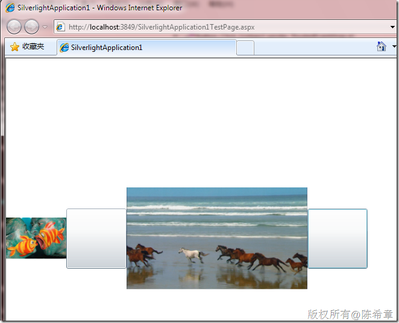

# Silverlight:动态读取图片或者视频 
> 原文发表于 2010-01-20, 地址: http://www.cnblogs.com/chenxizhang/archive/2010/01/20/1652052.html 


下面这个小例子演示了如何在Silverlight（或者WPF）中动态读取图片或者视频

  

 页面部分


```
<UserControl x:Class="SilverlightApplication1.MainPage"
    xmlns="http://schemas.microsoft.com/winfx/2006/xaml/presentation" 
    xmlns:x="http://schemas.microsoft.com/winfx/2006/xaml"
    xmlns:d="http://schemas.microsoft.com/expression/blend/2008" xmlns:mc="http://schemas.openxmlformats.org/markup-compatibility/2006" 
    mc:Ignorable="d" d:DesignWidth="640" d:DesignHeight="480">
    <StackPanel Name="pl" Orientation="Horizontal" >
        <Image Width="100" Height="100" Name="pic"></Image>
        <Button Name="bt"  Width="100" Height="100" Click="Button\_Click"></Button>
        <MediaElement Name="video" Width="300" Height="300"></MediaElement>
        <Button Name="bt2" Width="100" Height="100" Click="Button\_Click\_1"></Button>
    </StackPanel>
</UserControl>

```

.csharpcode, .csharpcode pre
{
 font-size: small;
 color: black;
 font-family: consolas, "Courier New", courier, monospace;
 background-color: #ffffff;
 /*white-space: pre;*/
}
.csharpcode pre { margin: 0em; }
.csharpcode .rem { color: #008000; }
.csharpcode .kwrd { color: #0000ff; }
.csharpcode .str { color: #006080; }
.csharpcode .op { color: #0000c0; }
.csharpcode .preproc { color: #cc6633; }
.csharpcode .asp { background-color: #ffff00; }
.csharpcode .html { color: #800000; }
.csharpcode .attr { color: #ff0000; }
.csharpcode .alt 
{
 background-color: #f4f4f4;
 width: 100%;
 margin: 0em;
}
.csharpcode .lnum { color: #606060; }


```
 
```

```
代码部分
```

```
using System.Windows;
using System.Windows.Controls;
using System.IO;
using System.Windows.Media.Imaging;


namespace SilverlightApplication1
{
    public partial class MainPage : UserControl
    {
        public MainPage()
        {
            InitializeComponent();

        }

        private void Button\_Click(object sender, RoutedEventArgs e)
        {
            OpenFileDialog ofd = new OpenFileDialog();
            ofd.Filter = "JPG File|*.JPG";
            if ((bool)ofd.ShowDialog())
            {
                FileStream fs = ofd.File.OpenRead();
                BitmapImage image = new BitmapImage();
                image.SetSource(fs);
                pic.Source = image;
            }
        }

        private void Button\_Click\_1(object sender, RoutedEventArgs e)
        {
            OpenFileDialog ofd = new OpenFileDialog();
            ofd.Filter = "Video File|*.wmv";
            if ((bool)ofd.ShowDialog())
            {
                video.SetSource(ofd.File.OpenRead());
            }
        }
    }
}

```

```
效果图
```

.csharpcode, .csharpcode pre
{
 font-size: small;
 color: black;
 font-family: consolas, "Courier New", courier, monospace;
 background-color: #ffffff;
 /*white-space: pre;*/
}
.csharpcode pre { margin: 0em; }
.csharpcode .rem { color: #008000; }
.csharpcode .kwrd { color: #0000ff; }
.csharpcode .str { color: #006080; }
.csharpcode .op { color: #0000c0; }
.csharpcode .preproc { color: #cc6633; }
.csharpcode .asp { background-color: #ffff00; }
.csharpcode .html { color: #800000; }
.csharpcode .attr { color: #ff0000; }
.csharpcode .alt 
{
 background-color: #f4f4f4;
 width: 100%;
 margin: 0em;
}
.csharpcode .lnum { color: #606060; }

[](http://images.cnblogs.com/cnblogs_com/chenxizhang/WindowsLiveWriter/Silverlight_7DCF/image_2.png)

