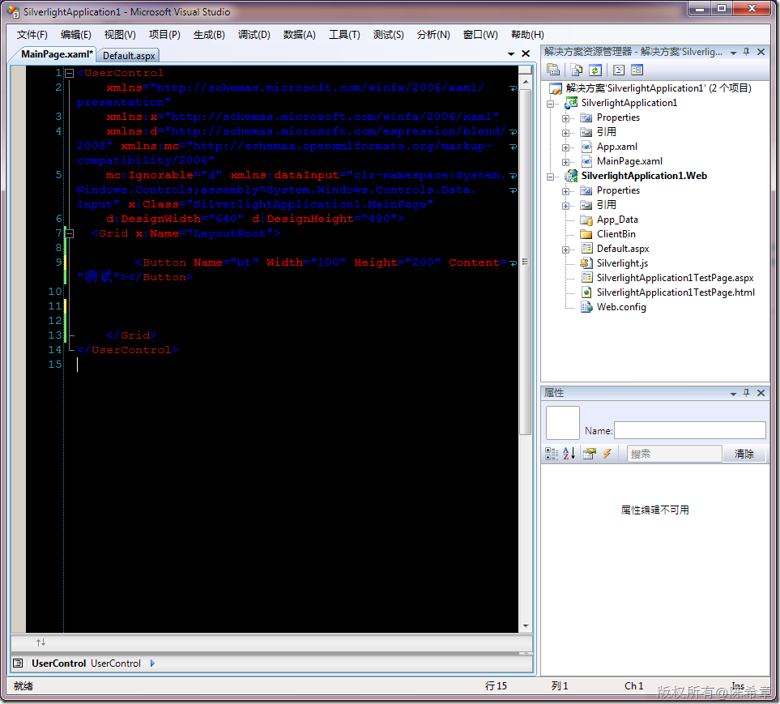
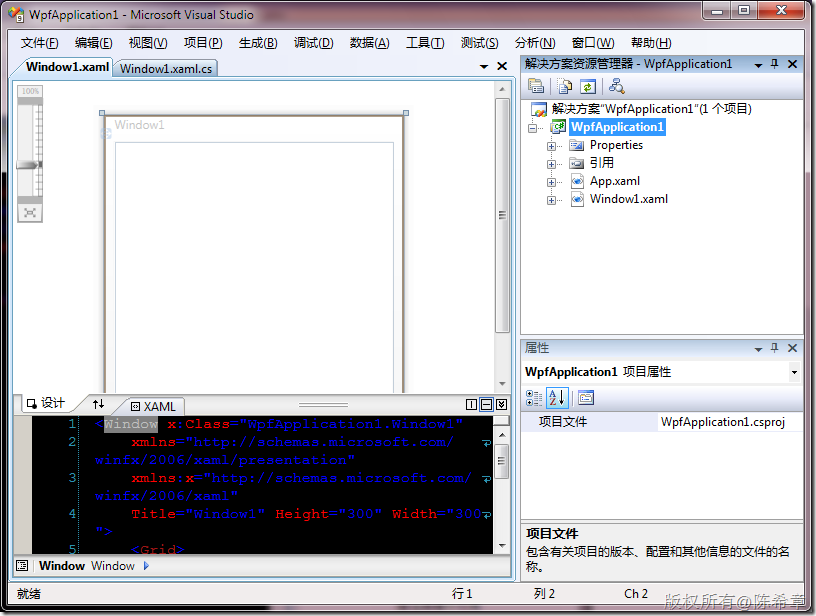
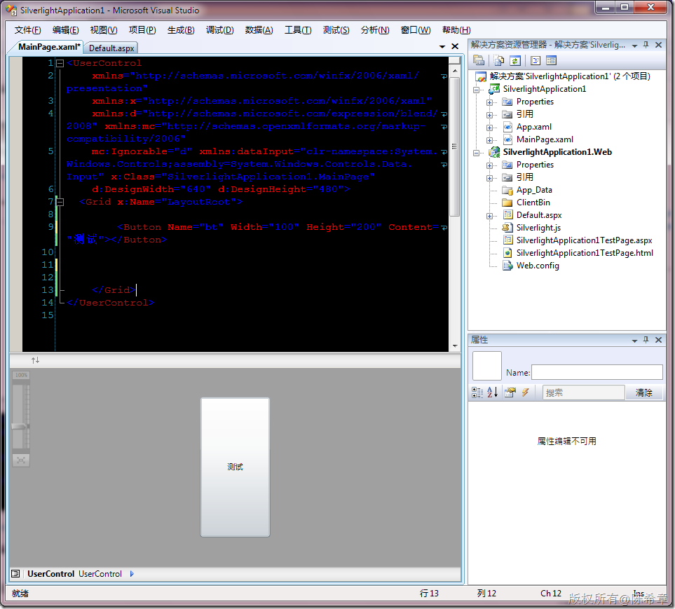
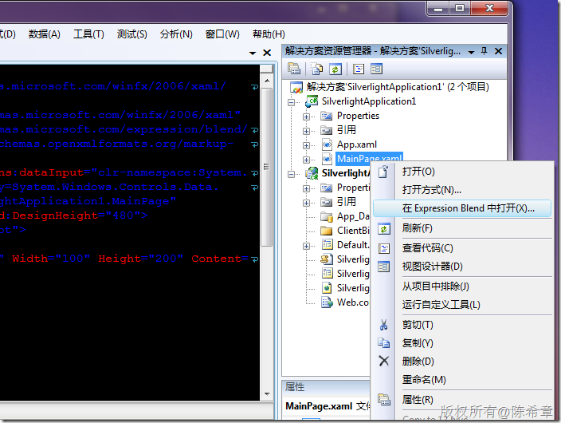
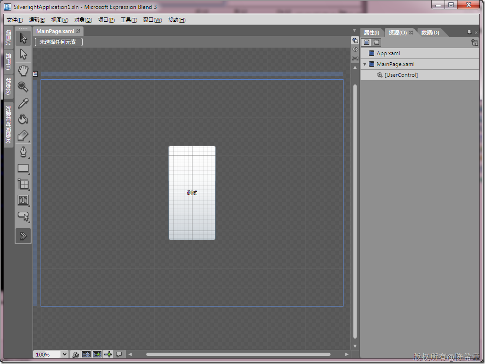

# Silverlight:设计器的问题 
> 原文发表于 2010-01-22, 地址: http://www.cnblogs.com/chenxizhang/archive/2010/01/22/1654441.html 

在VS 2008中，可以新建Silverlight 3的项目，但奇怪的是，设计器居然不见了。只有XAML编辑器。这一点与WPF程序是不一样的

  

 下面的截图则是针对WPF项目的

  

  

 当然，其实在Silverlight的那个XAML设计视图中，也可以通过拖拽显示出来一个可视化的界面。

  

 但区别是，这个界面是灰色的，没有办法直接拖拽控件进去。

 既然在Silverlight项目中无法直接可视化设计，那么有没有其他的方法呢？我们发现，有这么一个菜单项目：“在Expression Blend中打开....”

  

 

