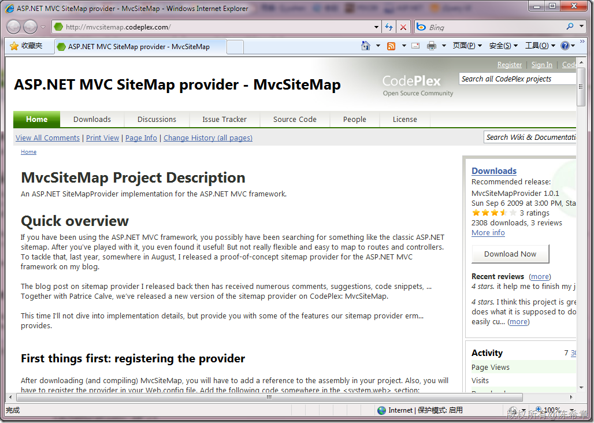

# MVC:如何使用站点地图 
> 原文发表于 2010-01-22, 地址: http://www.cnblogs.com/chenxizhang/archive/2010/01/22/1654483.html 

之前在Web Form这种模型下面，我们可以很方便地使用站点地图进行导航。那么这个功能在MVC中是否可以同样的实现呢？答案是默认不可以。

 但有一个开源的项目，可以解决这个问题

 <http://mvcsitemap.codeplex.com/>

 

