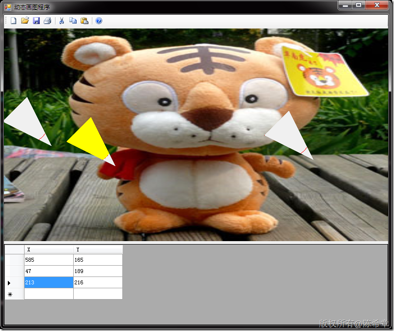

# GDI+:自定义控件时如何使用Region来输出特定区域 
> 原文发表于 2010-01-23, 地址: http://www.cnblogs.com/chenxizhang/archive/2010/01/23/1654607.html 


这是我的一个小工具中用到的一个功能。这个工具需要能对图片进行一些编辑和保存

 [](http://images.cnblogs.com/cnblogs_com/chenxizhang/WindowsLiveWriter/GDIRegion_91A4/image_2.png) 

 我我们的一个功能就是，在图片的任意位置双击之后，都会添加一个附加的控件出来，并且显示在图片上

 [](http://images.cnblogs.com/cnblogs_com/chenxizhang/WindowsLiveWriter/GDIRegion_91A4/image_4.png) 

 看起来很不错，但是那个白色的正方形背景是在不好看，能不能只是用那个圆圈呢？下面这样显然更加好一些

 [](http://images.cnblogs.com/cnblogs_com/chenxizhang/WindowsLiveWriter/GDIRegion_91A4/image_6.png) 

 那这是如何做到的呢？按说所有的Windows Forms控件在Render出来的时候，都会有一个矩形的区域的。看看下面代码吧


```
        protected override void OnPaint(PaintEventArgs e)
        {
            Graphics g = this.CreateGraphics();
            
            g.DrawEllipse(
                new Pen(Color.Red),
                new Rectangle(new Point(0, 0), new Size(this.Width-5,this.Height-5)));

            if (Selected)
                g.FillEllipse(new SolidBrush(Color.Yellow), new Rectangle(new Point(0, 0), new Size(this.Width - 5, this.Height - 5)));

            GraphicsPath p = new GraphicsPath();
            p.AddEllipse(new Rectangle(new Point(0, 0), new Size(this.Width - 5, this.Height - 5)));
            this.Region = new Region(p);//设置控件的区域是一个圆圈
            
            g.Save();
        }
```

.csharpcode, .csharpcode pre
{
 font-size: small;
 color: black;
 font-family: consolas, "Courier New", courier, monospace;
 background-color: #ffffff;
 /*white-space: pre;*/
}
.csharpcode pre { margin: 0em; }
.csharpcode .rem { color: #008000; }
.csharpcode .kwrd { color: #0000ff; }
.csharpcode .str { color: #006080; }
.csharpcode .op { color: #0000c0; }
.csharpcode .preproc { color: #cc6633; }
.csharpcode .asp { background-color: #ffff00; }
.csharpcode .html { color: #800000; }
.csharpcode .attr { color: #ff0000; }
.csharpcode .alt 
{
 background-color: #f4f4f4;
 width: 100%;
 margin: 0em;
}
.csharpcode .lnum { color: #606060; }


关于控件的Region属性，也可以参考 <http://msdn.microsoft.com/zh-cn/library/system.windows.forms.control.region.aspx>


按照这个思路，我们当然也可以画出某些带有圆角的控件，或者不规则的控件。尝试一下，你会改代码，让他输出下面这样的效果吗


[](http://images.cnblogs.com/cnblogs_com/chenxizhang/WindowsLiveWriter/GDIRegion_91A4/image_8.png)

