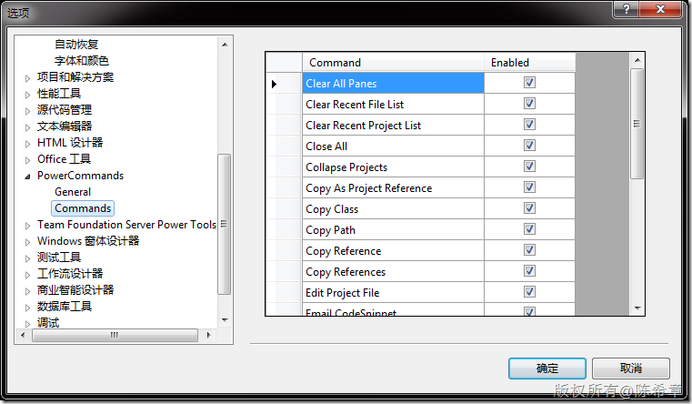

# PowerCommands for Visual Studio 2008 
> 原文发表于 2010-01-24, 地址: http://www.cnblogs.com/chenxizhang/archive/2010/01/24/1655203.html 

这是一套非常酷的Commands，鼓掌！<http://code.msdn.microsoft.com/PowerCommands>

  

 **Enable/Disable PowerCommands in Options dialog**  
This feature allows you to select which commands to enable in the Visual Studio IDE. Point to the Tools menu, then click Options. Expand the PowerCommands options, then click Commands. Check the commands you would like to enable.  
Note: All power commands are initially defaulted Enabled.  
**Format document on save / Remove and Sort Usings on save**  
The Format document on save option formats the tabs, spaces, and so on of the document being saved. It is equivalent to pointing to the Edit menu, clicking Advanced, and then clicking Format Document. The Remove and sort usings option removes unused using statements and sorts the remaining using statements in the document being saved.  
Note: The Remove and sort usings option is only available for C# documents.  
Note: Format document on save and Remove and sort usings both are initially defaulted OFF.  
**Clear All Panes**  
This command clears all output panes. It can be executed from the button on the toolbar of the Output window.  
**Copy Path**  
This command copies the full path of the currently selected item to the clipboard. It can be executed by right-clicking one of these nodes in the Solution Explorer:  
The solution node; A project node; Any project item node; Any folder.  
**Email CodeSnippet**  
To email the lines of text you select in the code editor, right-click anywhere in the editor and then click Email CodeSnippet.  
**Insert Guid Attribute**  
This command adds a Guid attribute to a selected class. From the code editor, right-click anywhere within the class definition, then click Insert Guid Attribute.  
**Show All Files**  
This command shows the hidden files in all projects displayed in the Solution Explorer when the solution node is selected. It enhances the Show All Files button, which normally shows only the hidden files in the selected project node.  
**Undo Close**  
This command reopens a closed document , returning the cursor to its last position. To reopen the most recently closed document, point to the Edit menu, then click Undo Close. Alternately, you can use the CtrlShiftZ shortcut.  
To reopen any other recently closed document, point to the View menu, click Other Windows, and then click Undo Close Window. The Undo Close window appears, typically next to the Output window. Double-click any document in the list to reopen it.  
**Collapse Projects**  
This command collapses a project or projects in the Solution Explorer starting from the root selected node. Collapsing a project can increase the readability of the solution. This command can be executed from three different places: solution, solution folders and project nodes respectively.  
**Copy Class**  
This command copies a selected class entire content to the clipboard, renaming the class. This command is normally followed by a Paste Class command, which renames the class to avoid a compilation error. It can be executed from a single project item or a project item with dependent sub items.  
**Paste Class**  
This command pastes a class entire content from the clipboard, renaming the class to avoid a compilation error. This command is normally preceded by a Copy Class command. It can be executed from a project or folder node.  
**Copy References**  
This command copies a reference or set of references to the clipboard. It can be executed from the references node, a single reference node or set of reference nodes.  
**Paste References**  
This command pastes a reference or set of references from the clipboard. It can be executed from different places depending on the type of project. For CSharp projects it can be executed from the references node. For Visual Basic and Website projects it can be executed from the project node.  
**Copy As Project Reference**  
This command copies a project as a project reference to the clipboard. It can be executed from a project node.  
**Edit Project File**  
This command opens the MSBuild project file for a selected project inside Visual Studio. It combines the existing Unload Project and Edit Project commands.  
**Open Containing Folder**  
This command opens a Windows Explorer window pointing to the physical path of a selected item. It can be executed from a project item node  
**Open Command Prompt**  
This command opens a Visual Studio command prompt pointing to the physical path of a selected item. It can be executed from four different places: solution, project, folder and project item nodes respectively.  
**Unload Projects**  
This command unloads all projects in a solution. This can be useful in MSBuild scenarios when multiple projects are being edited. This command can be executed from the solution node.  
**Reload Projects**  
This command reloads all unloaded projects in a solution. It can be executed from the solution node.  
**Remove and Sort Usings**  
This command removes and sort using statements for all classes given a project. It is useful, for example, in removing or organizing the using statements generated by a wizard. This command can be executed from a solution node or a single project node.  
**Extract Constant**  
This command creates a constant definition statement for a selected text. Extracting a constant effectively names a literal value, which can improve readability. This command can be executed from the code editor by right-clicking selected text.  
**Clear Recent File List**  
This command clears the Visual Studio recent file list. The Clear Recent File List command brings up a Clear File dialog which allows any or all recent files to be selected.  
**Clear Recent Project List**  
This command clears the Visual Studio recent project list. The Clear Recent Project List command brings up a Clear File dialog which allows any or all recent projects to be selected.  
**Transform Templates**  
This command executes a custom tool with associated text templates items. It can be executed from a DSL project node or a DSL folder node.  
**Close All**  
This command closes all documents. It can be executed from a document tab. 

