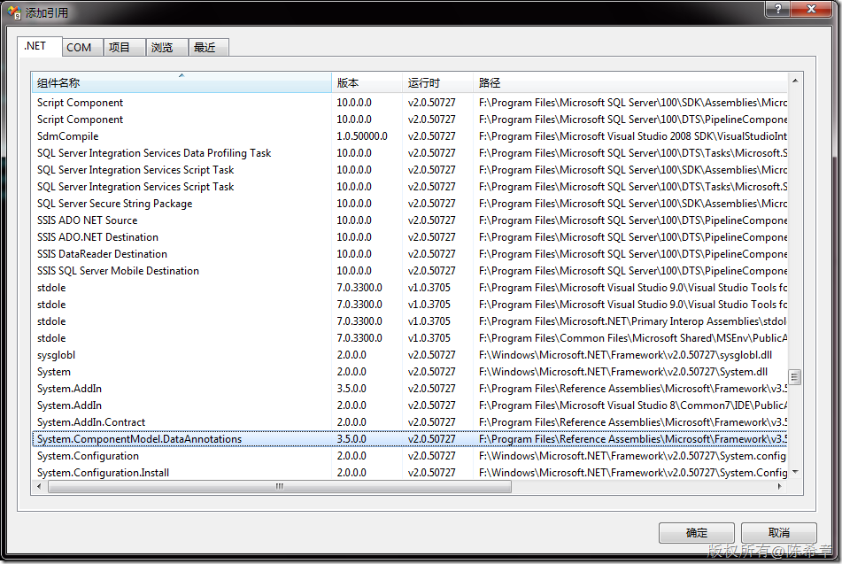
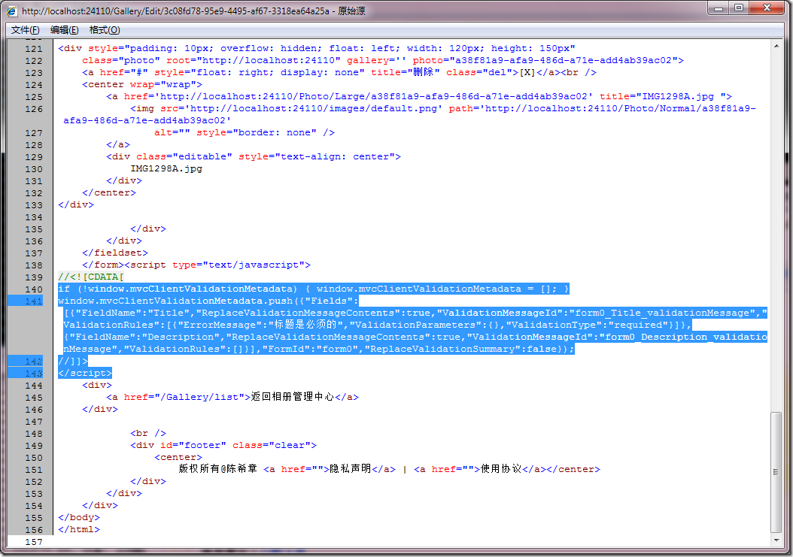

# ASP.NET MVC 2中的数据验证 
> 原文发表于 2010-01-24, 地址: http://www.cnblogs.com/chenxizhang/archive/2010/01/24/1655320.html 


对照scottgu的博客，我试用了一下这个新增的数据验证功能，总的来说，还是比较方便的。我简单地总结步骤如下

 1. 添加引用

 [](http://images.cnblogs.com/cnblogs_com/chenxizhang/WindowsLiveWriter/ASP.NETMVC2_F668/image_2.png)

 2. 修改业务实体类，在需要进行验证的Property上面添加一些特殊的Attribute


```

using System.ComponentModel.DataAnnotations;

namespace Web.Models
{
    public class GalleryListItem
    {
        [Required(ErrorMessage="标题是必须的")]
        public string Title { get; set; }


        public string Key { get; set; }
        public string Photo { get; set; }

        public string Description { get; set; }
    }
}

```

.csharpcode, .csharpcode pre
{
 font-size: small;
 color: black;
 font-family: consolas, "Courier New", courier, monospace;
 background-color: #ffffff;
 /*white-space: pre;*/
}
.csharpcode pre { margin: 0em; }
.csharpcode .rem { color: #008000; }
.csharpcode .kwrd { color: #0000ff; }
.csharpcode .str { color: #006080; }
.csharpcode .op { color: #0000c0; }
.csharpcode .preproc { color: #cc6633; }
.csharpcode .asp { background-color: #ffff00; }
.csharpcode .html { color: #800000; }
.csharpcode .attr { color: #ff0000; }
.csharpcode .alt 
{
 background-color: #f4f4f4;
 width: 100%;
 margin: 0em;
}
.csharpcode .lnum { color: #606060; }

3. 在页面中添加脚本引用


```
    <script src="../../Scripts/MicrosoftAjax.js" type="text/javascript"></script>
    <script src="../../Scripts/MicrosoftMvcAjax.js" type="text/javascript"></script>
    <script src="../../Scripts/MicrosoftMvcValidation.js" type="text/javascript"></script>
```

```
备注：这里必须使用MicrosoftMvcAjax，而不能使用jquery的那个validate.js
```

```
MicrosoftMvcAjax貌似会解析Model的所有属性，然后生成有关的验证规则，如下图所示
```

```
[](http://images.cnblogs.com/cnblogs_com/chenxizhang/WindowsLiveWriter/ASP.NETMVC2_F668/image_4.png) 
```


.csharpcode, .csharpcode pre
{
 font-size: small;
 color: black;
 font-family: consolas, "Courier New", courier, monospace;
 background-color: #ffffff;
 /*white-space: pre;*/
}
.csharpcode pre { margin: 0em; }
.csharpcode .rem { color: #008000; }
.csharpcode .kwrd { color: #0000ff; }
.csharpcode .str { color: #006080; }
.csharpcode .op { color: #0000c0; }
.csharpcode .preproc { color: #cc6633; }
.csharpcode .asp { background-color: #ffff00; }
.csharpcode .html { color: #800000; }
.csharpcode .attr { color: #ff0000; }
.csharpcode .alt 
{
 background-color: #f4f4f4;
 width: 100%;
 margin: 0em;
}
.csharpcode .lnum { color: #606060; }


4. 在页面中启用验证


```
<% Html.EnableClientValidation(); %>
```


.csharpcode, .csharpcode pre
{
 font-size: small;
 color: black;
 font-family: consolas, "Courier New", courier, monospace;
 background-color: #ffffff;
 /*white-space: pre;*/
}
.csharpcode pre { margin: 0em; }
.csharpcode .rem { color: #008000; }
.csharpcode .kwrd { color: #0000ff; }
.csharpcode .str { color: #006080; }
.csharpcode .op { color: #0000c0; }
.csharpcode .preproc { color: #cc6633; }
.csharpcode .asp { background-color: #ffff00; }
.csharpcode .html { color: #800000; }
.csharpcode .attr { color: #ff0000; }
.csharpcode .alt 
{
 background-color: #f4f4f4;
 width: 100%;
 margin: 0em;
}
.csharpcode .lnum { color: #606060; }


5. 文本框应该采用类似使用如下的语法绑定


```
        <p>
            <label for="Title">
                标题:</label>
            <%= Html.TextBoxFor(m=>m.Title)%>
            <%= Html.ValidationMessageFor(m=>m.Title)%>
        </p>
        <p>
            <label for="Description">
                描述:</label>
            <%= Html.TextBoxFor(m=>m.Description)%>
            <%= Html.ValidationMessageFor(m=>m.Description) %>
            
        </p>
```


.csharpcode, .csharpcode pre
{
 font-size: small;
 color: black;
 font-family: consolas, "Courier New", courier, monospace;
 background-color: #ffffff;
 /*white-space: pre;*/
}
.csharpcode pre { margin: 0em; }
.csharpcode .rem { color: #008000; }
.csharpcode .kwrd { color: #0000ff; }
.csharpcode .str { color: #006080; }
.csharpcode .op { color: #0000c0; }
.csharpcode .preproc { color: #cc6633; }
.csharpcode .asp { background-color: #ffff00; }
.csharpcode .html { color: #800000; }
.csharpcode .attr { color: #ff0000; }
.csharpcode .alt 
{
 background-color: #f4f4f4;
 width: 100%;
 margin: 0em;
}
.csharpcode .lnum { color: #606060; }


6. Action代码中使用下面代码进行验证（因为客户端可能禁用javascript，所以服务端还是要验证的）


```
        [AcceptVerbs(HttpVerbs.Post)]
        public ActionResult Edit(Models.GalleryListItem model)
        {
            if (ModelState.IsValid)
            {
                try
                {//这里做一些保存的操作

                    return RedirectToAction("List");
                }
                catch
                {
                    return View(model);
                }
            }


            return View(model);
        }
```

.csharpcode, .csharpcode pre
{
 font-size: small;
 color: black;
 font-family: consolas, "Courier New", courier, monospace;
 background-color: #ffffff;
 /*white-space: pre;*/
}
.csharpcode pre { margin: 0em; }
.csharpcode .rem { color: #008000; }
.csharpcode .kwrd { color: #0000ff; }
.csharpcode .str { color: #006080; }
.csharpcode .op { color: #0000c0; }
.csharpcode .preproc { color: #cc6633; }
.csharpcode .asp { background-color: #ffff00; }
.csharpcode .html { color: #800000; }
.csharpcode .attr { color: #ff0000; }
.csharpcode .alt 
{
 background-color: #f4f4f4;
 width: 100%;
 margin: 0em;
}
.csharpcode .lnum { color: #606060; }
