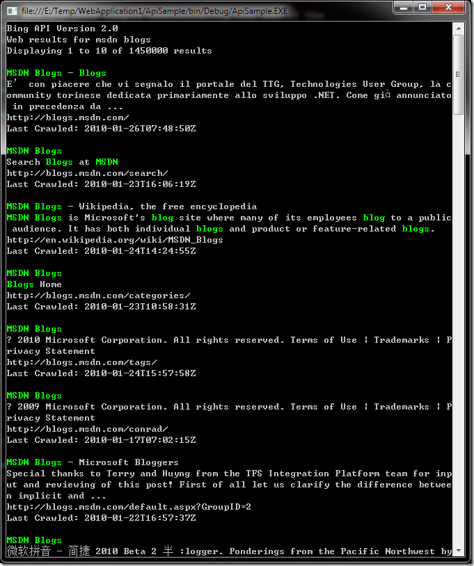

# Bing API 2的体验 
> 原文发表于 2010-01-26, 地址: http://www.cnblogs.com/chenxizhang/archive/2010/01/26/1656918.html 


所谓Bing API，就是微软的搜索服务所公开的一套API，其目的就是让任何应用程序可以调用Bing的服务实现自定义的搜索体验。

 基本的三个步骤：

 申请一个App Id

 <http://cn.bing.com/developers/createapp.aspx>

  

 下载SDK

 <http://www.microsoft.com/downloads/details.aspx?FamilyId=0F513086-078B-47A8-A889-842DC93A69AB&displaylang=en>

 [](http://images.cnblogs.com/cnblogs_com/chenxizhang/WindowsLiveWriter/BingAPI2_F899/image_4.png) 

  

 如何编程访问bing的搜索服务

 <http://msdn.microsoft.com/en-us/library/dd251049.aspx>

 [](http://images.cnblogs.com/cnblogs_com/chenxizhang/WindowsLiveWriter/BingAPI2_F899/image_2.png) 

  

 我做的一个例子：

  

 我们可以采用SOAP的方式，即调用Web Service的方式，首先按照下面这样的方式添加引用

 Using SOAP (Bing, Version 2) The Bing SOAP interface is most efficiently accessed by referencing the ***Web Service Description Language*** (WSDL) document from a Microsoft Visual Studio project. The WSDL defines the ports and messages that comprise the Bing API SOAP web service. #### To add a Web reference in Microsoft Visual Studio

 <?XML:NAMESPACE PREFIX = [default] http://ddue.schemas.microsoft.com/authoring/2003/5 NS = "http://ddue.schemas.microsoft.com/authoring/2003/5" /> 1. From **Solution Explorer** in an existing or newly created project, right-click **References** and, from the pop-up menu, select **Add Service Reference**.   
If you are using Microsoft Visual Studio 2005, this pop-up menu includes **Add Web Reference**. In this case, click **Add Web Reference** and proceed to Step 3.  
If you are using Microsoft Visual Studio 2008, proceed to Step 2. - Click **Advanced** on the **Add Service Reference** dialog box, then click **Add Web Reference** on the **Service Reference Settings** dialog box. - Type the following address in the URL text box: **http://api.bing.net/search.wsdl?AppID=***YourAppId***&Version=2.2**. For information about obtaining an AppId, see [Bing Developer Center](http://www.bing.com/developers). - Click **Go.**- You can accept the default web reference name `net.bing.api` suggested in the **Web reference name** text box, or type your own name for the web reference in the text box. Click **Add Reference** to add the web reference to your project.

 [](http://images.cnblogs.com/cnblogs_com/chenxizhang/WindowsLiveWriter/BingAPI2_F899/image_6.png) 

 使用下面的代码进行测试


```
using System;
using System.Xml;

// This using directive assumes that the project's default namespace is
// "ApiSamples" and the name of the Bing API web reference is
// "net.bing.api". Modify this using directive as necessary.
using ApiSample.net.bing.api;

// Bing API 2.1 code sample demonstrating the use of the
// Web SourceType over the SOAP Protocol.
static class WebSample
{
    // Replace the following string with the AppId you received from the
    // Bing Developer Center.
    const string AppId = "你的AppId";

    static void Main()
    {
        // BingService implements IDisposable.
        using (BingService service = new BingService())
        {
            try
            {
                SearchRequest request = BuildRequest();

                // Send the request; display the response.
                SearchResponse response = service.Search(request);
                DisplayResponse(response);
            }
            catch (System.Web.Services.Protocols.SoapException ex)
            {
                // A SOAP Exception was thrown. Display error details.
                DisplayErrors(ex.Detail);
            }
            catch (System.Net.WebException ex)
            {
                // An exception occurred while accessing the network.
                Console.WriteLine(ex.Message);
            }
        }

        Console.Read();
    }

    static SearchRequest BuildRequest()
    {
        SearchRequest request = new SearchRequest();

        // Common request fields (required)
        request.AppId = AppId;
        request.Query = "msdn blogs";
        request.Sources = new SourceType[] { SourceType.Web };

        // Common request fields (optional)
        request.Version = "2.0";
        request.Market = "en-us";
        request.Adult = AdultOption.Moderate;
        request.AdultSpecified = true;
        request.Options = new SearchOption[]
        {
            SearchOption.EnableHighlighting
        };

        // Web-specific request fields (optional)
        request.Web = new WebRequest();
        request.Web.Count = 10;
        request.Web.CountSpecified = true;
        request.Web.Offset = 0;
        request.Web.OffsetSpecified = true;
        request.Web.Options = new WebSearchOption[]
        {
            WebSearchOption.DisableHostCollapsing,
            WebSearchOption.DisableQueryAlterations
        };

        return request;
    }

    static void DisplayResponse(SearchResponse response)
    {
        // Display the results header.
        Console.WriteLine("Bing API Version " + response.Version);
        Console.WriteLine("Web results for " + response.Query.SearchTerms);
        Console.WriteLine(
            "Displaying {0} to {1} of {2} results",
            response.Web.Offset + 1,
            response.Web.Offset + response.Web.Results.Length,
            response.Web.Total);
        Console.WriteLine();

        // Display the Web results.
        System.Text.StringBuilder builder = new System.Text.StringBuilder();
        foreach (WebResult result in response.Web.Results)
        {
            builder.Length = 0;
            builder.AppendLine(result.Title);
            builder.AppendLine(result.Description);
            builder.AppendLine(result.Url);
            builder.Append("Last Crawled: ");
            builder.AppendLine(result.DateTime);

            DisplayTextWithHighlighting(builder.ToString());
            Console.WriteLine();
        }
    }

    static void DisplayTextWithHighlighting(string text)
    {
        // Write text to the standard output stream, changing the console
        // foreground color as highlighting characters are encountered.
        foreach (char c in text.ToCharArray())
        {
            if (c == '\uE000')
            {
                // If the current character is the begin highlighting
                // character (U+E000), change the console foreground color
                // to green.
                Console.ForegroundColor = ConsoleColor.Green;
            }
            else if (c == '\uE001')
            {
                // If the current character is the end highlighting
                // character (U+E001), revert the console foreground color
                // to gray.
                Console.ForegroundColor = ConsoleColor.Gray;
            }
            else
            {
                Console.Write(c);
            }
        }
    }

    static void DisplayErrors(XmlNode errorDetails)
    {
        // Add the default namespace to the namespace manager.
        XmlNamespaceManager nsmgr = new XmlNamespaceManager(
            errorDetails.OwnerDocument.NameTable);
        nsmgr.AddNamespace(
            "api",
            "http://schemas.microsoft.com/LiveSearch/2008/03/Search");

        XmlNodeList errors = errorDetails.SelectNodes(
            "./api:Errors/api:Error",
            nsmgr);

        if (errors != null)
        {
            // Iterate over the list of errors and display error details.
            Console.WriteLine("Errors:");
            Console.WriteLine();
            foreach (XmlNode error in errors)
            {
                foreach (XmlNode detail in error.ChildNodes)
                {
                    Console.WriteLine(detail.Name + ": " + detail.InnerText);
                }

                Console.WriteLine();
            }
        }
    }
}
```

.csharpcode, .csharpcode pre
{
 font-size: small;
 color: black;
 font-family: consolas, "Courier New", courier, monospace;
 background-color: #ffffff;
 /*white-space: pre;*/
}
.csharpcode pre { margin: 0em; }
.csharpcode .rem { color: #008000; }
.csharpcode .kwrd { color: #0000ff; }
.csharpcode .str { color: #006080; }
.csharpcode .op { color: #0000c0; }
.csharpcode .preproc { color: #cc6633; }
.csharpcode .asp { background-color: #ffff00; }
.csharpcode .html { color: #800000; }
.csharpcode .attr { color: #ff0000; }
.csharpcode .alt 
{
 background-color: #f4f4f4;
 width: 100%;
 margin: 0em;
}
.csharpcode .lnum { color: #606060; }

[](http://images.cnblogs.com/cnblogs_com/chenxizhang/WindowsLiveWriter/BingAPI2_F899/image_8.png)


