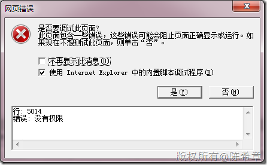
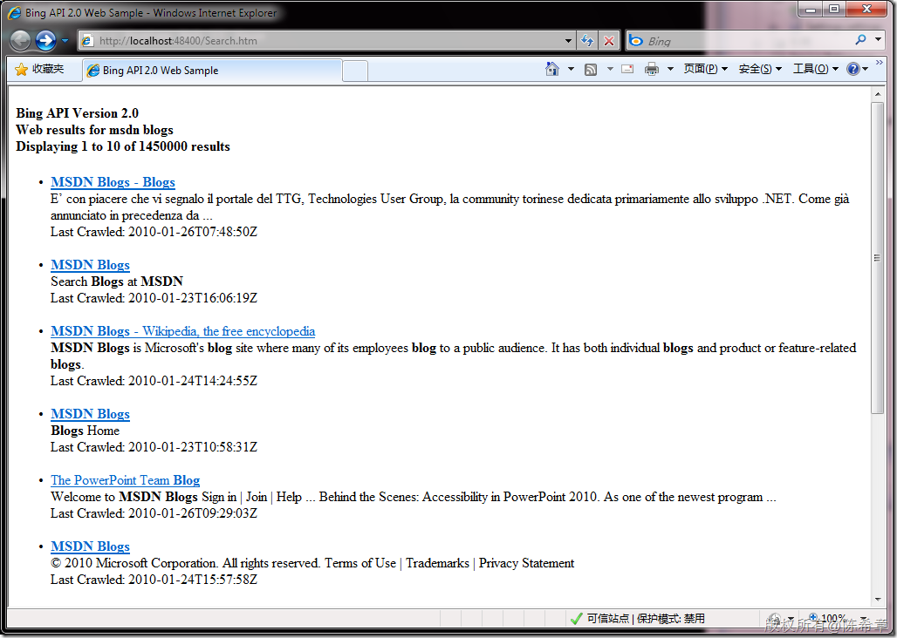
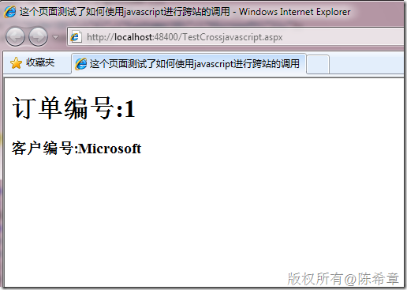

# javascript是否真的就不能实现跨站请求呢？ 
> 原文发表于 2010-01-26, 地址: http://www.cnblogs.com/chenxizhang/archive/2010/01/26/1656942.html 


这是一个老问题，出于安全考虑，javascript是没有办法直接调用不同网站的资源的，例如下面的脚本就会出错


```
<%@ Page Language="C#" AutoEventWireup="true" CodeBehind="Default.aspx.cs" Inherits="WebApplication1.\_Default" %>

<!DOCTYPE html PUBLIC "-//W3C//DTD XHTML 1.0 Transitional//EN" "http://www.w3.org/TR/xhtml1/DTD/xhtml1-transitional.dtd">
<html xmlns="http://www.w3.org/1999/xhtml">
<head runat="server">
    <title></title>

    <script src="jquery-1.3.2-vsdoc.js" type="text/javascript"></script>

    <script type="text/javascript">
        $(function() {
            $("#search").click(function() {
                var url = "http://cn.bing.com/search";
                var data = { q: "星球大战", cp: "936" };

                $.get(url, data, function(result) {
                    $(result).find("#result").appendTo($("#result"));
                });
            });
        });
    </script>

</head>
<body>
    <form id="form1" runat="server">
    <div>
        <button value="搜索" id="search">
        </button>
        <hr />
        <div id="result">
        </div>
    </div>
    </form>
</body>
</html>

```

```
这一段，我的本意是调用微软的Bing服务，进行搜索。但一旦运行，就会报告如下的错误
```

```
[](http://images.cnblogs.com/cnblogs_com/chenxizhang/WindowsLiveWriter/javascript_104D1/image_2.png) 
```

.csharpcode, .csharpcode pre
{
 font-size: small;
 color: black;
 font-family: consolas, "Courier New", courier, monospace;
 background-color: #ffffff;
 /*white-space: pre;*/
}
.csharpcode pre { margin: 0em; }
.csharpcode .rem { color: #008000; }
.csharpcode .kwrd { color: #0000ff; }
.csharpcode .str { color: #006080; }
.csharpcode .op { color: #0000c0; }
.csharpcode .preproc { color: #cc6633; }
.csharpcode .asp { background-color: #ffff00; }
.csharpcode .html { color: #800000; }
.csharpcode .attr { color: #ff0000; }
.csharpcode .alt 
{
 background-color: #f4f4f4;
 width: 100%;
 margin: 0em;
}
.csharpcode .lnum { color: #606060; }

但是不是这个问题就无解了呢？其实不然


大家可以参考下面这个例子程序


<http://msdn.microsoft.com/en-us/library/dd251093.aspx>


```
<!DOCTYPE html PUBLIC "-//W3C//DTD XHTML 1.0 Transitional//EN"
    "http://www.w3.org/TR/xhtml1/DTD/xhtml1-transitional.dtd">
<html >
<head>
    <title>Bing API 2.0 Web Sample</title>
    <meta http-equiv="Content-Type" content="text/html; charset=UTF-8" />
    <script id="searchCallback" type="text/javascript" src="">
    </script>

    <script type="text/javascript">

    
    // Replace the following string with the AppId you received from the
    // Bing Developer Center.
    var AppId = "Insert your AppId here";
    
    // Bing API 2.0 code sample demonstrating the use of the
    // Web SourceType over the JSON Protocol.
    function Search()
    {
        var requestStr = "http://api.bing.net/json.aspx?"
        
            // Common request fields (required)
            + "AppId=" + AppId
            + "&Query=msdn blogs"
            + "&Sources=Web"
            
            // Common request fields (optional)
            + "&Version=2.0"
            + "&Market=en-us"
            + "&Adult=Moderate"
            + "&Options=EnableHighlighting"

            // Web-specific request fields (optional)
            + "&Web.Count=10"
            + "&Web.Offset=0"
            + "&Web.Options=DisableHostCollapsing+DisableQueryAlterations"

            // JSON-specific request fields (optional)
            + "&JsonType=callback"
            + "&JsonCallback=SearchCompleted";

         var requestScript = document.getElementById("searchCallback");
         requestScript.src = requestStr;

    }

    function SearchCompleted(response)
    {
        var errors = response.SearchResponse.Errors;
        if (errors != null)
        {
            // There are errors in the response. Display error details.
            DisplayErrors(errors);
        }
        else
        {
            // There were no errors in the response. Display the
            // Web results.
            DisplayResults(response);
        }
    }

    function DisplayResults(response)
    {
        var output = document.getElementById("output");
        var resultsHeader = document.createElement("h4");
        var resultsList = document.createElement("ul");
        output.appendChild(resultsHeader);
        output.appendChild(resultsList);
    
        var results = response.SearchResponse.Web.Results;
        
        // Display the results header.
        resultsHeader.innerHTML = "Bing API Version "
            + response.SearchResponse.Version
            + "<br />Web results for "
            + response.SearchResponse.Query.SearchTerms
            + "<br />Displaying "
            + (response.SearchResponse.Web.Offset + 1)
            + " to "
            + (response.SearchResponse.Web.Offset + results.length)
            + " of "
            + response.SearchResponse.Web.Total
            + " results<br />";
        
        // Display the Web results.
        var resultsListItem = null;
        var resultStr = "";
        for (var i = 0; i < results.length; ++i)
        {
            resultsListItem = document.createElement("li");
            resultsList.appendChild(resultsListItem);
            resultStr = "<a href=\""
                + results[i].Url
                + "\">"
                + results[i].Title
                + "</a><br />"
                + results[i].Description
                + "<br />Last Crawled: "
                + results[i].DateTime
                + "<br /><br />";
            
            // Replace highlighting characters with strong tags.
            resultsListItem.innerHTML = ReplaceHighlightingCharacters(
                resultStr,
                "<strong>",
                "</strong>");
        }
    }
    
    function ReplaceHighlightingCharacters(text, beginStr, endStr)
    {
        // Replace all occurrences of U+E000 (begin highlighting) with
        // beginStr. Replace all occurrences of U+E001 (end highlighting)
        // with endStr.
        var regexBegin = new RegExp("\uE000", "g");
        var regexEnd = new RegExp("\uE001", "g");
              
        return text.replace(regexBegin, beginStr).replace(regexEnd, endStr);
    }

    function DisplayErrors(errors)
    {
        var output = document.getElementById("output");
        var errorsHeader = document.createElement("h4");
        var errorsList = document.createElement("ul");
        output.appendChild(errorsHeader);
        output.appendChild(errorsList);
        
        // Iterate over the list of errors and display error details.
        errorsHeader.innerHTML = "Errors:";
        var errorsListItem = null;
        for (var i = 0; i < errors.length; ++i)
        {
            errorsListItem = document.createElement("li");
            errorsList.appendChild(errorsListItem);
            errorsListItem.innerHTML = "";
            for (var errorDetail in errors[i])
            {
                errorsListItem.innerHTML += errorDetail
                    + ": "
                    + errors[i][errorDetail]
                    + "<br />";
            }
            
            errorsListItem.innerHTML += "<br />";
        }
    }
    
    </script>

</head>
<body onload="Search()">
    <div id="output"></div>
</body>
</html>
```

```
[](http://images.cnblogs.com/cnblogs_com/chenxizhang/WindowsLiveWriter/javascript_104D1/image_4.png) 
```

```
 
```


.csharpcode, .csharpcode pre
{
 font-size: small;
 color: black;
 font-family: consolas, "Courier New", courier, monospace;
 background-color: #ffffff;
 /*white-space: pre;*/
}
.csharpcode pre { margin: 0em; }
.csharpcode .rem { color: #008000; }
.csharpcode .kwrd { color: #0000ff; }
.csharpcode .str { color: #006080; }
.csharpcode .op { color: #0000c0; }
.csharpcode .preproc { color: #cc6633; }
.csharpcode .asp { background-color: #ffff00; }
.csharpcode .html { color: #800000; }
.csharpcode .attr { color: #ff0000; }
.csharpcode .alt 
{
 background-color: #f4f4f4;
 width: 100%;
 margin: 0em;
}
.csharpcode .lnum { color: #606060; }


简单地说，这个设计很巧妙地绕开了跨站调用的问题：它将请求的地址封装为一个js的src属性，因为js的src确实可以引用外部文件，所以该文件会被下载。然后里面的脚本自动地再调用页面上的某个方法。我要说的是，太有才了！


我们来看看它到底传过来什么东西


```
if(typeof SearchCompleted == 'function') 
```

```
SearchCompleted(
```

```
{"SearchResponse":{"Version":"2.0","Query":
```

```
{"SearchTerms":"msdn blogs"},"Web":
```

```
{"Total":1450000,"Offset":0,
```

```
"Results":[
```

```
{"Title":"MSDN Blogs - Blogs","Description":"E’ con piacere che vi segnalo il portale del TTG, Technologies User Group, la community torinese dedicata primariamente allo sviluppo .NET. Come già annunciato in precedenza da ...","Url":"http:\/\/blogs.msdn.com\/","DisplayUrl":"blogs.msdn.com","DateTime":"2010-01-26T07:48:50Z"},
```

```
{"Title":"MSDN Blogs","Description":"Search Blogs at MSDN","Url":"http:\/\/blogs.msdn.com\/search\/","DisplayUrl":"blogs.msdn.com\/search","DateTime":"2010-01-23T16:06:19Z"},
```

```
{"Title":"MSDN Blogs - Wikipedia, the free encyclopedia","Description":"MSDN Blogs is Microsoft's blog site where many of its employees blog to a public audience. It has both individual blogs and product or feature-related blogs.","Url":"http:\/\/en.wikipedia.org\/wiki\/MSDN\_Blogs","DisplayUrl":"en.wikipedia.org\/wiki\/MSDN\_Blogs","DateTime":"2010-01-24T14:24:55Z"},
```

```
{"Title":"MSDN Blogs","Description":"Blogs Home","Url":"http:\/\/blogs.msdn.com\/categories\/","DisplayUrl":"blogs.msdn.com\/categories","DateTime":"2010-01-23T10:58:31Z"},
```

```
{"Title":"The PowerPoint Team Blog","Description":"Welcome to MSDN Blogs Sign in | Join | Help ... Behind the Scenes: Accessibility in PowerPoint 2010. As one of the newest program ...","Url":"http:\/\/blogs.msdn.com\/powerpoint","DisplayUrl":"blogs.msdn.com\/powerpoint","DateTime":"2010-01-26T09:29:03Z"},
```

```
{"Title":"MSDN Blogs","Description":"© 2010 Microsoft Corporation. All rights reserved. Terms of Use | Trademarks | Privacy Statement","Url":"http:\/\/blogs.msdn.com\/tags\/","DisplayUrl":"blogs.msdn.com\/tags","DateTime":"2010-01-24T15:57:58Z"},
```

```
{"Title":"MSDN Blogs","Description":"© 2009 Microsoft Corporation. All rights reserved. Terms of Use | Trademarks | Privacy Statement","Url":"http:\/\/blogs.msdn.com\/conrad\/","DisplayUrl":"blogs.msdn.com\/conrad","DateTime":"2010-01-17T07:02:15Z"},
```

```
{"Title":"MSDN Blogs - Microsoft Bloggers","Description":"Special thanks to Terry and Huyng from the TFS Integration Platform team for input and reviewing of this post! First of all let us clarify the difference between implicit and ...","Url":"http:\/\/blogs.msdn.com\/default.aspx?GroupID=2","DisplayUrl":"blogs.msdn.com\/default.aspx?GroupID=2","DateTime":"2010-01-22T16:57:37Z"},
```

```
{"Title":"Microsoft Project 2010","Description":"Microsoft Office Project Server 2007 is a set of tools which enables you to effectively manage and coordinate work for an individual, team or enterprise.","Url":"http:\/\/blogs.msdn.com\/project\/","DisplayUrl":"blogs.msdn.com\/project","DateTime":"2010-01-26T09:21:54Z"},
```

```
{"Title":"MSDN Blogs","Description":"frankarr - an aussie microsoft blogger. Ponderings from the Pacific Northwest by an Aussie Geek who works at a software company","Url":"http:\/\/blogs.msdn.com\/frankarr\/about.aspx","DisplayUrl":"blogs.msdn.com\/frankarr\/about.aspx","DateTime":"2010-01-23T19:26:45Z"}]}}} /* pageview\_candidate */);
```

```
 
```

```
一看到这个，大家应该明白了吧。这确实是一个脚本文件，没有任何问题。它自动调用SearchCompleted方法，这也很合理。
```

```
鼓掌~~~
```

```
 
```

.csharpcode, .csharpcode pre
{
 font-size: small;
 color: black;
 font-family: consolas, "Courier New", courier, monospace;
 background-color: #ffffff;
 /*white-space: pre;*/
}
.csharpcode pre { margin: 0em; }
.csharpcode .rem { color: #008000; }
.csharpcode .kwrd { color: #0000ff; }
.csharpcode .str { color: #006080; }
.csharpcode .op { color: #0000c0; }
.csharpcode .preproc { color: #cc6633; }
.csharpcode .asp { background-color: #ffff00; }
.csharpcode .html { color: #800000; }
.csharpcode .attr { color: #ff0000; }
.csharpcode .alt 
{
 background-color: #f4f4f4;
 width: 100%;
 margin: 0em;
}
.csharpcode .lnum { color: #606060; }

又及：


研究一个东西，最重要是转换为自己的理解。所以下面我用一个简单例子来体验一把，也给读者解释一下那个Json.aspx页面一般可以怎么编写出来


1. json.aspx文件


页面部分


```
<%@ Page Language="C#" AutoEventWireup="true" CodeBehind="json.aspx.cs" Inherits="WebApplication1.json" %>

```

```
代码部分
```

```
using System;
using System.Text;

namespace WebApplication1
{
    public partial class json : System.Web.UI.Page
    {
        protected void Page\_Load(object sender, EventArgs e)
        {
            StringBuilder sb = new StringBuilder();
            sb.Append("if(typeof Display =='function')Display(");
            sb.Append("{\"OrderID\":\"1\",\"CustomerID\":\"Microsoft\"});");
            Response.Write(sb.ToString());
        }
    }
}

```

 


2。调用页面


```
<%@ Page Language="C#" AutoEventWireup="true" CodeBehind="TestCrossjavascript.aspx.cs" Inherits="WebApplication1.TestCrossjavascript" %>

<!DOCTYPE html PUBLIC "-//W3C//DTD XHTML 1.0 Transitional//EN" "http://www.w3.org/TR/xhtml1/DTD/xhtml1-transitional.dtd">

<html xmlns="http://www.w3.org/1999/xhtml" >
<head runat="server">
    <title>这个页面测试了如何使用javascript进行跨站的调用</title>
    <script id="placeholder" src="" type="text/javascript"></script>
    <script src="jquery-1.3.2-vsdoc.js" type="text/javascript"></script>
    <script type="text/javascript">
        $(function() {
            var p = $("#placeholder");
            p.attr("src", "http://localhost:48400/json.aspx");
        });

        function Display(result) {
            var orderId = result.OrderID;
            var customerId = result.CustomerID;
            $("<h1>订单编号:" + orderId + "</h1>").appendTo("#contents");
            $("<h3>客户编号:" + customerId + "</h3>").appendTo("#contents");
            
        }
    </script>
</head>
<body>
    <form id="form1" runat="server">
    <div id="contents">
    
    </div>
    </form>
</body>
</html>

```

.csharpcode, .csharpcode pre
{
 font-size: small;
 color: black;
 font-family: consolas, "Courier New", courier, monospace;
 background-color: #ffffff;
 /*white-space: pre;*/
}
.csharpcode pre { margin: 0em; }
.csharpcode .rem { color: #008000; }
.csharpcode .kwrd { color: #0000ff; }
.csharpcode .str { color: #006080; }
.csharpcode .op { color: #0000c0; }
.csharpcode .preproc { color: #cc6633; }
.csharpcode .asp { background-color: #ffff00; }
.csharpcode .html { color: #800000; }
.csharpcode .attr { color: #ff0000; }
.csharpcode .alt 
{
 background-color: #f4f4f4;
 width: 100%;
 margin: 0em;
}
.csharpcode .lnum { color: #606060; }

.csharpcode, .csharpcode pre
{
 font-size: small;
 color: black;
 font-family: consolas, "Courier New", courier, monospace;
 background-color: #ffffff;
 /*white-space: pre;*/
}
.csharpcode pre { margin: 0em; }
.csharpcode .rem { color: #008000; }
.csharpcode .kwrd { color: #0000ff; }
.csharpcode .str { color: #006080; }
.csharpcode .op { color: #0000c0; }
.csharpcode .preproc { color: #cc6633; }
.csharpcode .asp { background-color: #ffff00; }
.csharpcode .html { color: #800000; }
.csharpcode .attr { color: #ff0000; }
.csharpcode .alt 
{
 background-color: #f4f4f4;
 width: 100%;
 margin: 0em;
}
.csharpcode .lnum { color: #606060; }

 


```
3. 测试效果
```

```
[](http://images.cnblogs.com/cnblogs_com/chenxizhang/WindowsLiveWriter/javascript_104D1/image_6.png) 
```

.csharpcode, .csharpcode pre
{
 font-size: small;
 color: black;
 font-family: consolas, "Courier New", courier, monospace;
 background-color: #ffffff;
 /*white-space: pre;*/
}
.csharpcode pre { margin: 0em; }
.csharpcode .rem { color: #008000; }
.csharpcode .kwrd { color: #0000ff; }
.csharpcode .str { color: #006080; }
.csharpcode .op { color: #0000c0; }
.csharpcode .preproc { color: #cc6633; }
.csharpcode .asp { background-color: #ffff00; }
.csharpcode .html { color: #800000; }
.csharpcode .attr { color: #ff0000; }
.csharpcode .alt 
{
 background-color: #f4f4f4;
 width: 100%;
 margin: 0em;
}
.csharpcode .lnum { color: #606060; }

 


到这里，有的朋友可能会讲，手工地拼接那个 Json字符串岂不是太累了，也太容易出错。


谁说不是呢？那么如何在c#中将对象转换为json字符串呢


```
using System;
using System.Text;
using System.Runtime.Serialization;
using System.Runtime.Serialization.Json;
using System.IO;

namespace WebApplication1
{
    public partial class json : System.Web.UI.Page
    {
        protected void Page\_Load(object sender, EventArgs e)
        {
            StringBuilder sb = new StringBuilder();
            sb.Append("if(typeof Display =='function')Display(");
            sb.Append(GetConfig());
            sb.Append(");");
            Response.Write(sb.ToString());
        }

        private string GetConfig() {
            var config = new Config()
            {
                encoding = "UTF-8",
                plugins = new string[] { "python", "C++", "C#" },
                indent = new Indent() { length = 4, use\_space = false }
            };
            var serializer = new DataContractJsonSerializer(typeof(Config));
            var stream = new MemoryStream();
            serializer.WriteObject(stream, config);

            byte[] dataBytes = new byte[stream.Length];

            stream.Position = 0;

            stream.Read(dataBytes, 0, (int)stream.Length);

            string dataString = Encoding.UTF8.GetString(dataBytes);
            return dataString;
        }
    }

    [DataContract(Namespace = "http://blog.xizhang.com")]
    class Config
    {
        [DataMember(Order = 0)]
        public string encoding { get; set; }
        [DataMember(Order = 1)]
        public string[] plugins { get; set; }
        [DataMember(Order = 2)]
        public Indent indent { get; set; }
    }

    [DataContract(Namespace = "http://blog.xizhang.com")]
    class Indent
    {
        [DataMember(Order = 0)]
        public int length { get; set; }
        [DataMember(Order = 1)]
        public bool use\_space { get; set; }
    }
}
也就是说，其实.NET 3.5已经直接支持通过序列化的方式将对象转换为json格式
```

```
 
```

.csharpcode, .csharpcode pre
{
 font-size: small;
 color: black;
 font-family: consolas, "Courier New", courier, monospace;
 background-color: #ffffff;
 /*white-space: pre;*/
}
.csharpcode pre { margin: 0em; }
.csharpcode .rem { color: #008000; }
.csharpcode .kwrd { color: #0000ff; }
.csharpcode .str { color: #006080; }
.csharpcode .op { color: #0000c0; }
.csharpcode .preproc { color: #cc6633; }
.csharpcode .asp { background-color: #ffff00; }
.csharpcode .html { color: #800000; }
.csharpcode .attr { color: #ff0000; }
.csharpcode .alt 
{
 background-color: #f4f4f4;
 width: 100%;
 margin: 0em;
}
.csharpcode .lnum { color: #606060; }
