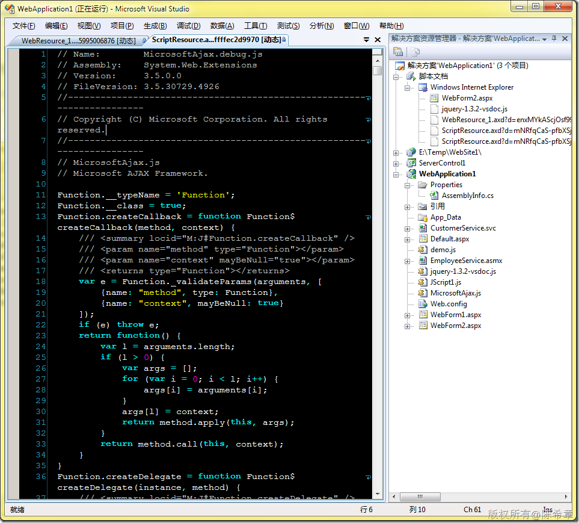

# ASP.NET AJAX:使用MicrosoftAJAX脚本库的方式 
> 原文发表于 2010-01-30, 地址: http://www.cnblogs.com/chenxizhang/archive/2010/01/30/1659668.html 


第一种方式是在页面上添加一个ScriptManager的服务器控件，这种情况适合于ASP.NET开发。


```
    <form id="form1" runat="server">
    <div>
        <asp:ScriptManager ID="ScriptManager1" runat="server">
        </asp:ScriptManager>
        <div id="info">
        </div>
    </div>
    </form>
```

其实这个控件会自动知道要下载那些js文件，而这些js文件是通过资源的方式提供的。注意看解决方案管理器中的那些脚本文档。为了进行调试，它这里动态加载了debug的版本


[](http://images.cnblogs.com/cnblogs_com/chenxizhang/WindowsLiveWriter/ASP.NETAJAXMicrosoftAJAX_98D3/image_2.png) 


 


.csharpcode, .csharpcode pre
{
 font-size: small;
 color: black;
 font-family: consolas, "Courier New", courier, monospace;
 background-color: #ffffff;
 /*white-space: pre;*/
}
.csharpcode pre { margin: 0em; }
.csharpcode .rem { color: #008000; }
.csharpcode .kwrd { color: #0000ff; }
.csharpcode .str { color: #006080; }
.csharpcode .op { color: #0000c0; }
.csharpcode .preproc { color: #cc6633; }
.csharpcode .asp { background-color: #ffff00; }
.csharpcode .html { color: #800000; }
.csharpcode .attr { color: #ff0000; }
.csharpcode .alt 
{
 background-color: #f4f4f4;
 width: 100%;
 margin: 0em;
}
.csharpcode .lnum { color: #606060; }


第二种方式则是直接添加MicrosoftAJAX.js的文件，这种情况适合于任何场景开发。你可以将它就是当作一个普通的js库


```
    <script src="MicrosoftAjax.js" type="text/javascript"></script>
这些脚本的下载地址是<http://www.asp.net/ajax/downloads/>
```

.csharpcode, .csharpcode pre
{
 font-size: small;
 color: black;
 font-family: consolas, "Courier New", courier, monospace;
 background-color: #ffffff;
 /*white-space: pre;*/
}
.csharpcode pre { margin: 0em; }
.csharpcode .rem { color: #008000; }
.csharpcode .kwrd { color: #0000ff; }
.csharpcode .str { color: #006080; }
.csharpcode .op { color: #0000c0; }
.csharpcode .preproc { color: #cc6633; }
.csharpcode .asp { background-color: #ffff00; }
.csharpcode .html { color: #800000; }
.csharpcode .attr { color: #ff0000; }
.csharpcode .alt 
{
 background-color: #f4f4f4;
 width: 100%;
 margin: 0em;
}
.csharpcode .lnum { color: #606060; }
