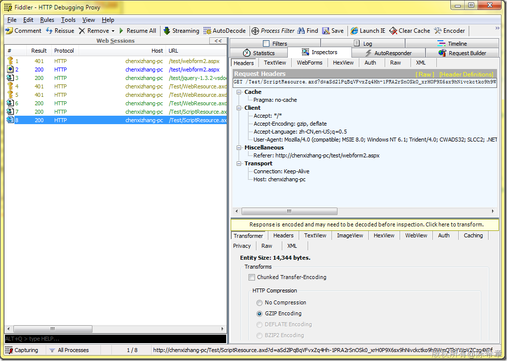

# Understanding ScriptResource and WebResource in ASP.NET 
> 原文发表于 2010-01-30, 地址: http://www.cnblogs.com/chenxizhang/archive/2010/01/30/1659675.html 

这是一个小问题，大家如果细心的话，下面的截图中，调试状态下生成的脚本有两种方式，一种是WebResource，还有一种是ScriptResource。为什么会有这个区别呢？

  

 下面这个文章做了一些解释

 <http://bchavez.bitarmory.com/archive/2008/07/28/understanding-scriptresource-and-webresource-in-asp.net.aspx>

  

 简单地说，WebResource泛指所有可以嵌入在程序集中的资源，包括脚本，图片，等等其他任何资源。而ScriptResource则特指脚本，它会自动进行GZip的压缩

 下面就可以通过截图来说明一下

  

   

 那么，如何产生所谓的ScriptResouce引用呢，其实是

 ScriptManager.RegisterClientScriptResource(this, typeof(SwfObject), "ProjectBase.Web.Scripts.swfobject.js" ); 而之前产生WebResource的引用是 this.Page.ClientScript.RegisterClientScriptResource(typeof(SwfObject), "ProjectBase.Web.Scripts.swfobject.js" );   在ASP.NET AJAX越来越流行之后，使用ScriptManager这种方式是更加通用的 

