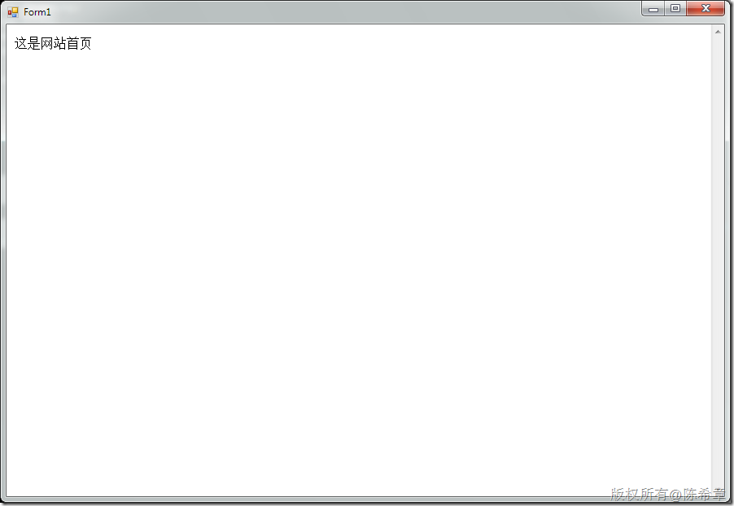

# 在WebBrowser控件中实现自动登录并跳转到指定页面 
> 原文发表于 2010-02-01, 地址: http://www.cnblogs.com/chenxizhang/archive/2010/02/01/1661321.html 


如果我们在Windows Forms里面使用了WebBrowser控件，与此同时我们希望用户进入某些页面的时候自动就能使用当前身份进行登录。那么该怎么办呢？下面看一个例子

  

 网站登录页面(Login.aspx)


```
using System;
using System.Collections.Generic;
using System.Linq;
using System.Web;
using System.Web.UI;
using System.Web.UI.WebControls;

using System.Web.Security;

namespace WebApplication1
{
    public partial class Login : System.Web.UI.Page
    {
        protected void Page\_Load(object sender, EventArgs e)
        {
            var username = Request["username"];
            var password = Request["password"];
            if (username == "chenxizhang" && password == "password")
                FormsAuthentication.RedirectFromLoginPage(username, false);
        }

        protected void btLogin\_Click(object sender, EventArgs e)
        {
            var username = txtUserName.Text;
            var password = txtPassword.Text;

            if (username=="chenxizhang" && password=="password")
                FormsAuthentication.RedirectFromLoginPage(username, false);
        }
    }
}

```

```
网站配置(web.config)
```

```
      <authentication mode="Forms">
        <forms loginUrl="Login.aspx" defaultUrl="default.aspx"></forms>
      </authentication>
      <authorization>
        <deny users="?"/>
      </authorization>
```


.csharpcode, .csharpcode pre
{
 font-size: small;
 color: black;
 font-family: consolas, "Courier New", courier, monospace;
 background-color: #ffffff;
 /*white-space: pre;*/
}
.csharpcode pre { margin: 0em; }
.csharpcode .rem { color: #008000; }
.csharpcode .kwrd { color: #0000ff; }
.csharpcode .str { color: #006080; }
.csharpcode .op { color: #0000c0; }
.csharpcode .preproc { color: #cc6633; }
.csharpcode .asp { background-color: #ffff00; }
.csharpcode .html { color: #800000; }
.csharpcode .attr { color: #ff0000; }
.csharpcode .alt 
{
 background-color: #f4f4f4;
 width: 100%;
 margin: 0em;
}
.csharpcode .lnum { color: #606060; }


窗体代码（Form1.cs)


```
            var url = "http://localhost:6063/Login.aspx?ReturnUrl=%2fDefault.aspx";
            var data = "username=chenxizhang&password=password";
            webBrowser1.Navigate(url, "", Encoding.UTF8.GetBytes(data), "Content-Type: application/x-www-form-urlencoded");
```

.csharpcode, .csharpcode pre
{
 font-size: small;
 color: black;
 font-family: consolas, "Courier New", courier, monospace;
 background-color: #ffffff;
 /*white-space: pre;*/
}
.csharpcode pre { margin: 0em; }
.csharpcode .rem { color: #008000; }
.csharpcode .kwrd { color: #0000ff; }
.csharpcode .str { color: #006080; }
.csharpcode .op { color: #0000c0; }
.csharpcode .preproc { color: #cc6633; }
.csharpcode .asp { background-color: #ffff00; }
.csharpcode .html { color: #800000; }
.csharpcode .attr { color: #ff0000; }
.csharpcode .alt 
{
 background-color: #f4f4f4;
 width: 100%;
 margin: 0em;
}
.csharpcode .lnum { color: #606060; }

这段代码的意思就是，请求Login.aspx，并且传递用户名和密码过去。如果登录成功的话，自然就会转到Default.aspx页面


注意Navigate方法的最后一个参数，我们需要在Request的Header里面特别声明一下当前数据是form数据


 


效果如下。我们一旦运行，就自动进入了Default.aspx，用户并无察觉到登录行为的


[](http://images.cnblogs.com/cnblogs_com/chenxizhang/WindowsLiveWriter/WebBrowser_12B9F/image_2.png)
.csharpcode, .csharpcode pre
{
 font-size: small;
 color: black;
 font-family: consolas, "Courier New", courier, monospace;
 background-color: #ffffff;
 /*white-space: pre;*/
}
.csharpcode pre { margin: 0em; }
.csharpcode .rem { color: #008000; }
.csharpcode .kwrd { color: #0000ff; }
.csharpcode .str { color: #006080; }
.csharpcode .op { color: #0000c0; }
.csharpcode .preproc { color: #cc6633; }
.csharpcode .asp { background-color: #ffff00; }
.csharpcode .html { color: #800000; }
.csharpcode .attr { color: #ff0000; }
.csharpcode .alt 
{
 background-color: #f4f4f4;
 width: 100%;
 margin: 0em;
}
.csharpcode .lnum { color: #606060; }


