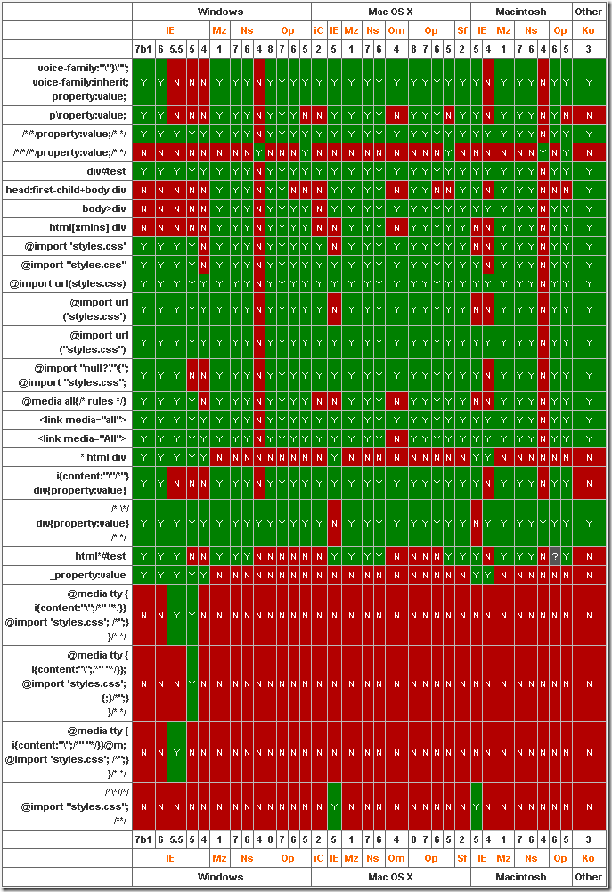

# CSS hack:区分IE6，IE7，firefox 
> 原文发表于 2010-02-05, 地址: http://www.cnblogs.com/chenxizhang/archive/2010/02/05/1664646.html 

<http://www.div-css.com/html/standard/hack/1136667.html>

  

 ### 区别不同浏览器，CSS hack写法：

   
 

 区别IE6与FF：        background:orange;*background:blue;   
 

 区别IE6与IE7：        background:green !important;background:blue;   
 

 区别IE7与FF：        background:orange; *background:green;   
 

 区别FF，IE7，IE6：        background:orange;*background:green !important;*background:blue;   
 

 注：IE都能识别*;标准浏览器(如FF)不能识别*； IE6能识别*，但不能识别 !important, IE7能识别*，也能识别!important; FF不能识别*，但能识别!important;   
 

 

|  | IE6 | IE7 | FF |
| * | √ | √ | × |
| !important | × | √ | √ |

   
  
 

 

---

 另外再补充一个，下划线"\_",  
IE6支持下划线，IE7和firefox均不支持下划线。  
  
于是大家还可以这样来区分IE6，IE7，firefox  
: background:orange;*background:green;\_background:blue;   
  
注：不管是什么方法，书写的顺序都是firefox的写在前面，IE7的写在中间，IE6的写在最后面。  
  
  
  
 

 

---

 相关：  
 

 * [在windows XP下面同时安装IE6，IE7和firefox](http://www.div-css.com/html/XHTML-CSS/hack/7164148320904.html "在windows XP下面同时安装IE6，IE7和firefox")  
（firefox的不同版本间可以共存，但是IE的不同版本之间不能共存，本文主要是解决将IE6和IE7安装到同一个XP系统里面去的问题）
   

  

 对于IE 8而言，CSS HACK的写法是在值后面添加\0后缀

 例如

 body   
{  
    padding-left:0px\0;  
} 

