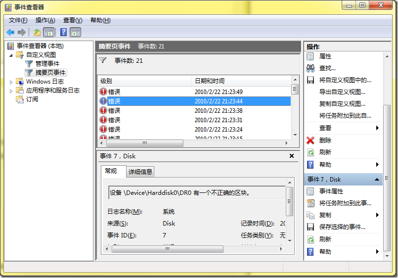
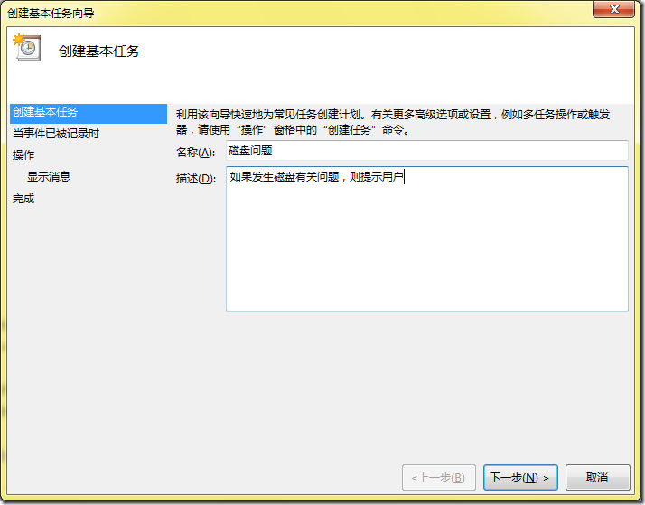
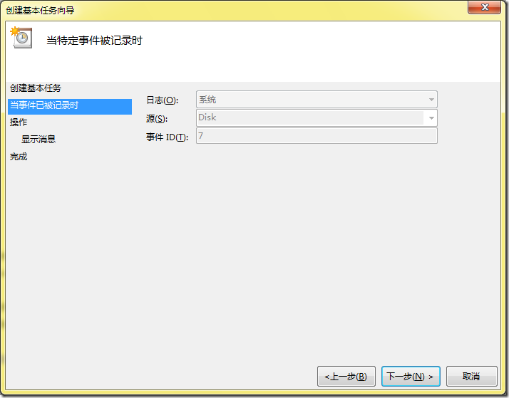
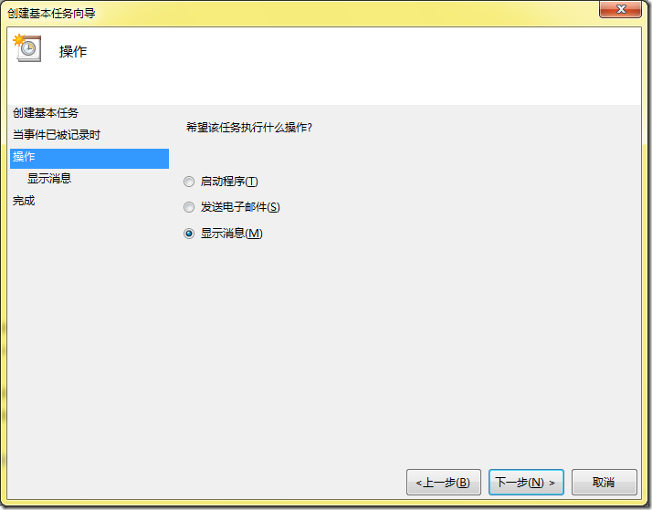
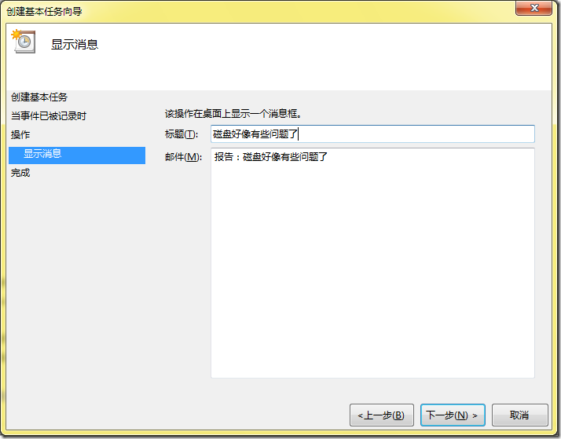
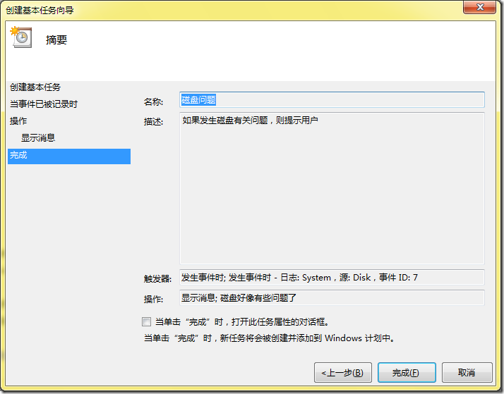

# Win7:如何让某个事件发生后启动某个任务 
> 原文发表于 2010-02-28, 地址: http://www.cnblogs.com/chenxizhang/archive/2010/02/28/1675254.html 

使用Win7有一段时间了，总体感觉还可以。但经常会遇到磁盘的问题，例如索引丢失之类，或者某个区块不正确。这在原先的XP时基本没有遇到过。磁盘出现问题之后，最直观的感觉就是速度慢，尤其是启动时很慢。然后容易蓝屏。

 当然这个问题是否与Win7有关我也不能下结论，只是用了之后出这种问题的机会大大增加了。

 如果遇到磁盘的问题，我一般就会启动磁盘的检查和修复。目前而言，这样做了之后基本能解决问题。

 那么，有没有办法在磁盘出现有关的问题时，自动通知我，或者直接启动一个程序呢？

 可以通过下面的方法实现这个目的。

  

  

 点击右侧的“将任务附加到此事件...”，然后按照类似下面这样的向导设置即可

  

  

  

  

  

 

