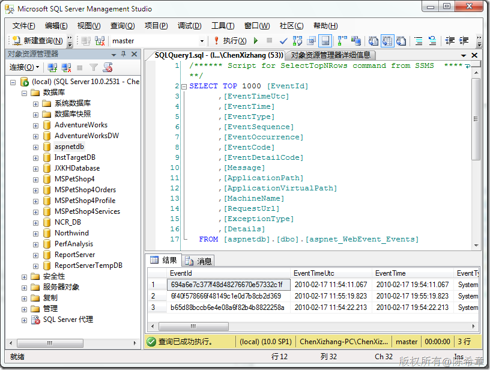

# ASP.NET中的healthMonitoring 
> 原文发表于 2010-02-28, 地址: http://www.cnblogs.com/chenxizhang/archive/2010/02/28/1675256.html 


有不少朋友不了解这个所谓的healthMonitoring，实际上这是自.NET Framework 2.0就开始拥有的特性。顾名思义，它是可以帮助我们对ASP.NET应用程序运行的健康状况进行监视的一套服务。

 这个部分的设置，可以在F:\Windows\Microsoft.NET\Framework\v2.0.50727\CONFIG目录下面的web.config文件中找到。

 我要简要地介绍一下这个特性的架构

 1. 首先，要设置有关的eventMappings，也就是说定义要监视的事件。

 2. 然后，定义所谓的监视提供程序（provider)，此时可能要定义有关的bufferMode，也就是每个provider所使用的缓冲模型。

 3. 然后，定义有关的规则，也就是说，哪些事件采用哪种provider来监视。（默认会有两个规则，就是将错误的事件，以及审核失败的事件，发送到事件日志中去）

 下面的粗体部分是我添加的，意思是说将所有事件都发送到一个数据库中去。  


```
       <healthMonitoring>
            <bufferModes>
                <add name="Critical Notification" maxBufferSize="100" maxFlushSize="20" urgentFlushThreshold="1" regularFlushInterval="Infinite" urgentFlushInterval="00:01:00" maxBufferThreads="1"/>
                <add name="Notification" maxBufferSize="300" maxFlushSize="20" urgentFlushThreshold="1" regularFlushInterval="Infinite" urgentFlushInterval="00:01:00" maxBufferThreads="1"/>
                <add name="Analysis" maxBufferSize="1000" maxFlushSize="100" urgentFlushThreshold="100" regularFlushInterval="00:05:00" urgentFlushInterval="00:01:00" maxBufferThreads="1"/>
                <add name="Logging" maxBufferSize="1000" maxFlushSize="200" urgentFlushThreshold="800" regularFlushInterval="00:30:00" urgentFlushInterval="00:05:00" maxBufferThreads="1"/>
            </bufferModes>

            <providers>
                <add name="EventLogProvider" type="System.Web.Management.EventLogWebEventProvider,System.Web,Version=2.0.0.0,Culture=neutral,PublicKeyToken=b03f5f7f11d50a3a"/>
                <add connectionStringName="LocalSqlServer" maxEventDetailsLength="1073741823" buffer="false" bufferMode="Notification" name="SqlWebEventProvider" type="System.Web.Management.SqlWebEventProvider,System.Web,Version=2.0.0.0,Culture=neutral,PublicKeyToken=b03f5f7f11d50a3a"/>
                <add name="WmiWebEventProvider" type="System.Web.Management.WmiWebEventProvider,System.Web,Version=2.0.0.0,Culture=neutral,PublicKeyToken=b03f5f7f11d50a3a"/>
            </providers>

            <profiles>
                <add name="Default" minInstances="1" maxLimit="Infinite" minInterval="00:01:00" custom=""/>
                <add name="Critical" minInstances="1" maxLimit="Infinite" minInterval="00:00:00" custom=""/>
            </profiles>

            <rules>
                <add name="All Errors Default" eventName="All Errors" provider="EventLogProvider" profile="Default" minInstances="1" maxLimit="Infinite" minInterval="00:01:00" custom=""/>
                <add name="Failure Audits Default" eventName="Failure Audits" provider="EventLogProvider" profile="Default" minInstances="1" maxLimit="Infinite" minInterval="00:01:00" custom=""/>
        **<add name="All Events" eventName="All Events" provider="SqlWebEventProvider" profile="Default" minInstances="1" maxLimit="Infinite" minInterval="00:01:00" custom=""/>**            </rules>

            <eventMappings>
                <add name="All Events" type="System.Web.Management.WebBaseEvent,System.Web,Version=2.0.0.0,Culture=neutral,PublicKeyToken=b03f5f7f11d50a3a" startEventCode="0" endEventCode="2147483647"/>
                <add name="Heartbeats" type="System.Web.Management.WebHeartbeatEvent,System.Web,Version=2.0.0.0,Culture=neutral,PublicKeyToken=b03f5f7f11d50a3a" startEventCode="0" endEventCode="2147483647"/>
                <add name="Application Lifetime Events" type="System.Web.Management.WebApplicationLifetimeEvent,System.Web,Version=2.0.0.0,Culture=neutral,PublicKeyToken=b03f5f7f11d50a3a" startEventCode="0" endEventCode="2147483647"/>
                <add name="Request Processing Events" type="System.Web.Management.WebRequestEvent,System.Web,Version=2.0.0.0,Culture=neutral,PublicKeyToken=b03f5f7f11d50a3a" startEventCode="0" endEventCode="2147483647"/>
                <add name="All Errors" type="System.Web.Management.WebBaseErrorEvent,System.Web,Version=2.0.0.0,Culture=neutral,PublicKeyToken=b03f5f7f11d50a3a" startEventCode="0" endEventCode="2147483647"/>
                <add name="Infrastructure Errors" type="System.Web.Management.WebErrorEvent,System.Web,Version=2.0.0.0,Culture=neutral,PublicKeyToken=b03f5f7f11d50a3a" startEventCode="0" endEventCode="2147483647"/>
                <add name="Request Processing Errors" type="System.Web.Management.WebRequestErrorEvent,System.Web,Version=2.0.0.0,Culture=neutral,PublicKeyToken=b03f5f7f11d50a3a" startEventCode="0" endEventCode="2147483647"/>
                <add name="All Audits" type="System.Web.Management.WebAuditEvent,System.Web,Version=2.0.0.0,Culture=neutral,PublicKeyToken=b03f5f7f11d50a3a" startEventCode="0" endEventCode="2147483647"/>
                <add name="Failure Audits" type="System.Web.Management.WebFailureAuditEvent,System.Web,Version=2.0.0.0,Culture=neutral,PublicKeyToken=b03f5f7f11d50a3a" startEventCode="0" endEventCode="2147483647"/>
                <add name="Success Audits" type="System.Web.Management.WebSuccessAuditEvent,System.Web,Version=2.0.0.0,Culture=neutral,PublicKeyToken=b03f5f7f11d50a3a" startEventCode="0" endEventCode="2147483647"/>
            </eventMappings>

        </healthMonitoring>
```


.csharpcode, .csharpcode pre
{
 font-size: small;
 color: black;
 font-family: consolas, "Courier New", courier, monospace;
 background-color: #ffffff;
 /*white-space: pre;*/
}
.csharpcode pre { margin: 0em; }
.csharpcode .rem { color: #008000; }
.csharpcode .kwrd { color: #0000ff; }
.csharpcode .str { color: #006080; }
.csharpcode .op { color: #0000c0; }
.csharpcode .preproc { color: #cc6633; }
.csharpcode .asp { background-color: #ffff00; }
.csharpcode .html { color: #800000; }
.csharpcode .attr { color: #ff0000; }
.csharpcode .alt 
{
 background-color: #f4f4f4;
 width: 100%;
 margin: 0em;
}
.csharpcode .lnum { color: #606060; }

.csharpcode, .csharpcode pre
{
 font-size: small;
 color: black;
 font-family: consolas, "Courier New", courier, monospace;
 background-color: #ffffff;
 /*white-space: pre;*/
}
.csharpcode pre { margin: 0em; }
.csharpcode .rem { color: #008000; }
.csharpcode .kwrd { color: #0000ff; }
.csharpcode .str { color: #006080; }
.csharpcode .op { color: #0000c0; }
.csharpcode .preproc { color: #cc6633; }
.csharpcode .asp { background-color: #ffff00; }
.csharpcode .html { color: #800000; }
.csharpcode .attr { color: #ff0000; }
.csharpcode .alt 
{
 background-color: #f4f4f4;
 width: 100%;
 margin: 0em;
}
.csharpcode .lnum { color: #606060; }


这个数据库其实是与membership等服务公用的，如下图所示


[](http://images.cnblogs.com/cnblogs_com/chenxizhang/WindowsLiveWriter/ASP.NEThealthMonitoring_12B7A/image_4.png) 


 


看到这里，有的朋友可能要问，那么这些事件能不能添加呢？答案是肯定的，下面有一个简单的例子。


```
 1: using System;
```

```
 2: using System.Web;
```

```
 3: using System.Web.Management;
```

```
 4: using System.Web.UI;
```

```
 5: using System.Web.UI.WebControls;
```

```
 6:  
```

```
 7:  
```

```
 8: namespace Samples.AspNet.Management
```

```
 9: {
```

```
 10:  
```

```
 11:     public class CustomWebEvents : Page, IHttpModule
```

```
 12:     {
```

```
 13:  
```

```
 14:         public override void Dispose()
```

```
 15:         {
```

```
 16:         }
```

```
 17:  
```

```
 18:         // Add event handlers to the HttpApplication.
```

```
 19:         public new void Init(HttpApplication httpApp)
```

```
 20:         {
```

```
 21:             httpApp.BeginRequest +=
```

```
 22:                 new EventHandler(OnBeginRequest);
```

```
 23:  
```

```
 24:             httpApp.EndRequest +=
```

```
 25:                 new EventHandler(OnEndRequest);
```

```
 26:  
```

```
 27:         }
```

```
 28:  
```

```
 29:         // Issues a custom begin request event.
```

```
 30:         public void OnBeginRequest(Object sender, EventArgs e)
```

```
 31:         {
```

```
 32:  
```

```
 33:             HttpApplication httpApp = sender as HttpApplication;
```

```
 34:  
```

```
 35:             try
```

```
 36:             {
```

```
 37:                 // Make sure to be outside the forbidden range.
```

```
 38:                 System.Int32 myCode = WebEventCodes.WebExtendedBase + 30;
```

```
 39:                 SampleWebRequestEvent swre =
```

```
 40:                   new SampleWebRequestEvent(
```

```
 41:                   "SampleWebRequestEvent Start", this, myCode);
```

```
 42:                 // Raise the event.
```

```
 43:                 swre.Raise();
```

```
 44:             }
```

```
 45:             catch (Exception ex)
```

```
 46:             {
```

```
 47:                 httpApp.Context.Response.Output.WriteLine(
```

```
 48:                     ex.ToString());
```

```
 49:             }
```

```
 50:  
```

```
 51:         }
```

```
 52:  
```

```
 53:         // Issues a custom end request event.
```

```
 54:         public void OnEndRequest(Object sender, EventArgs e)
```

```
 55:         {
```

```
 56:             HttpApplication httpApp = sender as HttpApplication;
```

```
 57:  
```

```
 58:             try
```

```
 59:             {
```

```
 60:                 // Make sure to be outside the forbidden range.
```

```
 61:                 System.Int32 myCode = WebEventCodes.WebExtendedBase + 40;
```

```
 62:                 SampleWebRequestEvent swre =
```

```
 63:                   new SampleWebRequestEvent(
```

```
 64:                   "SampleWebRequestEvent End", this, myCode);
```

```
 65:                 // Raise the event.
```

```
 66:                 swre.Raise();
```

```
 67:             }
```

```
 68:             catch (Exception ex)
```

```
 69:             {
```

```
 70:                 httpApp.Context.Response.Output.WriteLine(
```

```
 71:                     ex.ToString());
```

```
 72:             }
```

```
 73:  
```

```
 74:         }
```

```
 75:     }
```

```
 76:     public class SampleWebRequestEvent : System.Web.Management.WebRequestEvent
```

```
 77:     {
```

```
 78:         private string customCreatedMsg;
```

```
 79:         private string customRaisedMsg;
```

```
 80:  
```

```
 81:         // Invoked in case of events identified only by their event code.
```

```
 82:         public SampleWebRequestEvent(
```

```
 83:             string msg,
```

```
 84:             object eventSource,
```

```
 85:             int eventCode)
```

```
 86:             :
```

```
 87:             base(msg, eventSource, eventCode)
```

```
 88:         {
```

```
 89:             // Perform custom initialization.
```

```
 90:             customCreatedMsg = string.Format("Event created at: {0}",
```

```
 91:                 EventTime.ToString());
```

```
 92:         }
```

```
 93:  
```

```
 94:         // Invoked in case of events identified by their event code and 
```

```
 95:         // related event detailed code.
```

```
 96:         public SampleWebRequestEvent(
```

```
 97:             string msg,
```

```
 98:             object eventSource,
```

```
 99:             int eventCode,
```

```
 100:             int eventDetailCode)
```

```
 101:             :
```

```
 102:             base(msg, eventSource, eventCode, eventDetailCode)
```

```
 103:         {
```

```
 104:             // Perform custom initialization.
```

```
 105:             customCreatedMsg = string.Format("Event created at: {0}",
```

```
 106:                 EventTime.ToString());
```

```
 107:  
```

```
 108:         }
```

```
 109:  
```

```
 110:         // Raises the SampleWebRequestEvent.
```

```
 111:         public override void Raise()
```

```
 112:         {
```

```
 113:             // Perform custom processing.
```

```
 114:             customRaisedMsg = string.Format("Event raised at: {0}",
```

```
 115:                 EventTime.ToString());
```

```
 116:  
```

```
 117:             // Raise the event.
```

```
 118:             base.Raise();
```

```
 119:         }
```

```
 120:  
```

```
 121:         //Formats Web request event information.
```

```
 122:         public override void FormatCustomEventDetails(
```

```
 123:             WebEventFormatter formatter)
```

```
 124:         {
```

```
 125:             // Add custom data.
```

```
 126:             formatter.AppendLine("");
```

```
 127:  
```

```
 128:             formatter.IndentationLevel += 1;
```

```
 129:             formatter.AppendLine("* Custom Request Information Start *");
```

```
 130:  
```

```
 131:             // Display custom event timing.
```

```
 132:             formatter.AppendLine(customCreatedMsg);
```

```
 133:             formatter.AppendLine(customRaisedMsg);
```

```
 134:  
```

```
 135:             formatter.AppendLine("* Custom Request Information End *");
```

```
 136:  
```

```
 137:             formatter.IndentationLevel -= 1;
```

```
 138:         }
```

```
 139:     }
```

```
 140: }
```

```
 
```

```
从上面的代码可以看出，要实现一个自定义的事件，只要继承System.Web.Management命名空间下面的某个Event类型即可。
```

```
然后在web.config中进行注册
```

```
<httpModules>
  <add name="Raising Custom Web Events" 
    type="Samples.AspNet.Management.CustomWebEvents" 
  />
</httpModules>
<healthMonitoring 
  heartbeatInterval="0" 
  enabled="true">
  <eventMappings>
    <add name="SampleWebRequestEvent" 
      type="Samples.AspNet.Management.SampleWebRequestEvent" 
    />
  </eventMappings>
  <profiles>
    <add name="Custom" 
      minInstances="1" 
      maxLimit="Infinite" 
      minInterval="00:00:00" 
    />
  </profiles>
  <rules>
    <clear />
      <add name="Custom Web Request Event" 
        eventName="SampleWebRequestEvent"
        provider="EventLogProvider" 
        profile="Custom" 
     />
  </rules>
</healthMonitoring>
```

.csharpcode, .csharpcode pre
{
 font-size: small;
 color: black;
 font-family: consolas, "Courier New", courier, monospace;
 background-color: #ffffff;
 /*white-space: pre;*/
}
.csharpcode pre { margin: 0em; }
.csharpcode .rem { color: #008000; }
.csharpcode .kwrd { color: #0000ff; }
.csharpcode .str { color: #006080; }
.csharpcode .op { color: #0000c0; }
.csharpcode .preproc { color: #cc6633; }
.csharpcode .asp { background-color: #ffff00; }
.csharpcode .html { color: #800000; }
.csharpcode .attr { color: #ff0000; }
.csharpcode .alt 
{
 background-color: #f4f4f4;
 width: 100%;
 margin: 0em;
}
.csharpcode .lnum { color: #606060; }


```
 
```

```
而要引发该事件，则大致使用下面的代码即可
```


```
 1:                 // Make sure to be outside the forbidden range.
```

```
 2:                 System.Int32 myCode = WebEventCodes.WebExtendedBase + 30;
```

```
 3:                 SampleWebRequestEvent swre =
```

```
 4:                   new SampleWebRequestEvent(
```

```
 5:                   "SampleWebRequestEvent Start", this, myCode);
```

```
 6:                 // Raise the event.
```

```
 7:                 swre.Raise();
```

.csharpcode, .csharpcode pre
{
 font-size: small;
 color: black;
 font-family: consolas, "Courier New", courier, monospace;
 background-color: #ffffff;
 /*white-space: pre;*/
}
.csharpcode pre { margin: 0em; }
.csharpcode .rem { color: #008000; }
.csharpcode .kwrd { color: #0000ff; }
.csharpcode .str { color: #006080; }
.csharpcode .op { color: #0000c0; }
.csharpcode .preproc { color: #cc6633; }
.csharpcode .asp { background-color: #ffff00; }
.csharpcode .html { color: #800000; }
.csharpcode .attr { color: #ff0000; }
.csharpcode .alt 
{
 background-color: #f4f4f4;
 width: 100%;
 margin: 0em;
}
.csharpcode .lnum { color: #606060; }


```
 
```
