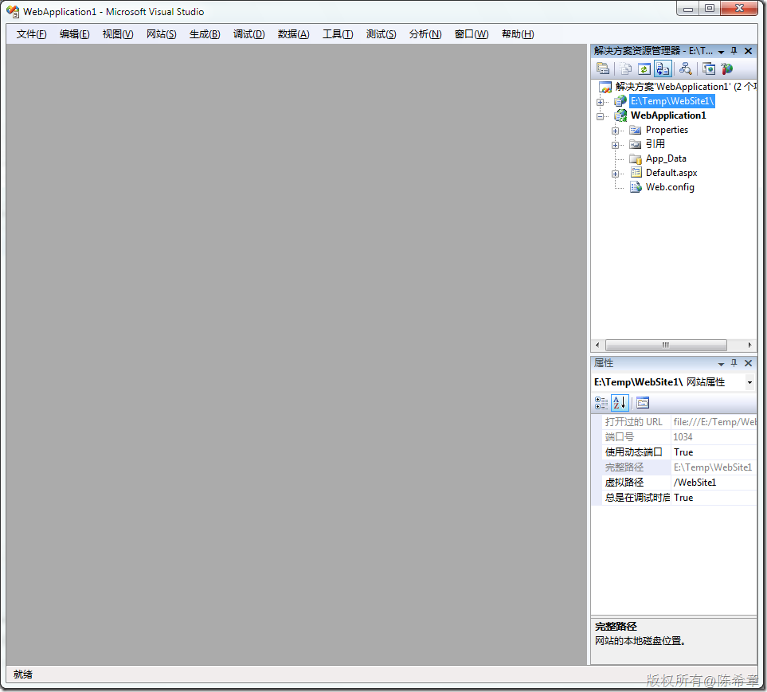
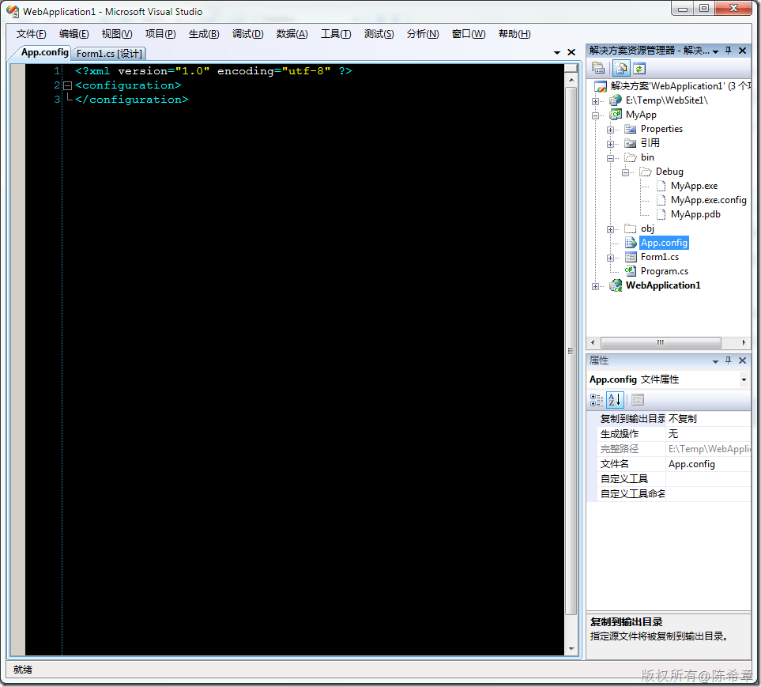
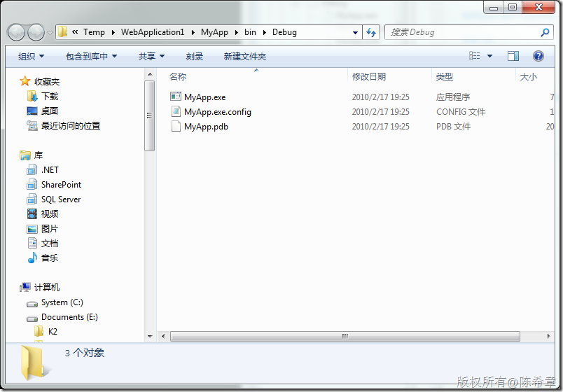
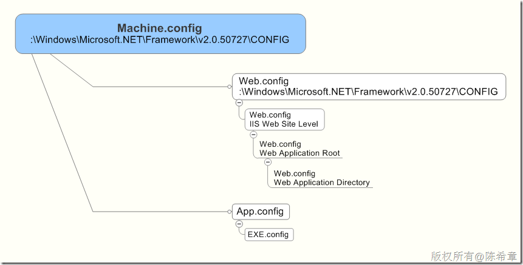

# .NET Framework中的配置文件(config) 
> 原文发表于 2010-02-28, 地址: http://www.cnblogs.com/chenxizhang/archive/2010/02/28/1675258.html 

在.NET Framework中，配置几乎是无处不在的。配置是控制应用程序行为的一些设置。下面我们就来看看到底有几个配置文件，而他们又分别代表了什么？

 1. machine.config
-----------------

 这个文件只有一个，顾名思义，它是控制整个物理机器级别的设置的。它的设置将影响所有的应用程序，不管是Windows Forms程序，还是Console Application,或者是Windows Service，又或者是Web Application，Web Service 等等。

 这个文件所在的位置是：

 F:\Windows\Microsoft.NET\Framework\v2.0.50727\CONFIG

  

 2. web.config
-------------

 这个文件可能会有很多个。但至少会有一个，这个web.config也是在上面这个目录中。它是控制机器上所有的Web应用程序的。也就是说它的设置是只影响本地机器上所有的Web Application，或者Web Service的。对于Windows桌面应用则没有影响

 然后，在每个IIS的网站，可能还有一个web.config文件。（默认这个文件是不存在的），一般是在下面的界面中，编辑了ASP.NET组中某些设置后才会产生一个web.config出来

  

  

 那么，也就是说，如果我们并没有为当前IIS的网站添加任何特殊的设置，那么它就使用F:\Windows\Microsoft.NET\Framework\v2.0.50727\CONFIG下面的web.config文件。

 接下来，我们自己开发的Web Application或者Web Service的根目录下默认会有一个web.config。

  

 然后，在我们的Web Application或者Web Service内部的子目录中，还可以有单独的web.config

  

 3. app.config
-------------

 与web.config不同，这个配置文件是用于Windows Forms，Console Application，Windows Service，或者WPF Application的。而且它们最后会被变成另外一个名称，就是根据当前应用程序名而改变。例如，假设当前的应用程序编译的结果是 MyApp.exe，那么配置文件虽然在Visual Studio中是叫app.config,但最后的结果是MyApp.exe.config

  

  

     所以，总得来说，在.NET Framework中，配置文件的层次是下面这样的

 

