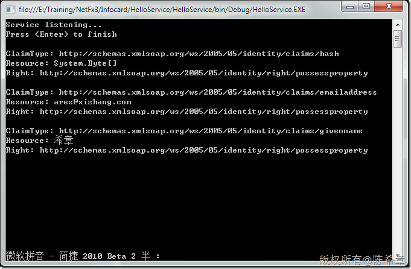
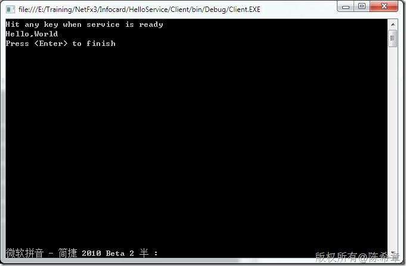
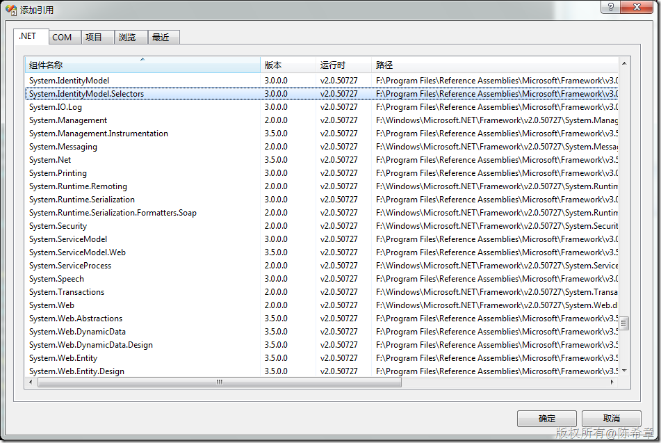

# 如何在WCF解决方案中使用WCS（windows cardspace）作为身份验证方式 
> 原文发表于 2010-02-28, 地址: http://www.cnblogs.com/chenxizhang/archive/2010/02/28/1675262.html 


本文提供了一个引导步骤，讲解了如何在WCF解决方案中采用WCS作为身份验证方式。本文假设你已经清楚地了解了WCF的各项机制。

  

 第一部分：服务部分

 1. 服务契约


```
using System.ServiceModel;

namespace HelloService
{
    [ServiceContract]
    public interface IHello
    {
        [OperationContract]
        string Say();
    }
}
```

```
2. 服务实现和宿主程序
```

```
需要预先引用System.ServiceModel，System.IdentityModel
```

```
using System;
using System.Collections.Generic;
using System.Linq;
using System.Text;

using System.ServiceModel;
using System.IdentityModel.Claims;
using System.IdentityModel.Policy;

namespace HelloService
{


    class Hello : IHello
    {

        #region IHello 成员

        public string Say()
        {
            GetIdentity();
            return "Hello,World";
        }

        private void GetIdentity()
        {
            AuthorizationContext ctx =
OperationContext.Current.ServiceSecurityContext.AuthorizationContext;
            foreach (ClaimSet claimSet in ctx.ClaimSets)
            {
                foreach (Claim claim in claimSet)
                {
                    Console.WriteLine();
                    Console.WriteLine("ClaimType: " + claim.ClaimType);
                    Console.WriteLine("Resource: " + claim.Resource);
                    Console.WriteLine("Right: " + claim.Right);
                }
            }
            return;
        }

        #endregion
    }

    class Program
    {
        static void Main(string[] args)
        {
            ServiceHost sh = new ServiceHost(typeof(Hello), new Uri("http://localhost:4123/helloService"));
            sh.Open();
            Console.WriteLine("Service listening...");
            Console.WriteLine("Press <Enter> to finish");
            Console.ReadLine();
            sh.Close(); // close the service
        }
    }
}

```

```
代码中的GetIdentity方法是我们自己写的，主要是为了解析Windows Cardspace传递过来的凭据信息。
```

```
 
```

```
3. 服务配置
```

```
<?xml version="1.0" encoding="utf-8" ?>
<configuration>
  <system.serviceModel>
    <services>
      <service
      name="HelloService.Hello"
      behaviorConfiguration="helloServiceBehavior">
        <endpoint
        address="helloEndpoint"
        contract="HelloService.IHello"
        binding="wsFederationHttpBinding"
        bindingConfiguration="helloFederatedBinding">

          <identity>
            <certificateReference
            findValue="WCFTestCert"
            storeLocation="CurrentUser"
            storeName="My"
            x509FindType="FindBySubjectName" />
          </identity>
        </endpoint>
        <endpoint contract="IMetadataExchange" binding="mexHttpBinding" address="mex" />
      </service>
    </services>
    <bindings>
      <wsHttpBinding>
        <binding name="helloBinding">
          <security mode="Message">
            <message clientCredentialType="IssuedToken" />
          </security>
        </binding>
      </wsHttpBinding>

      <wsFederationHttpBinding>
        <binding name="helloFederatedBinding" >
          <security mode="Message">
            <message
            algorithmSuite="Basic128"
            issuedTokenType="urn:oasis:names:tc:SAML:1.0:assertion"
            issuedKeyType="SymmetricKey">
              <issuer address="http://schemas.xmlsoap.org/ws/2005/05/identity/issuer/self"/>
              <claimTypeRequirements>
                <add claimType ="http://schemas.xmlsoap.org/ws/2005/05/identity/claims/emailaddress"/>
                <add claimType ="http://schemas.xmlsoap.org/ws/2005/05/identity/claims/givenname"/>
              </claimTypeRequirements>
            </message>
          </security>
        </binding>
      </wsFederationHttpBinding>
    </bindings>
    <behaviors>
      <serviceBehaviors>
        <behavior name="helloServiceBehavior">
          <serviceMetadata httpGetEnabled="true" />

          <serviceCredentials>
            <issuedTokenAuthentication allowUntrustedRsaIssuers="true" />
            <serviceCertificate
            findValue="WCFTestCert"
            storeLocation="CurrentUser"
            storeName="My"
            x509FindType="FindBySubjectName" />
          </serviceCredentials>
        </behavior>
      </serviceBehaviors>
    </behaviors>
  </system.serviceModel>
</configuration>
```

```
在这里，我们指定了一个特殊的binding(wsFederationHttpBinding)这是专用于WCS的。并且我们声明了当前应用程序需要两部分信息，一个是emailaddress，一个是givename
```

```
需要注意的是，我们需要在服务端设置证书，并且在endpoint对其进行引用，这是什么道理呢? 因为客户端也要对服务进行验证。
```

```
 
```

```
第二部分：客户端部分  

```

```
1. 服务契约
```

```
using System.ServiceModel;

namespace HelloService
{
    [ServiceContract]
    public interface IHello
    {
        [OperationContract]
        string Say();
    }
}

```

.csharpcode {
 background-color: #ffffff; font-family: consolas, "Courier New", courier, monospace; color: black; font-size: small
}
.csharpcode pre {
 background-color: #ffffff; font-family: consolas, "Courier New", courier, monospace; color: black; font-size: small
}
.csharpcode pre {
 margin: 0em
}
.csharpcode .rem {
 color: #008000
}
.csharpcode .kwrd {
 color: #0000ff
}
.csharpcode .str {
 color: #006080
}
.csharpcode .op {
 color: #0000c0
}
.csharpcode .preproc {
 color: #cc6633
}
.csharpcode .asp {
 background-color: #ffff00
}
.csharpcode .html {
 color: #800000
}
.csharpcode .attr {
 color: #ff0000
}
.csharpcode .alt {
 background-color: #f4f4f4; margin: 0em; width: 100%
}
.csharpcode .lnum {
 color: #606060
}


```
2. 客户端代码
```

```
 
```

```
using System;

using System.ServiceModel;

namespace Client
{
    class Program
    {
        static void Main(string[] args)
        {
            Console.WriteLine("Hit any key when service is ready");
            Console.ReadKey();
            ChannelFactory<HelloService.IHello> cnFactory =
            new ChannelFactory<HelloService.IHello>("helloClient");
            HelloService.IHello chn = cnFactory.CreateChannel();
            Console.WriteLine(chn.Say());
            // Clean up
            cnFactory.Close(); // close the client’s channel
            Console.WriteLine("Press <Enter> to finish");
            Console.ReadLine();
        }
    }
}

```

```
3. 客户端配置
```

```
<?xml version="1.0" encoding="utf-8" ?>
<configuration>
  <system.serviceModel>
    <client>
      <endpoint
      name="helloClient"
      address="http://localhost:4123/helloService/helloEndpoint"
      contract="HelloService.IHello"
      binding="wsFederationHttpBinding"
      bindingConfiguration="helloFederatedBinding"
      behaviorConfiguration="helloClientBehavior">
        <identity>
          <certificateReference
          findValue="WCFTestCert"
          storeLocation="CurrentUser"
          storeName="My"
          x509FindType="FindBySubjectName" />
        </identity>
      </endpoint>
    </client>
    <bindings>
      <wsHttpBinding>
        <binding name="helloBinding">
          <security mode="Message">
            <message clientCredentialType="IssuedToken" />
          </security>
        </binding>
      </wsHttpBinding>

      <wsFederationHttpBinding>
        <binding name="helloFederatedBinding" >
          <security mode="Message">
            <message
            algorithmSuite="Basic128"
            issuedTokenType="urn:oasis:names:tc:SAML:1.0:assertion"
            issuedKeyType="SymmetricKey">
              <issuer address="http://schemas.xmlsoap.org/ws/2005/05/identity/issuer/self"/>
              <claimTypeRequirements>
                <add claimType ="http://schemas.xmlsoap.org/ws/2005/05/identity/claims/emailaddress"/>
                <add claimType ="http://schemas.xmlsoap.org/ws/2005/05/identity/claims/givenname"/>
              </claimTypeRequirements>
            </message>
          </security>
        </binding>
      </wsFederationHttpBinding>
    </bindings>
    <behaviors>
      <endpointBehaviors>
        <behavior name="helloClientBehavior">
          <clientCredentials>
            <serviceCertificate>
              <authentication
              trustedStoreLocation="CurrentUser"
              revocationMode="NoCheck"/>
              <defaultCertificate
              findValue="WCFTestCert"
              storeLocation="CurrentUser"
              storeName="My"
              x509FindType="FindBySubjectName" />
            </serviceCertificate>
          </clientCredentials>
        </behavior>
      </endpointBehaviors>
    </behaviors>
  </system.serviceModel>
</configuration>
```


.csharpcode {
 background-color: #ffffff; font-family: consolas, "Courier New", courier, monospace; color: black; font-size: small
}
.csharpcode pre {
 background-color: #ffffff; font-family: consolas, "Courier New", courier, monospace; color: black; font-size: small
}
.csharpcode pre {
 margin: 0em
}
.csharpcode .rem {
 color: #008000
}
.csharpcode .kwrd {
 color: #0000ff
}
.csharpcode .str {
 color: #006080
}
.csharpcode .op {
 color: #0000c0
}
.csharpcode .preproc {
 color: #cc6633
}
.csharpcode .asp {
 background-color: #ffff00
}
.csharpcode .html {
 color: #800000
}
.csharpcode .attr {
 color: #ff0000
}
.csharpcode .alt {
 background-color: #f4f4f4; margin: 0em; width: 100%
}
.csharpcode .lnum {
 color: #606060
}


也就是说，在客户端也是需要包含证书的。一般是把不包含私钥的证书在客户端安装。


 


4. 运行效果


服务端


[](http://images.cnblogs.com/cnblogs_com/chenxizhang/WindowsLiveWriter/WCFWCSwindowscardspace_6B2A/image_2.png) 


客户端


[](http://images.cnblogs.com/cnblogs_com/chenxizhang/WindowsLiveWriter/WCFWCSwindowscardspace_6B2A/image_4.png) 


[备注]因为是Session的隔离，所以选择卡片的界面是没有办法截图的。


 


4. 为客户端实现异常处理


添加System.IdentityModel.Selectors引用


[](http://images.cnblogs.com/cnblogs_com/chenxizhang/WindowsLiveWriter/WCFWCSwindowscardspace_6B2A/image_6.png) 


```
using System;

using System.ServiceModel;
using System.IdentityModel.Selectors;

namespace Client
{
    class Program
    {
        static void Main(string[] args)
        {
            try
            {
                Console.WriteLine("Hit any key when service is ready");
                Console.ReadKey();
                ChannelFactory<HelloService.IHello> cnFactory = new
                ChannelFactory<HelloService.IHello>("helloClient");
                HelloService.IHello chn = cnFactory.CreateChannel();
                Console.WriteLine(chn.Say());
                cnFactory.Close();
            }
            catch (UserCancellationException)
            {
                Console.WriteLine("User cancelled");
            }
            catch (UntrustedRecipientException)
            {
                Console.WriteLine("User does not trust the recipient");
            }
            catch (ServiceNotStartedException)
            {
                Console.WriteLine("Cardspace service not started");
            }
            catch (CardSpaceException cse)
            {
                Console.WriteLine("Generic Cardspace exception:" + cse.Message);
            }
            catch (Exception e)
            {
                Console.WriteLine("Other exceptions :" + e.Message);
            }
            finally
            {
                Console.WriteLine("Press <Enter> to finish");
                Console.ReadLine();
            }
        }
    }
}

```

.csharpcode {
 background-color: #ffffff; font-family: consolas, "Courier New", courier, monospace; color: black; font-size: small
}
.csharpcode pre {
 background-color: #ffffff; font-family: consolas, "Courier New", courier, monospace; color: black; font-size: small
}
.csharpcode pre {
 margin: 0em
}
.csharpcode .rem {
 color: #008000
}
.csharpcode .kwrd {
 color: #0000ff
}
.csharpcode .str {
 color: #006080
}
.csharpcode .op {
 color: #0000c0
}
.csharpcode .preproc {
 color: #cc6633
}
.csharpcode .asp {
 background-color: #ffff00
}
.csharpcode .html {
 color: #800000
}
.csharpcode .attr {
 color: #ff0000
}
.csharpcode .alt {
 background-color: #f4f4f4; margin: 0em; width: 100%
}
.csharpcode .lnum {
 color: #606060
}
