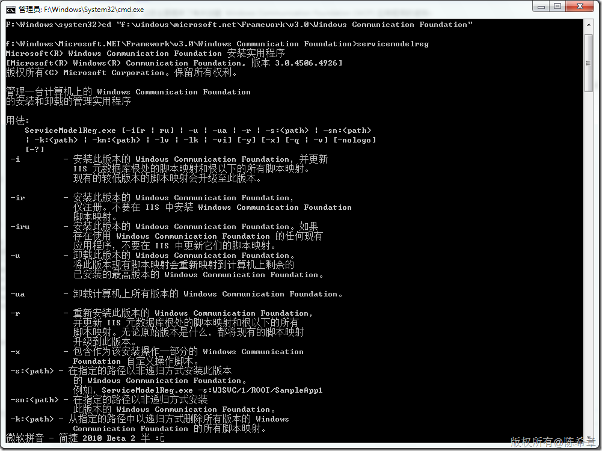

# 如何安装WCF以便让IIS能够承载svc文件 
> 原文发表于 2010-02-28, 地址: http://www.cnblogs.com/chenxizhang/archive/2010/02/28/1675263.html 

我们知道WCF可以宿主在任意的.NET程序中，一般在调试阶段，我们会将其宿主在控制台程序中。但如果在生产环境的话，则比较合适的宿主是：Windows服务和IIS。

 在一个网站中添加一个WCF服务简直可以用容易之极来形容。但很多朋友在本地Visual Studio调试好之后，发布到IIS却发现服务不能正常工作。究其原因是因为WCF与IIS之间的搭配关系，我们可以通过下面的工具，为WCF进行注册

 这个工具的名称是 ServiceModelReg.exe，它的位置是f:\windows\microsoft.net\Framework\v3.0\Windows Communication Foundation

 

