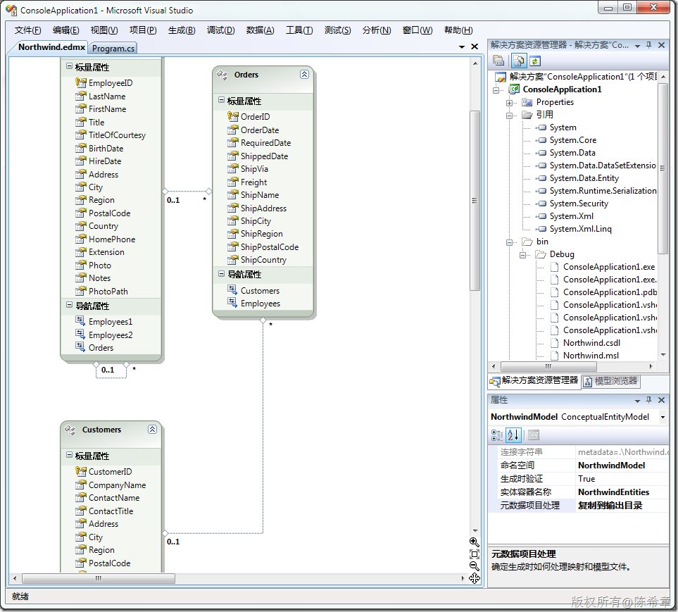
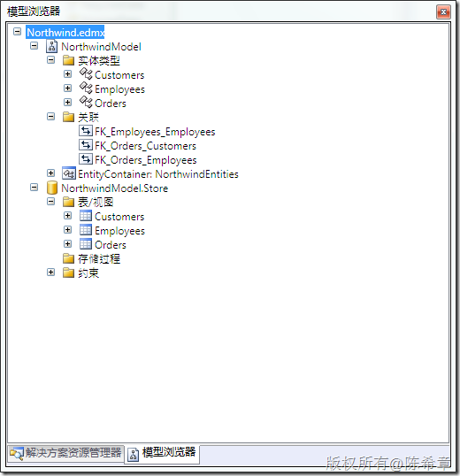

# 如何生成EDM的元数据文件csdl,msl,ssdl 
> 原文发表于 2010-02-28, 地址: http://www.cnblogs.com/chenxizhang/archive/2010/02/28/1675264.html 

在一个EDM模型上，点击右键，属性中选择“元数据项目处理”=〉“复制到输出目录”

  

 这几个文件的分工大致如下

 CSDL: 定义了业务实体

 MSL：定义了业务实体与数据库对象之间的映射

 SSDL：定义了在数据库内部的一些属性（例如字段的长度等）

  

 那么，为什么我们需要生成这几个文件呢？我想作用主要是，当数据库的对象发生变化之后，能够尽可能减少修改的内容。

 例如，某个数据库字段名发生了变化，其实无需修改实体，而只要修改映射即可。

 通过下面的图也可以很好地看到这个关系

 

